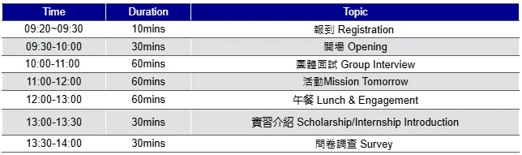

ASML 為引領全球半導體產業創新的領導者，為全球晶片製造商提供全方位的微影系統、軟體與服務，來進行晶片量產，客戶包含 TSMC、Samsung、Intel 等。而台灣是 ASML 在亞洲最大的據點，ASML設立菁英獎學金，提供每年八位學生（大學以上）高額獎學金與實習機會。

今年很榮幸我能夠成為 2023 ASML 菁英獎學金計畫的得獎者之一。從遞交履歷到成功媒合，整個申請過程大約花了半年的時間。因為當初申請時也受到許多網路上其他人分享的幫助，因此我也想透過這篇文章來分享自己的申請過程給未來的申請者做參考！

# 獎學金介紹

## 獎學金內容

每年的獎學金計畫可能會有所變動，以下內容擷取自ASML菁英獎學金計畫官網：

- 最高NT$300,000獎學金，分三階段發放
    - 第一階段：完成暑期實習 (7月至9月)，即發放NT$100,000元
    - 第二階段：完成學期實習 (10月至12月)，另發放NT$100,000元
    - 第三階段：畢業後到職台灣ASML，享有簽約獎金NT$100,000元
- EF英語線上課程
- ASML導師學生培訓
- ASML實習

## 申請資格

- GPA 3.7/4.0
- GPA 4.0/4.3
- 學業成績85分以上
- 系排名15%前
- 中、英文表達流暢

# 申請流程
1. 書審資料上傳 （2023.11）
一開始看到計劃介紹時，覺得ASML這麼知名的國際企業，我真的有可能成功嗎？但又想著剛好剛經歷完碩士推甄，申請資料也不需要做太多修改，因此抱著姑且試試的心態將履歷等資料上傳。

需要上傳的檔案有：

- 簡歷（英文）
- 在學證明
- 成績單
- 讀書計畫（英文）
- 其他相關資料（英文） 
其實這些資料和申請推甄大同小異，稍微修改後即可上傳。

2. 線上HireVue（2023.12）
通過第一階段篩選後，會收到線上HireVue邀請信。

HireVue是一個線上面試的平台，在這關，畫面會跳出問題，而受試者需要在時限內錄影，用英文回答問題。這些問題通常都是開放式問題，主要詢問受試者的個人特質（領導、合作方法）與經驗等。問題不難，也不需要提前準備。只要在一個哀靜的場所內就可以完成。回答完每個問題後，系統就會將回答的影片上傳。

HireVue系統有練習題可以讓使用者在正式錄影前先適應這種模式，使用者也可以選擇關閉鏡頭，只記錄聲音。

隔一段期間後，會收到Thank you for completing your HireVue interview的信件，便完成這關了。

3. Master Class（2024.01）

當你收到HR的電話或是email通知你進入Master Class時，就代表成功進到最後一關了。這個Master Class其實就是團體面試／認識公司／交朋友的一日活動。

Master Class的活動會需要大約半天多一點，早上是團體面試，會依4個人一組，面對各部門主管。面試過程全程使用英文，依照面試者喜好，可能是隨機順序，也可能是依照座位發言回答問題。

面試問題通常都是BQ（Behavior Questions），因為和你一組的同學還自各個領域，因此不會問太專業性太高的問題。常問的問題不外乎是，領導團隊的經驗、如何解決紛爭、如何安排時間、在學期間的高潮／低潮等。只要能夠合理清晰地描述，不需要去設想面試官想要聽到什麼答案，做最真實的你就好。

團體面試完後，會有ASML設計的桌游遊戲 Mission ToMorrow，這個遊戲旨在讓大家更了解ASML，遊戲是合作模式，因此團隊溝通就顯得重要。但我認為也不一定要爭著當主導者，每個人在團隊中本來就有自己適合的角色，因此就以平常心，盡力去解出答案就好。

團體面試的部分，自我介紹是一定會被問到的，也是比較好事前準備的部分，因此一定要把握機會將大約一分鐘的自我介紹練熟。

上午的活動結束後，下午主要是HR會以簡報方式介紹ASML的企業文化，其中3C文化真的在之後的實習中體現得很明顯。在聽介紹時，不妨思考一下這樣的工作環境、模式是不是自己嚮往的。

一天的活動大約上就是這樣，結束後就可以回家靜待消息。

4. 宣布獎學金得主（2024.03）
大約過了2個月後的某一天，我突然收到HR的電話，告知我錄取了ASML的獎學金計畫，並且會開始進行媒合過程，媒合到適合實習的單位。

HR會幫你配對到覺得和你專業相關的部門，我在媒合時，也和部門team lead 線上面試過一次，這次的面試就問了比較多專業的問題，但也不會到太困難。我面試時，被問到了沒接觸過的use case，我也只依照我的直覺以及對這個領域的了解去盡力回答。

面試完成的當天，我傳email詢問HR我的面試結果。很意外的是，HR告知我TL很喜歡我，因此我被錄取了！而接下來就是在Me@ASML的旅程。

# 結語
> You never know unless you have tried.

從一開始投遞履歷，到最後坐進ASML辦公室寫程式的過程真的很令我感到不可思議。我從來沒有想過自己有能力進到ASML實習。在Master Class當天和其他同學聊天時，發現大家不外乎都是台清交等頂大學生，而我只是一個來自彰師大，碩士推甄上交大的大四生而已。但是這次的經驗告訴我，不要妄自菲薄，反正試試看，頂多就是和現狀一樣罷了，累積一些面試實務經驗也不錯！

這次在ASML的實習對我的專業技能有非常重要的幫助與提升，有時間再寫一篇分享在ASML的實習經驗！

# 相關連結
- [ASML介紹](https://www.asml.com/zh-tw/technology)
- [ASML菁英獎學金官網](https://www.asml.com/zh-tw/careers/students-new-graduates/taiwan/scholarship)
- [2021 ASML菁英獎學金得主心得](https://medium.com/@winnie54liu0504/2021-asml%E8%8F%81%E8%8B%B1%E7%8D%8E%E5%AD%B8%E9%87%91%E7%94%B3%E8%AB%8B%E5%BF%83%E5%BE%97-dc9657a4db3d)
- [2022 ASML菁英獎學金得主心得](https://felixliawi.medium.com/asml-elite-scholarship-2022-taiwan-acee41dd0f50)