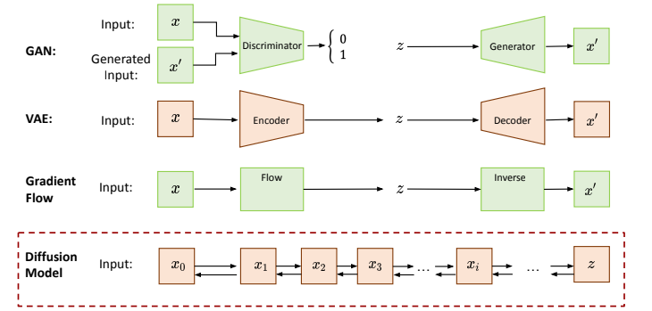
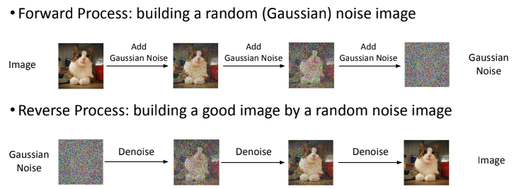
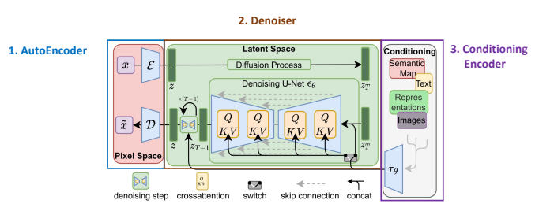
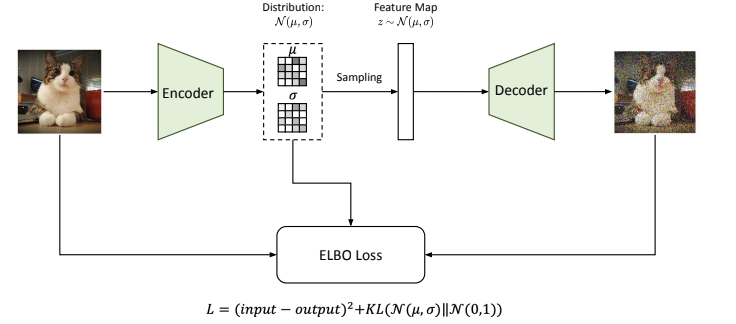
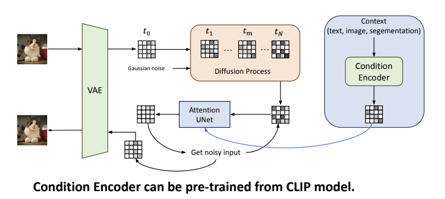
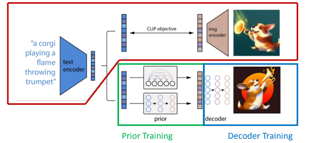

# Image Generation

# Diffusion Model

1. Forward Process:
    - build a random Gaussian noise image
    - generate training data & labels for reverse process
2. Reverse Process:
    - train noise predictor (Unet) to generate denoised image
    - input: noise image & step number (to indicate the amount of noise per image step)
    - output: denoised image
    - Why need T steps?
        - break down a hard problem
        - easier to inject conditions (i.e text prompt) gradually
    - Noise predictor loss function: distance between predicted image and ground truth (from forward process)

- Text-to-Image: in reverse process, add text prompt as an input.
    - 3 inputs: noise image, step number, text prompt

# Stable (Latent) Diffusion
> Why need?
- DM often operate on high dimension pixel space $\Rightarrow$ costly computation

## AutoEncoder
- implemented as Variational Autoencoder (VAE)
- handle perceptual image compression (reduces the dimension of input data)

## Denoiser
- latent diffusion models

## Condition Encoder
- arbutrary encoder that produces a sequence of tokens to generate embeddings for denoiser

# Dall-E 2

- 4 parts:
    - text encoder & image encoder (pretrained from CLIP)
    - prior training (transform text embedding to image embedding)
    - decoder training (produces image conditioned on CLIP image embeddings and text captions)
    - inference (delete CLIP image encoder, save CLIP text encoder)
