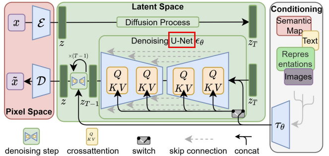
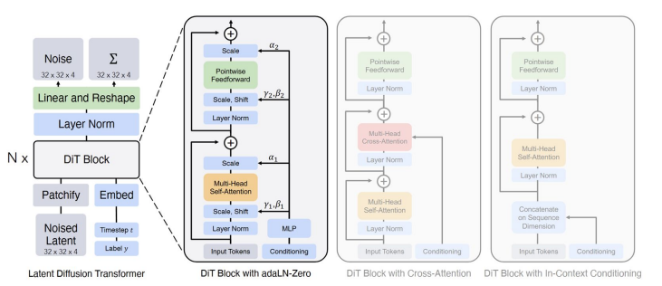
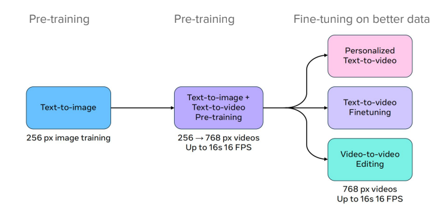
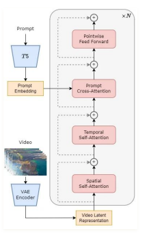

# Diffusion Model before DiT: U-Net

- but U-Net is not designed for long sequence data i.e video

# Diffusion Transformers (DiT)

- input: latent representation of image or video

## adaLN-Zero
- LayerNorm with parameters generated by input

## Cross Attention
- conditions are encoded in Keys and Values
- latent in Queries
## In-context Conditioning
- conditions are concatenated to the latent tokens

# MovieGen
- a cast of foundation models that generates videos & synchronized audio

- training scheme

# Open-Sora

- utilizes DiT architecture
- reduce training & inference cost
- large-scale image pre-training $\rightarrow$ high quality video data find tuning