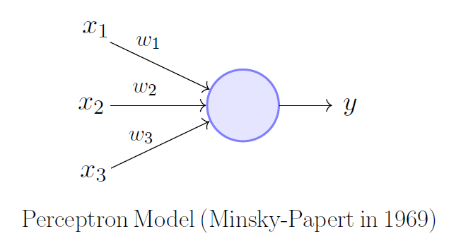

# The Perceptron

- algorithm to perform image classification

# Multi-layer Perceptron (MLP)

- with fully connected layers

# Gradient Descent
1. Predict
    - Forward pass: $\tilde y = w x_i$
    - Compute loss: $L_i = \frac {1}{2}(y_i- \tilde y)^2$ (L2 loss function)
2. Update
    - Backward propogation: $\frac{\partial L_i}{\partial w} = -(y_i - \tilde y) x_i = ▽w$
    - Gradient update: $w = w - ŋ▽w$

# Under/ Over fitting

- Underfitting:
    - Low model complexity => too simple to fit data
    - High **bias** (constently learn wrong thing)
- Overfitting:
    - High model complexity => fits too well to seen data
    - High **variance** (amount of parameter change for different training data)
    - Cannot generalize onto new unseen data)

# Data Splitting
- Training set for model training
- Validation set for model tuning
- Testing set for testing the final model
 
## K-fold cross validation
- if only few training data
- Divide training set into $K$ partitions
- $K-1$ for training, $1$ for validation
- Repeat $k$ times 

## Cross entropy loss function

- for ** classification**
- Entropy: the degree of randomness (uncertainty)
    - $H(x) = - \sum p(x) log p(x)$
    - the grater the more uncertain
- $L = \frac {1}{n} [\sum_{j=1}^N [t_j log(p_j) + (1-t_j) log (1-p_j)]]$, $t_j$: the true value ${0,1}$
    - if $y=1$ => $L=-log(p)$
    - if $y=0$ => $L=-log(1-p)$

