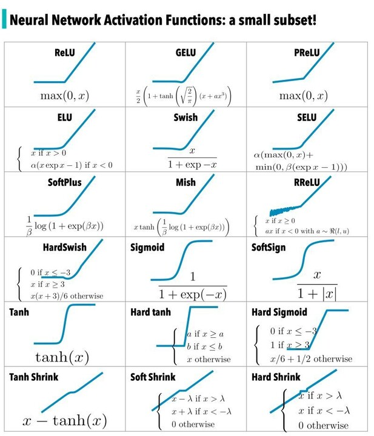

# Activation Function $g()$
- perform non-linear feature transformation
    - e.g 
- non-linear because linear is too limited
    - many linear layers can collapse into one single layer
- $Z^i = w^ih^{i-1} + b^i$  
  $h^i = g^i(Z^i)$, where $g^i$ is the non-linear activation function

# Stochastic Gradient Discent
- Problems with GD:
    - **Local Optimum**: cannot update weights, so next gradients are also 0, each iteration use same (whole) dataset, so there's no way it can escape
    - **Efficiency**: GD has to load all training samples
- randomly pick a (single)training sample to perform BP
    - mode efficient
    - but much slower, needs more iterations to train
- Mini-batch SGD: randomly pick $b$ training samples
- Converge rate: $R_{GD} > R_{mini-SGD} > R_{SGD}$
- Time per iteration: $T_{GD} > T_{mini-SGD} > T_{SGD}$
- Training time = $T/R$

- AdaGrad: change learning rate according to gradient
- RMSProp: rescale learning rate to remove effect of gradient size, balance between different directions
    - $S = \beta s + (i- \beta) g^2$, $s$ has history information,   
      $w = w - \frac {\alpha g}{\sqrt {\hat S + \epsilon}}$, $g$ has current information, $\beta$ to balance
- Adam: combining momentum and RMSProp
    - $v = \beta_1 v + (1- \beta_1)g$  
      $s = \beta_2 s + (1- \beta_2)g$  
      $w = w - \alpha \frac {\hat v}{\sqrt {\hat s + \epsilon}}, \hat v = \frac {v}{1-\beta_1}, \hat s = \frac {s}{1- \beta_2}$
