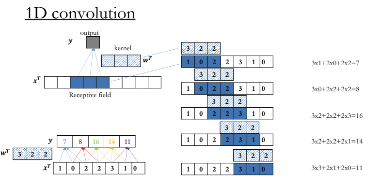
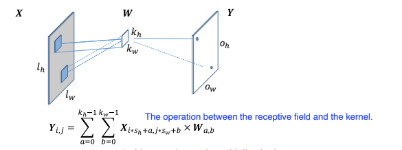
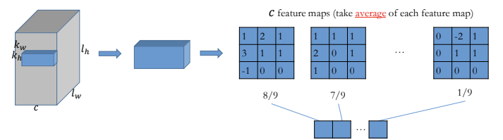

# Convolution
- Linear transformation
- Feature extraction
- 1D: Text, 2D: Image, 3D: microscopy ...
- 
> Why convolution?
- Sparse connection: each output only connect to inputs in reception field
    - fewer parameters, less overfitting
- Weight sharing (use the same kernel weight)
    - regularization, less overfitting
- Location/ Spatial invariant
    - same prediction for same input no matter where
# 1D Convolution
- $y = \sum_{i=0}^{k-1} w_i \times x_{t+i}$
    - $w$: kernel/ filter (weights to be trained)
    - $x$: input
    - $y$: output feature
    - applied area = receptive field: generate one output value
- 

## Padding
> What to do with boundary cases?
- determine edge values
- we want all elements to be processed the same # of time
- we also want output size = input size
### pad with extra values (0)
- without padding: $Output = input - kernal + 1$
- with padding: $Output = (input + padding) - kernal + 1$
- => same padding: $padding = kernal - 1$

## Stride
> How to make training faster?
- steps to skip
- consecutive: stride = 1
- $s>1$: skip some elements
    - faster, efficive
- $Output = \lfloor \frac {input + padding - kernal}{stride}\rfloor + 1$
- same padding:
    - $\lfloor \frac {input + padding - kernal}{stride}\rfloor ≥ Output - 1$  
        $padding ≥ stride \times (\lceil \frac {Output} {stride}\rceil - 1) + kernal - input$  
        => $padding = max(stride \times (\lceil \frac {Output} {stride}\rceil - 1)+ kernal - input, 0)$

# 2D Convolution

- Shape:
    - input = $n_h \times n_w$
    - kernal = $k_h \times k_w$
    - output = $O_h \times O_w$ = $(\lfloor \frac {n_h+p_h-k_h}{s_h}\rfloor  + 1, \lfloor \frac {n_w+p_w-k_w}{s_w}\rfloor  + 1)$
- Computational cost: $O(k_w \times k_h \times O_w \times O_h)$
- Multiple kernels: different levels of information (local vs. global)
- Multiple channels: results for all channels are summed (e.g RGB)

## Pooling
> What to do for reducing size?
- Aggregrate information from each receptive field
    - average, maximum
- No parameter
- Applied for each channels respectively
- Reduces feature/ model size
- Invariant to rotation of input
- e.g Average pooling
    