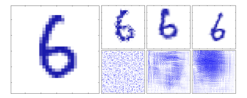
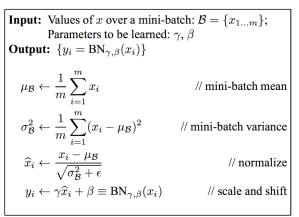

# Regularization
- modification intended to reduce generalization (*validation*) error but not training error
- reduce variance significantly while not overly increase bias

## Parameter Norm Penalties
- add penalty $Ω(w)$ to regularize $J$
    - $J(w; x, y) = J(w; x, y) + \alpha Ω(w)$
- prevent overfitting
- L1 norm regularization: $J_{reg} = J + \alpha ||w||_1$
- L2 norm regularization: $J_{reg} = J + \frac {\alpha}{2} ||w||_2$

## Parameter sharing
- force the set of parameter to be equal
- only a subset of the parmeters need to be stored in memory
- e.g CNN

## Dropout
- Training: randomly set some neurons to $0$ with probability $p$
    - can be different each iteration
- computational cheap
- hidden layer must perform well regardless of other hidden units

## Data augmentation
- synthesize data by transforming the original dataset
- incorporate invariances
- e.g 

## Injecting noise
- add noise to simulate real-world situation
    - Input: train with noise injected data
    - Hidden units: noise inject to hidden layers
    - Weights: increase stability for learned functions and parameters.
        -e.g RNN

## Batch normalization (BN)
- reduces internal covariate shift by normalizaing inputs of each layer
- normalize → scale and shift
    - $x → \hat x = \frac {x-µ}{σ} → y= \gamma \hat x + \beta$  
      $µ$: average, $σ$: standard deviation  
      $\gamma$: scale, $\beta$: shift
    - $\gamma$ and $\beta$ are parameters to learn
- 