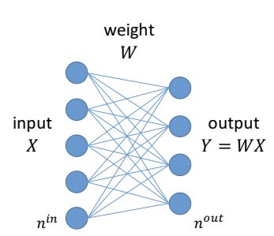
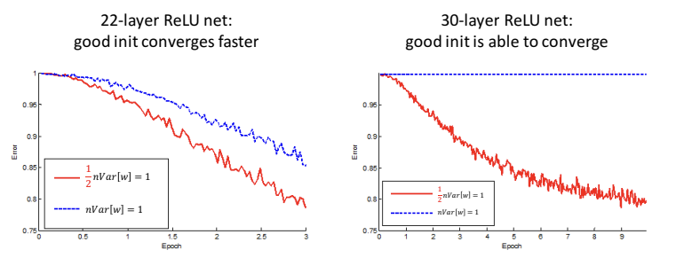
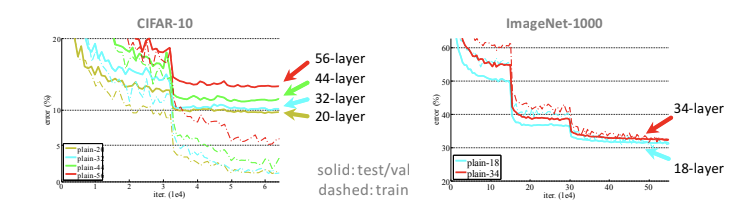
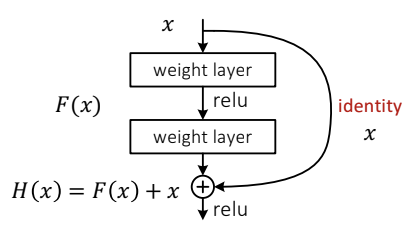
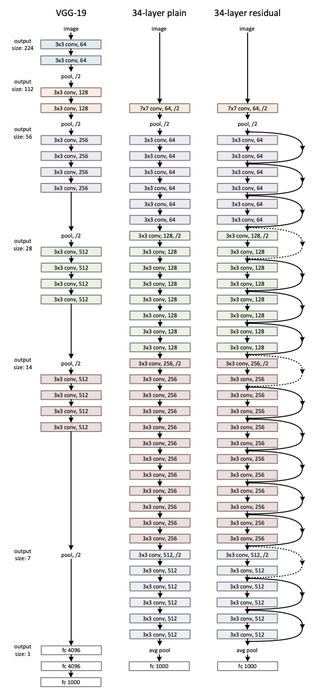

> How do we initiate the weights to prevent **vanish**/ **explode**?

- Forward: $Var[y] = \prod \limits_d n_d^{in} Var[w_d]) Var[x]$
- Backward: $Var[\frac {\partial}{\partial x}] = \prod \limits_d n_d^{out} Var[w_d]) Var[\frac {\partial}{\partial y}]$
- initiate $n_d^{in} Var[w_d] = 1$ or $n_d^{out} Var[w_d] = 1$
    - ReLU: $\frac {1}{2} n_d^{in} Var[w_d] = 1$ or $\frac {1}{2} n_d^{out} Var[w_d] = 1$
- 

# Deep Residual Learning

> We cannot simply stack layers, or we'll have **optimization** difficulties

- $F(x)=H(x)-x$
- $F(x)$ just learn the change (residue)
- RESNET-34 structure

> Why use the shortcut?
- Degrading problem
    - when the model gets deeper, it becomes more difficult for layers to propagate information from shallow layers and information is lost (degrade rapidly)
    - we use shortcuts (identity function)
