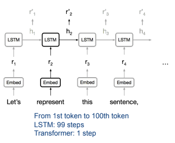
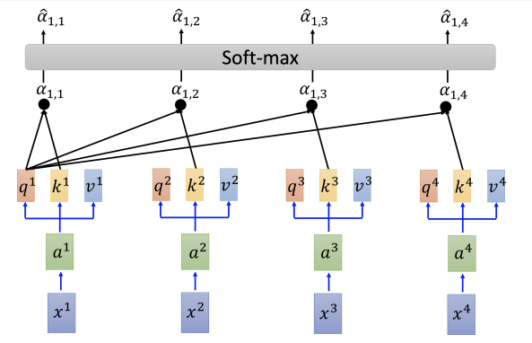
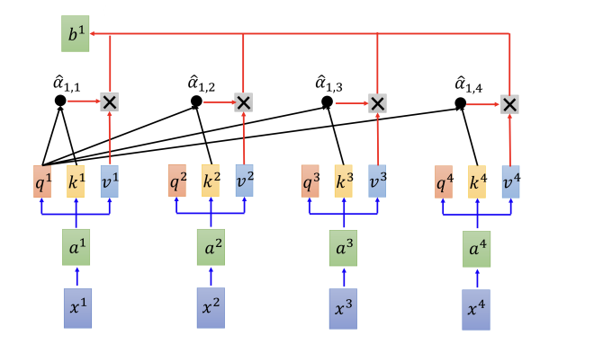
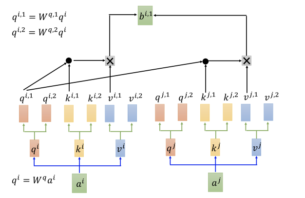
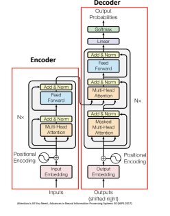
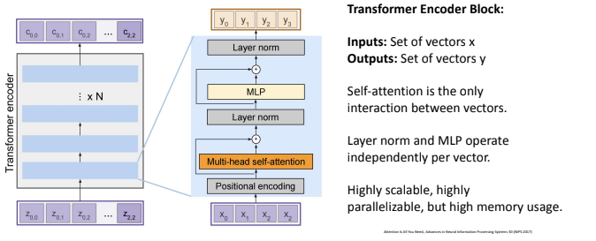
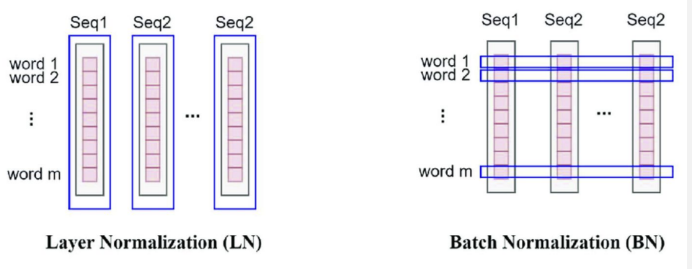
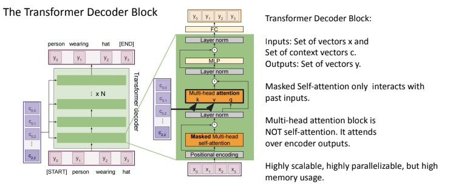

# Limitations of RNN & LSTM
> Why use self attention?
- poor sequence **parallelism**
    - LSTM relies on a sequential computation process, difficult to achieve sequence parallelism
- difficulty handling long-distance dependencies
    - LSTM struggles with captureing **long-range** dependencies as sequences grow longer
    -gradient vanishing or exploding can occur during backpropagation
    
- inefficient parameter usage
    - LSTM requires maintaining a large number of parameters

# Self attention

- a.k.a **global attention**
- $q$: query (to match others)
    - $q^i = W^q a^i$
- $k$: key (to be matched)
    - $k^i = W^k a^i$
- $v$: value (to be extracted)
    - $v^i = W^k a^i$
- $a_{i,j} = \frac {q^i \cdot k^j}{\sqrt d} $
- $b^1 = \sum_i \hat \alpha_{1,i} \times v^i$: all the attentions of $x^1$ on other inputs and itself
    
    - $b^1, b^2 ...$ can be computed in parallel
- can reduce computational cost by **local attention**
    - focuses only on the positions near the current position within the input sequence
    - restricts the attention to a local neighborhood
    
## Multi-Head self attention
- i.e. 2 heads
    
- can only communicate within the same head group
- merge the outputs of multiple heads into one single output (concat together)
- can capture diverse pattern and relationships
- high scalable & parallelizable

# Transformer

- Self-attention enhances multi-head self attention
    - in multi-head attention, we use several attention heads in parallel.
    - each head learns different representations of Query, Key & Value
## Encoder

### Layer norm
- same for all feature dimensions
    - Batch norm is same for all training examples
    

## Decoder

# Application
- Vision: ViT, Sora
- Language: BERT, GPTs
- Vision-Language: CLIP
