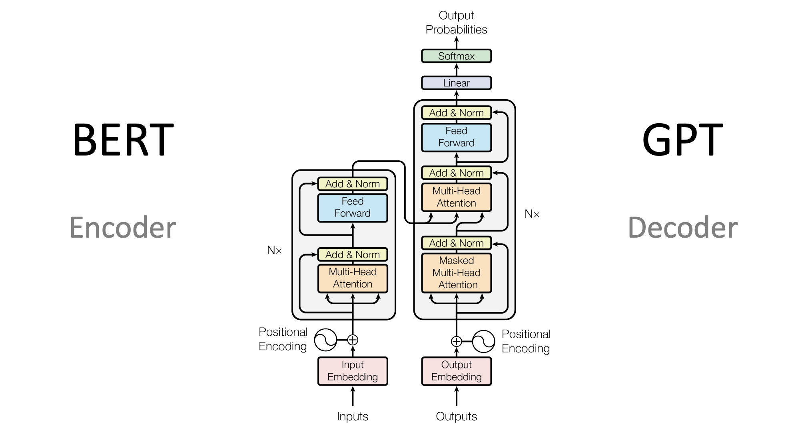
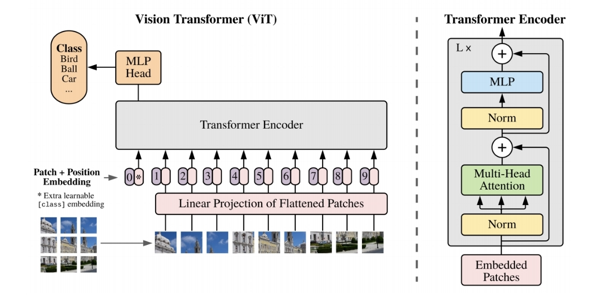

# BERT (**B**idirectional **E**ncoder **R**epresentations from **T**ransformers)
## Limitations of traditional NLP models
> Why do we need BERT?
- unidirectional context: may miss out on full context
- task-specific conplexity: designed for specific task, may increase complexity to generalize
- scarse pre-trained resources: 這邊老師上課的解釋是小公司沒有資源用大數據做大模型，但是Google可以
- limited semantic grasp because of unidirectional relationship

## BERT
- unsupervised learning: pre-trained on extensive data, boost performance for various language understanding tasks
- bidirectional understanding: understand words by considering both left and right context
- transformer: BERT uses encoder-only transformer

### Pretraining
1. Mask LM (mask token prediction)
    - mask 15% of the input tokens at random, then predict the token
2. Next Sentence Prediction
    - predicts whether the given sentence is the next sentence of the current one
    - builds understanding of the relationship of sentence
### Finetune
    - We have the pretrained model, BERT can be finetuned to solve downstream tasks
# ViT (Vision Transformer)
 
- apply BERT directly to images
- partition image into patches, use the sequence of linear embeddings of these patches as an inputs of transformer (tokens)

# ALBERT (A Lite BERT)
- reduces parameter techniques
    - **factorized embedding layer**
        - decomposing large vocabulary embedding matrix into two small matrices
    - **cross-layer parameter sharing**
        - the parameter size doesn't grow with the depth of the network
    