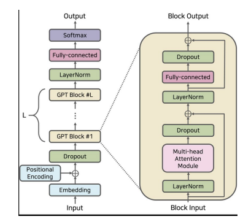
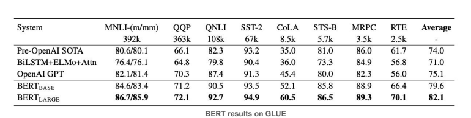
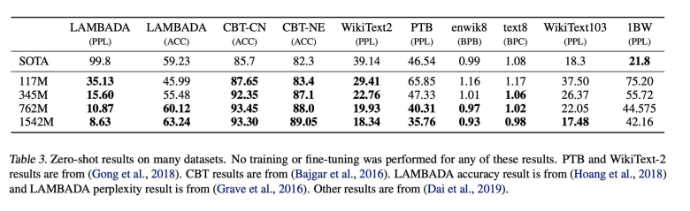
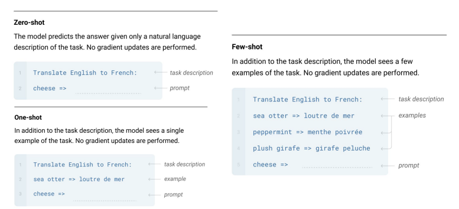
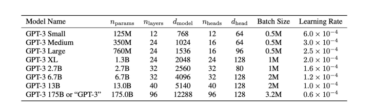

> Generative Pre-Trained Transformers
# GPT-1

- Semi-supervised learning: combine unsupervised pre-training and supervised fine-tuning for language model
- no need to change model architecture for different tasks

> Why do we use **unsupervised** training?  
A: lack of labeled data to train language model
- But difficult.
    - unclear what type of optimization objectives
    - no efficient way to transfer learned representations during fine-tuning

- Goal: to learn an universal representation

## Architecture: Transformer Decoder
 
- Transformer: enable more structure memory for handling long-term dependencies in text
- Decoder: decoder model using next token prediction training objective, more suitable for text generation

### Stage 1: Unsupervised Pre-Training
- Given an unsupervised dataset of tokens $U = u_1, ..., u_n$
- use a standard language modeling objective to maximize likelihood
    - $L_1(U) = \sum_i log \ P(u_i | u_{1-k}, ... , u_{i-1}, \theta)$
- i.e predict $21^{st}$ word using $1^{st}$ to $20^{th}$ words
### Stage 2: Supervised Fine-tuning
- Given a labeled data pair $C$ with input sequence $x$ and a label $y$
- Maximize $L_2(C) = \sum_{x,y} log \ p(y|x^1, ...x^m)$ and
    - $L_3(C) = l_2(C) + \lambda L_1(C)$
- Pretraining data: BooksCorpus dataset, 7000 unpublished book
    - 1B tokens
    - 12 layers decoder-only transformer
    - 12 attention heads
## Comparison with BERT
- GPT: Decoder-only Transformer, uses next-token prediction
- BERT: Encoder-only Transformer, uses masked-language modeling
- GPT-1 lost the competition against BERT

> It takes time for innovation to be recognized

# GPT-2
- larger dataset & larger model
    - WebText, 10B tokens, 1.5B parameters
    - 10x GPT-1, 5x BERT large
- Zero-shot setting
    - no more fine-tuning
    - specify the task with natural language (prompt) and take it as input
    - learn directly from natural language in the pretraining stage

# GPT-3
- largest AI model by then
    - 185B parameters, 1500x GPT-1, 100x GPT-2
    - training dataset includes WebText, books, Wikipedia
- few-shot learning (in context learning)
    
    - cannot guarantee zero-shot and one-shot are real
        - may be just remembering examples in the training data
    - we assume no similar pattern in learned in the training data
## Architecture

- Limitations:
    - still has notable weakness in document-level text generation
    - pretraining objective weights every token equally and lacks a notion of what is more important to predict
    - power consuming