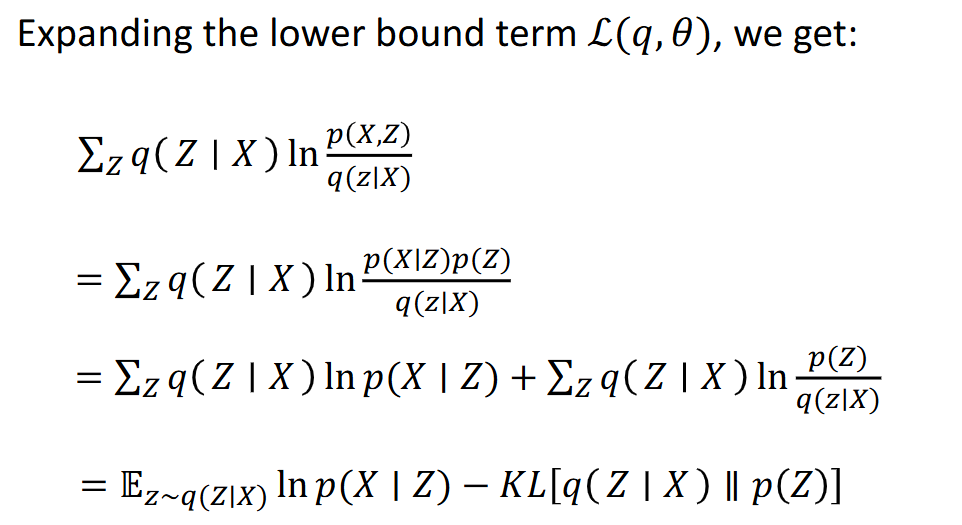
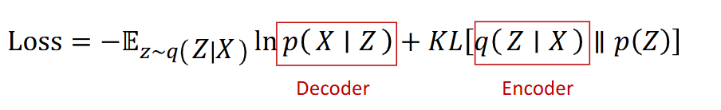
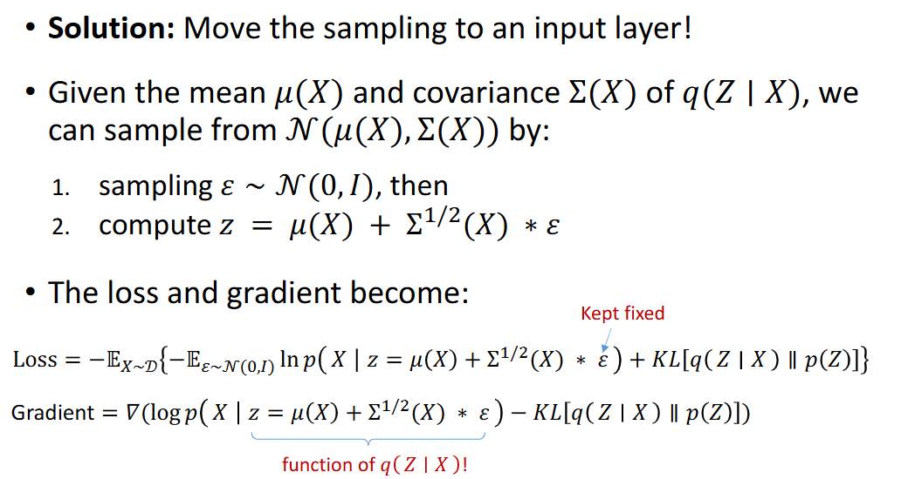
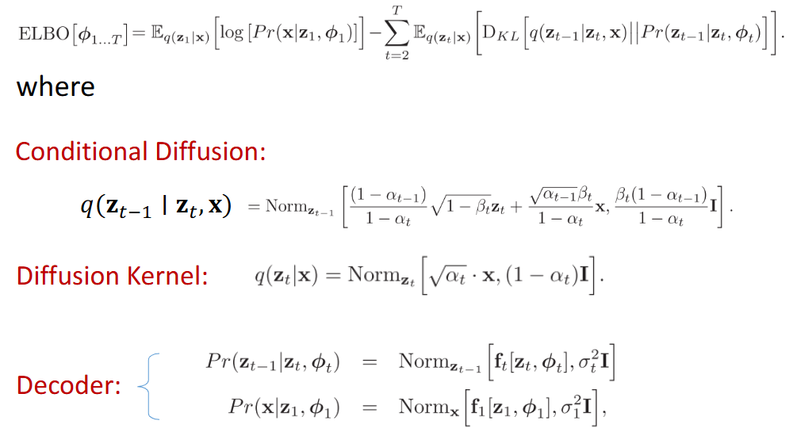
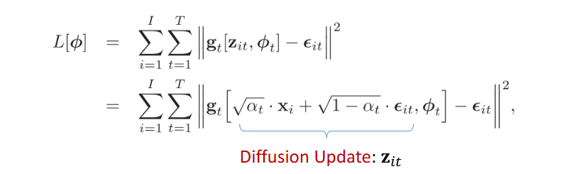

# Discriminative model
- posterior $p(C_k | X)$
- map $x$ to $C_k$ (class)

# Generative model
- likelihood $p(X|C_k)$
- sampling from the distribution
- can generate data points in input space 
    - $p(x,z| \theta) = p(x|z, \theta) p(z)$
- 1. sampling from the prior $z ~ p(z)$ e.g: z = Bedroom
  2. generate new image from likelihood $p(x| z = Bedroom)$
- define prior $p(z)$, deterministic function $f(z ; \theta): z \times \theta \rightarrow x$
- optimize $\theta$: maximize likelihood $p(x| \theta) = \inf p(x|z, \theta) p(z) dz$, where $p(x|z, \theta) = N(x | f(z, \theta), \sigma^2I)$
    - but $z$ is high dimension, intractable
    - we suppose $p(z) = N(0,I)$
    - learn $f(z, \theta)$ in deep neural network

# $f(z ; \theta): z \times \theta \rightarrow x$
- consider $ln p(x | z, \theta) = ln N(x| f(z; \theta), \sigma^2I) = - | x-f(z; \theta)|^2 + const.$
- $ln p(x) = \sum_z q(z|x) ln p(x)$ (encoder) $= \sum_z q(z|x) ln \frac {p(x,z)}{q(z|x)}$ which is the lowerbound ($L(q, \theta)$) $+ \sum_z q(z|x) ln \frac {q(z|x)}{p(z|x)}$ (is the $KL[q(z|x) || p(z|x)] \geq 0$)

- but gradient $= \triangledown (ln p(x|z)) - KL[q(z|x) || p(z)]]$
    - $q(z|x)$ is not trained

## Reparameterization Trick

# Diffusion Model
- Encoder: data sample $x$, map it through a series of intermediate latent variables. (add noise)
    - no learning
    - $x \rightarrow Z_1 \rightarrow Z_2 \rightarrow ... \rightarrow Z_T$
- Decoder: starting with $Z_T$, map back to $x$
    - deep network
    - $Z_T \rightarrow Z_{T-1} \rightarrow ... \rightarrow Z_1 \rightarrow x$

## Encoder (Diffusion)
- $Z_1 = \sqrt {1- \beta_1} \times x + \sqrt {\beta_1} \times \epsilon_1$ (noise from normal distribution)
- $Z_t = \sqrt {1- \beta_t} \times Z_{t-1} + \sqrt {\beta_t} \times \epsilon_t$

- $\Rightarrow q(Z_1|x) = Norm[\sqrt {1-\beta_1} x, \beta_1 I]$   
    $q(Z_{1 ...T}|x) = q(Z_1|x) \prod_{t=1}^T q(Z_t|Z_{t-1})$
- we want to get $z_t$ directly from $x$
- $Z_t = \sqrt {\alpha_t} \times x + \sqrt {q-\alpha_t} \times \epsilon$, $\alpha_t = \prod_{s=1}^t 1-\beta_s$
- $q(Z_t|x) = Norm_{Z_t} [\sqrt{\alpha_t} \times x, (q - \alpha_t)I]$

## Decoder (learn the reverse process)
- approx $Pr(Z_T) = Norm_{Z_T} [0,T]$  
  $Pr(Z_t-1| Z_t, \phi_t) = Norm_{Z_{t-1}} [f_t[Z_t, \phi_t], \sigma_t^2I]$  
  $Pr(x| Z_1, \phi_t) = Norm_{x} [f_1[Z_1, \phi_1], \sigma_1^2I]$
- 
- final lost function: 

