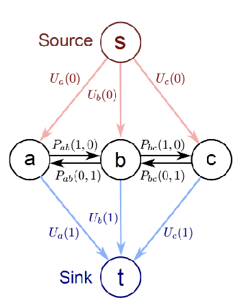
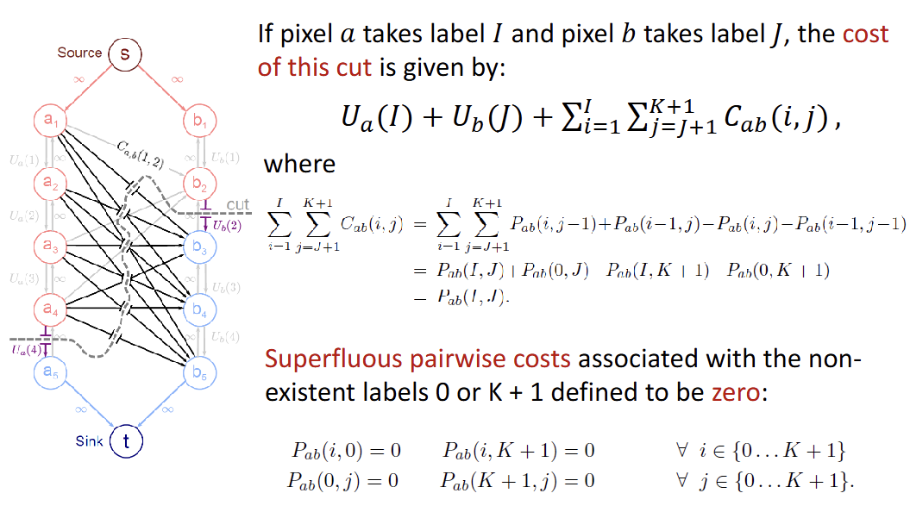

- Recover clean image pixels $w=\{w_1, w_2, ..., w_N\}$, given noisy observed data $x=\{x_1, x_2, ...x_N\}$
- we want to:
    1. $p(x|w)$: encourage pixels ($w$) to stay the same label as observation ($x$)
    2. $p(w_i, w_j)$: take the same label as neighbor ($w1, w2$)
- **cost function** 

# Max-flow = Min-cut
- a directed graph, a source, a sink
- capacity $u(e_{ij}) \geq 0$ of an edge = max flow possible on the edge
- cut: node partition $(S,T)$ on graph
- capacity: sum of weights **leaving** $S$
- flow: assignment of weights to edges
    - $0 \leq f(w_{ij}) \leq u(e_{ij})$ (capacity)
    - flow leaving $V_i =$ flow entering $V_i$
- Goal: find the flow that maximizes net flow

## Observations
- net flow = flow entering $t$
- value of flow $\leq$ capacity of the cut
- if capacity of the cut $=$ value of the flow, $f$ is max flow, $(S,T)$ is min cut

# Residual Graph

- undo flow sent
- augmenting path = path in residual graph
- if augmenting path exist: not a maz flow yet

## Augmenting Path Algorithm

# Case 1: Binary MRF

- Unary costs $U(0), U(1)$ attached to links to source and to sink. Either one or the other is paid
- Pairwise costs $P_{ij}(0,1), P_{ij}(1,0)$ between nodes, either one or the other is paid when $i$ and $j$ takes opposite labels.
- Reparameterization
    - adjust the edge capacities so every possible solution is $\geq 0$
    
# Submodularity
- if $\theta_{10} + \theta_{01} - \theta_{11} - \theta_{00} \geq 0$
- solve in polynomial time

# Case 2: Multiple Labels (Submodular)

- Convex may over-smooth the image

# Case 3: Multiple Labels (Non-submodular)
- **Alpha-Expansion Algorithm**
    - breaks into binary sub-problems
    - each step, choose an $\alpha$ and expend, until no change
    - each vertix is connected to $s$ & $t$
    - structure of graph is dynamix, changes depend on choice of $\alpha$
- 4 possible relationships
    1. $i, j$ have label $\alpha$, pairwise cost=0, only $U_i(\alpha) + U_j(\alpha)$
    2. $i=\alpha, j=\beta$
        - solution may be $\alpha - \alpha$ or $\alpha - \beta \rightarrow P(\alpha, \beta)$ (add new edge)
    3. $i=\beta, j=\beta$
        - solution may be $\alpha - \alpha$, $\beta - \beta$ (no pairwise cost), $\alpha - \beta$ (add $P(\alpha, \beta)$), $\beta - \alpha$ (add $P(\beta, \alpha)$)
        
    4. $i=\beta, j=\gamma$
        - solution may be: 
            - $\beta - \gamma$ ($P(\beta, \gamma)$, add new edge between $k$ and sink)
            - $\alpha - \gamma$ ($P(\alpha, \gamma)$, add new edge between $k$ and $j$)
            - $\beta - \alpha$ ($P(\beta, \alpha)$, add new edge between $i$ and $k$)
            - $\alpha - \alpha$ (no paiwise cost added)
        
- triangle inequality **must hold**
    - $P(\beta, \gamma) = 0 iff \beta = \gamma$
    - $P(\beta, \gamma) = P(\gamma, \beta)$
    - $P(\beta, \gamma) \leq P(\beta, \alpha) + P(\alpha, \gamma)$
    