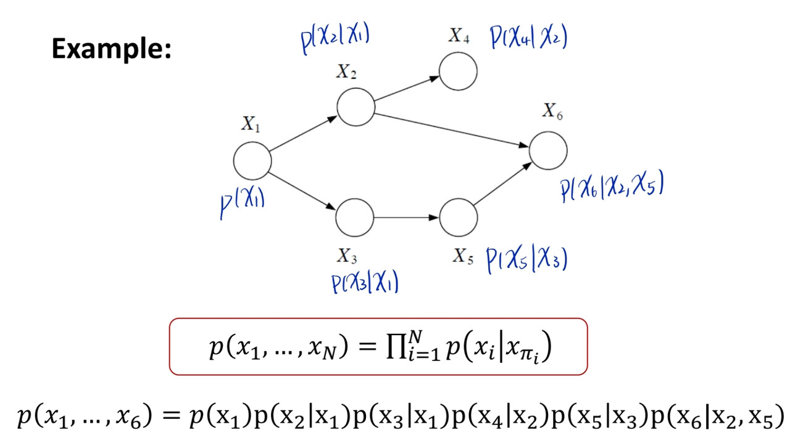
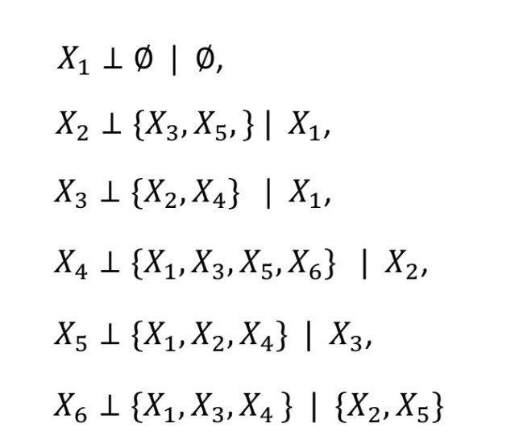
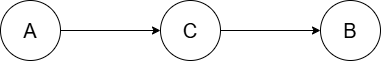
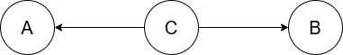
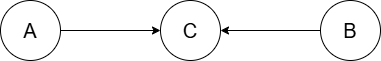
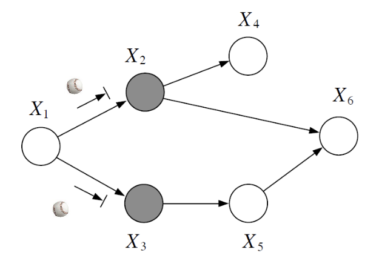
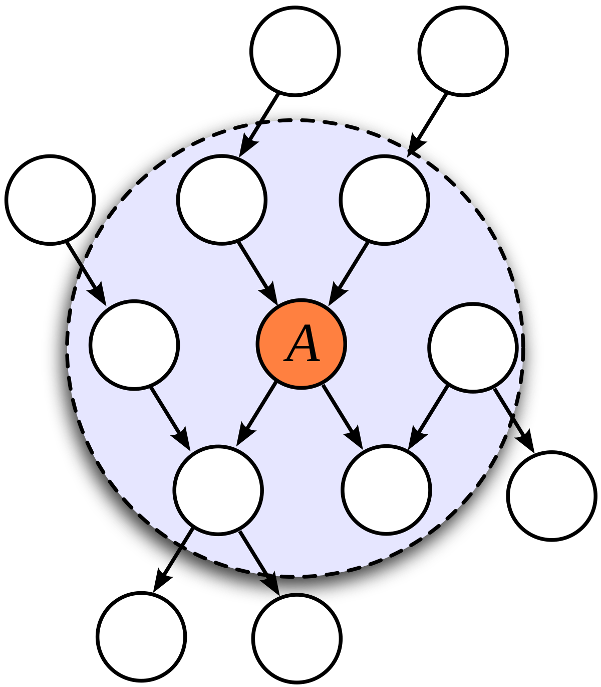

# Conditional Independence

:::Note
Random variables are often NOT fully independence, we use conditional independence to assume an intermediate degree of dependency among the random variables.
:::

- Definition: $x_a ⊥ x_c | x_b$
    - $p(x_a, x_c | x_b) = p(x_a|x_b)p(x_c|x_b)$
    - $p(x_a|x_b,x_c) = p(x_a|x_b)$ (learning the values of $x_c$ does not change the prediction of $x_a$ once we know the value of $x_b$)

## Markov Assumption
- $x_a ⊥ (x_{nonDesc} - x_{parent}) | x_{parent}$
- $x_a$ is dependent only on its parents when given its parents
    
### Parent-child relationship
- $p(x_i | x_{parent}, (x_{nonDesc} - x_{parent}) = p(x_i | x_{parent})$
- 
- 
- by using parent-child relationship to represent  **joint probability ** $p(x_1, x_2, ..., x_n)$, parameter reduce from $O(K^n)$ to $O(K^{m_i + 1})$, where "$m$" is the # of parent of node $x_i$, and "$+1$" is $x_i$ itself

> How can we find conditional independent directly from DGM?

# Three Canonical 3-Node Graph
## Head-to-Tail 

- $p(a,b,c)=p(a)p(c|a)p(b|c)$
- No observation: $p(a,b)=p(a) \sum_c p(c|a)p(b|c)$  
    $= p(a) \sum_c \frac {p(a)p(c|a)p(b|c)}{p(a)} = p(a) \sum_c \frac {p(a,b,c)}{p(a)} = p(b|a) ≠ p(a)p(b)$
- Observe $c$: $p(a,b|c) = \frac {p(a,b,c)}{p(c)} = \frac {p(a)p(c|a)p(b|c)}{p(c)} = \frac {p(c)p(a|c)p(b|c)}{p(c)} = p(a|c)p(b|c)$, therefore $A⊥B|C$

## Tail-to-Tail

- $p(a,b,c) = p(a|c)p(b|c)p(c)$
- No observation: $p(a,b) = \sum_c p(a|c)p(b|c)p(c) ≠ p(a)p(b)$
- Observe $c$: $p(a,b|c) = \frac {p(a|c)p(b|c)p(c)}{p(c)} = p(a|c)p(b|c)$, therefore $A⊥B|C$

## Head-to-Head (V-Structure)

- $p(a,b,c) = p(a)p(b)p(c|a,b)$
- No observation: $p(a,b) = p(a)p(b) \sum_c p(c|a,b) = p(a)p(b)$, therefore $A⊥B$
- Observe $c$: $p(a,b|c) = \frac {p(a)p(b)p(c|a,b)}{p(c)}$

|                         |          **Head-to-Tail**         |         **Tail-to-Tail**        |            **Head-to-Head**            |
|:-----------------------:|:---------------------------------:|:-------------------------------:|:--------------------------------------:|
|    **No observation**   |         $p(a,b)≠p(a)p(b)$         |        $p(a,b)≠p(a)p(b)$        |          **$p(a,b)=p(a)p(b)$**         |
| **Observe middle node** | $p(a,b\|c) = p(a\|c)p(b\|c)$ (CI) | $p(a,b\|c)=p(a\|c)p(b\|c)$ (CI) | $p(a,b\|c)≠p(a\|c)p(b\|c)$ **(No CI)** |

:::Note
If all paths from $A$ to $B$ are blocked by observing $C$, $A$ is **d-seperated** from $B$ by $C$
⇨ $A⊥B|C$
:::

> How do we define "blocked"?

# Bayes Ball Algorithm
- reachability test
- If ball from node $A$ cannot reach $B$ by any path, then $A⊥B|C$, else $A \not\perp B|C$
- 

# Markov Blanket
- Markov Blanket of node {x_i} comprised the set of **parents**, **children** & **co-parents**
- 
