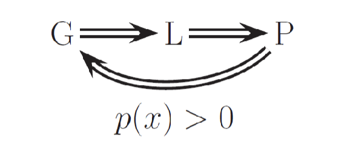
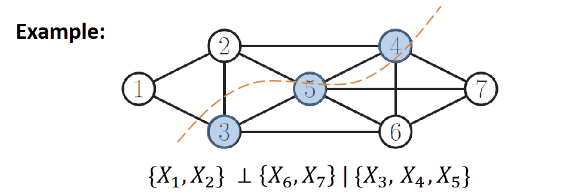
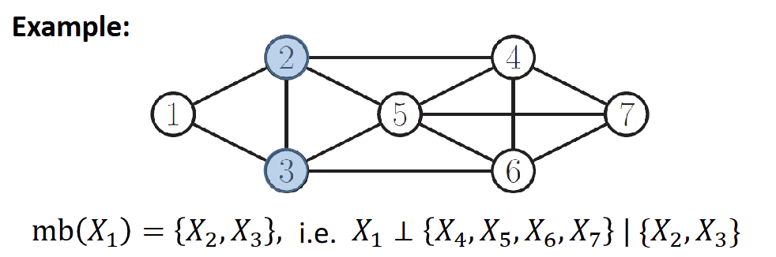
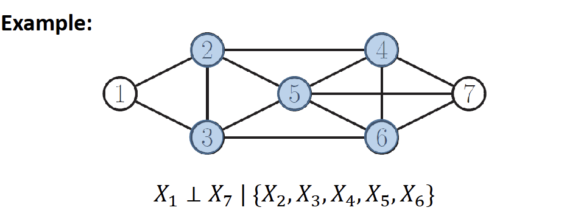

# Conditional Independence
$x_a⊥x_c | x_b ⇨ \begin{cases} p(x_a,x_c|x_b)=p(x_a|x_b)p(x_c|x_b) \\ p(x_a|x_b,x_c) = p(x_a|x_b)\end{cases}$

## 5 Rules of Conditional Independence

### R1 Symmetry: $x⊥y ⇨ y⊥x$

###  R2 Decomposition: $x⊥{A,b} ⇨ x⊥A $ & $x⊥b$
- *pf*:  
    $X⊥{A,B} ⇨ p(X,A,B) = p(X)p(A,B) \\ p(X,A) = \int p(X,A,B)dB = \int p(X)p(A,B)dB \\ = p(X) \int p(A,B)dB = p(X)p(A)$  

### R3 Weak Union: $X⊥{A,B} ⇨ X⊥A|B$ & $X⊥B|A$
- *pf*:
    $X⊥{A,B} ⇨ p(X) = p(X|A,B)$  
    $X⊥{A,B} ⇨ X⊥B$
    $p(X) = p(X|A,B) = p(X|A)$, 
    similar proof with $p(X|B)$

### R4 Contraction: $X⊥A|B$ and $X⊥B ⇨ X⊥{A,B}$
- *pf*:  
    $X⊥A|B$ and $X⊥B ⇨ p(X|A,B)= p(X|B) = p(X) ⇨ X⊥{A,B}$

### R5 Intersection: $X⊥Y|{W,Z}$ and $X⊥W|{Y,Z} ⇨ X⊥ {Y,W}|Z$
- *pf*:
    $X⊥Y|{W,Z} ⇨ p(X|Y,W,Z) = p(X|W,Z)$  
    $X⊥W|{Y,Z} ⇨ p(X|Y,W,Z) = p(X|Y,Z)$  
    $p(X|W,Z) = p(X|Y,Z)$  
    $p(X|Z) = \int p(X.W|Z)dW = \int p(X|W,Z)p(W|Z)dW = p(X|Y,Z \int p(W|Z)dW = p(X|Y,Z)$   
    $p(X|W,Y,Z) = p(X|Y,Z) = p(X|Z) ⇨ X⊥{W,Y}|Z$

# Independence Map (I-Map)
- $I(p)$ represents all independencies in $p(x_1, ..., x_N)$
- $G$ is valid if $I(G) \le I(P)$

# Markov Property

## Global Markov Property
- $x_A ⊥ x_B | x_C$ iff $C$ seperated $A$ from $B$
- 

## Local Markov Property
- $x_S ⊥ V\backslash  \{ mb(x_s), x_s\} | mb(x_s)$, where $mb(x_s)$ is the markov blanket of $x_s$
- 

## Pairwise Markov Property
- $x_s ⊥ x_t | v \backslash \{ x_s, x_t\}$
- $x_s, x_t$ condition independence given the rest if no direct edge between
- 

# Parameterization of MRF
- if $x$ and $y$ are not directed linked $\Rightarrow$ they are conditionally independent  
    $\Rightarrow$ must place $x$ and $y$ in different factors (local functions)
- $𝜓(x_c)$: the local function of maximal clique $c$
- maximal clique: clique that cannot include additional nodes (fully connected subset of nodes)

## Hammersley-Clifford Theorem
- $p(y| \theta) = \frac {1}{Z(\theta)} \prod_c 𝜓_c(y_c| \theta_c$ (product of local function of max cliques)
    - $Z(\theta)$: for normalization (constant)

## Log-Linear Potential Function (Maximum entropy) 
- $log p(y|\theta) = \sum_c \phi_c(y_c)^T \theta_c - log Z(\theta)$ (can reduce parameter)

# Conditional Random Field (Discriminative random field)
- $p(y | x,w) = \frac {1}{Z(x,w)} \prod_c 𝜓_c (y_c |x,w)$
- $ 𝜓_c (y_c |x,w) = \exp (w_c^T \phi (x,y_c)))$