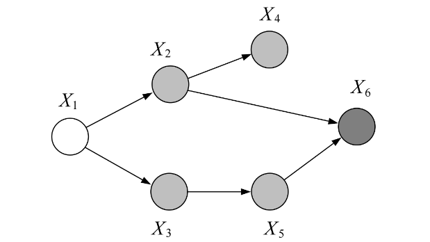
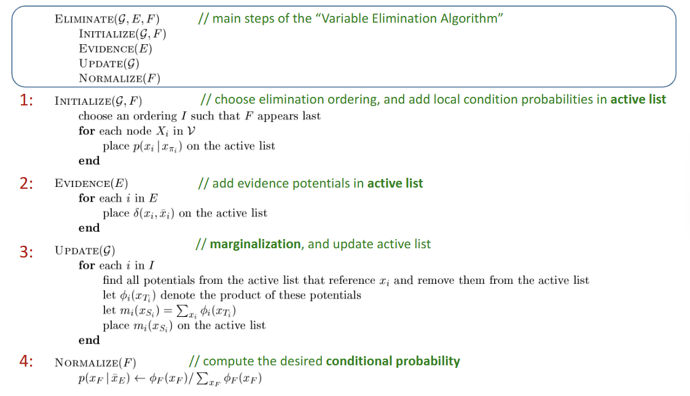
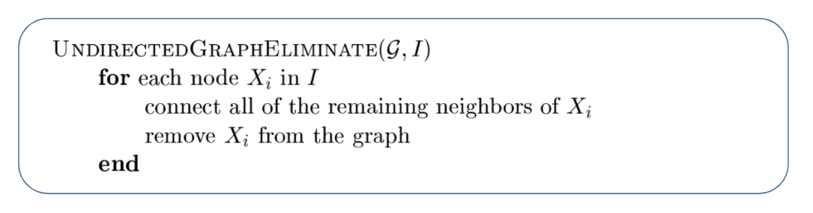
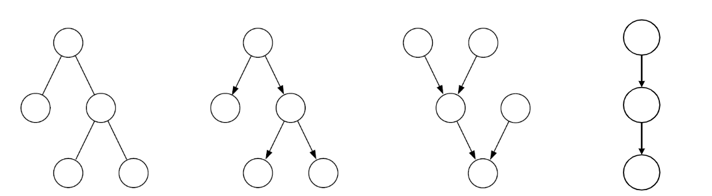
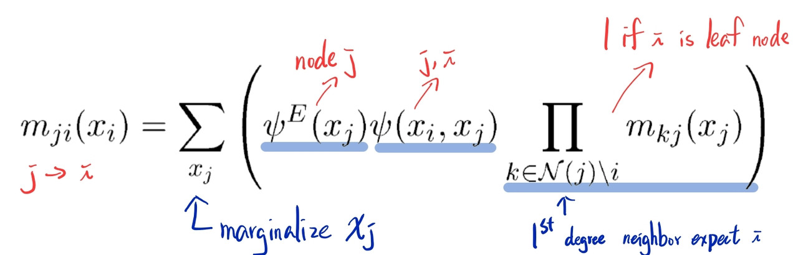
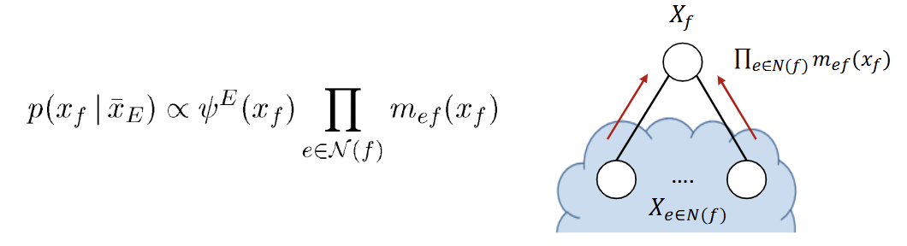
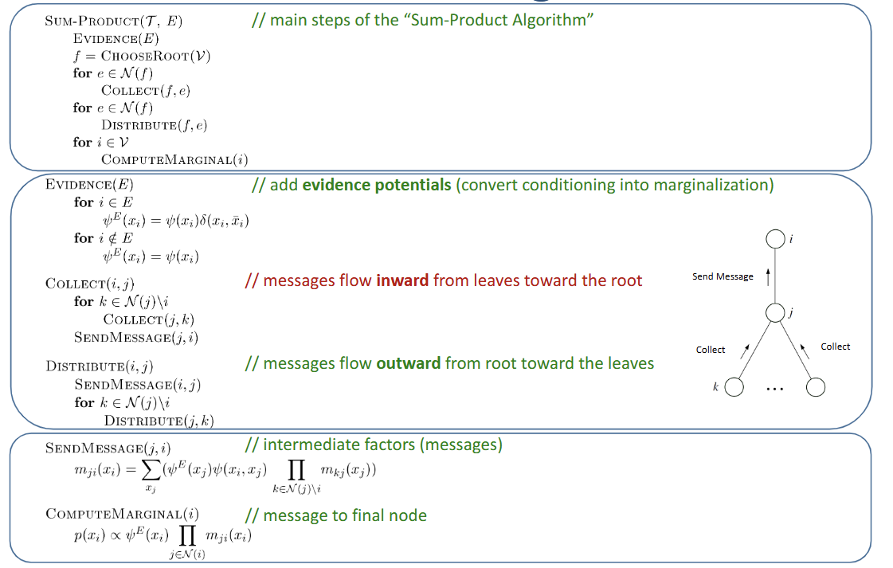
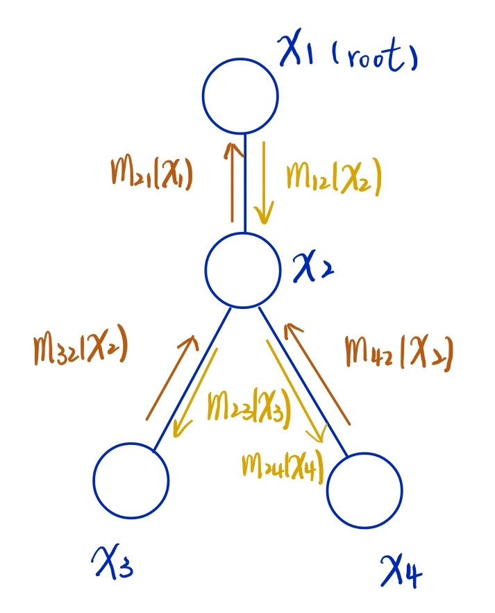

> Goal: To calculate $p(x_F|x_E)$
- where $x_F$, $x_E$ are disjoint subsets
- $x_F$: query node  
  $x_E$: evidence node
- needs to marginalize **all** nuisance variables $x_R$ ($x_V - (x_E, x_F)$)
    - $p(x_F | x_E) = \frac {p(x_F, x_E)} {p(x_E)} = \frac {\sum_{x_R} p(x_f, x_e, x_R)}{\sum_{x_F} p(x_F, x_E)} \Rightarrow O(K^n)$ (exponential, intractable!)
# Variable elimination (the naive way)

- $p(x_1, ..., x_5) = \sum_{x_6} p(x1)p(x_2|x_1)p(x_3|x_1)p(x_4|x_2)p(x_5|x_3)p(x_6|x_3, x_5) \\ = p(x1)p(x_2|x_1)p(x_3|x_1)p(x_4|x_2)p(x_5|x_3) \sum_{x_6} (x_6|x_3, x_5) \Rightarrow$ reduced table size to $K^3$
- When evidence node is observed ($ x_6 = \bar x_6$):  
    - e.g $p(x_6|x_2, x_5) \Rightarrow p(x_6 = 1 | x_2, x_5)$  
      table from 3D ($x_2, x_5, x_6$) to 2D ($x_2, x_5$), $x_6=1$
    - $p(x_1|\bar x_6) = \sum_{x_2} \sum_{x_3} \sum_{x_4} \sum_{x_5} p(x_1)p(x_2|x_1)p(x_3|x_1)p(x_4|x_2)p(x_5|x_3)p(\bar x_6|x_3, x_5) \\ = p(x_1) \sum_{x_2} p(x_2|x_1) \sum_{x_3} p(x_3|x_1) \sum_{x_4} p(x_4|x_2) \sum_{x_5} p(x_5|x_3)p(\bar x_6|x_3, x_5) \\ = p(x_1) \sum_{x_2} p(x_2|x_1) \sum_{x_3} p(x_3|x_1) \sum_{x_4} p(x_4|x_2) \times m_5 (x_2, x_3) \\ = p(x_1) \sum_{x_2} p(x_2|x_1) \sum_{x_3} p(x_3|x_1) m_5 (x_2, x_3) \sum_{x_4} p(x_4|x_2) \\ = p(x_1) \sum_{x_2} p(x_2|x_1) m_4(x_2)\sum_{x_3} p(x_3|x_1) m_5 (x_2, x_3) \\ =  p(x_1) \sum_{x_2} p(x_2|x_1) m_4(x_2) m_3(x_1, x_2) \\ = p(x_1) m_2(x_1) \\ = p(x_1, \bar x_6) \\ \Rightarrow p(x_1 | \bar x_6) = \frac {p(x_1) m_2(x_1)}{\sum_{x_1} p(x_1) m_2 (x_1)}$  
    - $m_i (S_{x_i})$: when performing $\sum_{x_i}$, $x_{s_i}$ are (variables in summand $- x_i$)

:::Note
Conditioning $\Rightarrow$ Marginalization trick for Notation
- evidence potential: $\delta (x_i, \bar x_i) = \begin{cases} 1, if x_i = \bar x_i \\ 0, otherwise \end{cases}$
:::

- $g(\bar x_i) = \sum_{x_i} g(x_i) \delta (x_i, \bar x_i)$
- $\delta (x_E, \bar x_E) = \prod_{i \in E} \delta (x_i, \bar x_i) = \begin{cases} 1, if x_i = \bar x_1 \\ 0, otherwise \end{cases}$

## Algorithm of variable elimination

## Variable elimination algorithm for Undirected Graph
- Only change in **initialize step**
    - local condition (parent-child relation from DGM) $\rightarrow$ potential of $𝜓_{x_c} (x_c)$
- e.g $p(x_1, \bar x_6) = \frac {1}{Z} \sum_{x_2}\sum_{x_3}\sum_{x_4}\sum_{x_5} 𝜓(x_1, x_2) 𝜓(x_1, x_3) 𝜓(x_2, x_4) 𝜓(x_3, x_5) 𝜓(x_2, x_5, x_6) 𝜓(x_6, \bar x_6)$

# Reconstituted graph
- **Eliminate nodes** and **connect its (remaining) neighbors** following the elimination order
- Reconstituted graph: original graph + new added edges
- complexity: the size of the largest clique in reconstructed graph

- Treewidth: smallest overall complexity $-1$ (NP-hard)
  - we want to minimize the cardinality of largest elimination clique

# Moralization
> to trandorm DGM to UGM
- for every node in DGM, link its **parents** together to trandform to UGM
- So, to transfrom DGM to reconstituted graph `DIRECTEDGRAPHELIMINATE`
  - first we moraliza the DGM,
  - then we perform the `UNDIRECTEDGRAPHELIMINATE` algorithm

:::Warning
We need to re-run for every query node to get each singleton conditional probability! Very inefficient!
:::

- Sol: use the **sum-product algorithm** to get all single-node marginals for **tree-like** structures

## Tree-like structures 

  - (a) Undirected tree: no loop
  - (b) Directed tree: 1 single parent per node, moralizations will not add link
  - (c) Polytree: nodes with **more** than 1 parent, moralization will lead to *loops* $\Rightarrow$ cannot perform sum-product algorithm
  - (d) Chain: just another directed tree

## Parameterization
- Undirected tree: only single & pair in cliques
  - $p(x) = \frac {1}{Z} (\prod_{i \in V} 𝜓(x_i) \prod_{(i, j) \in \epsilon} 𝜓(x_i, x_j))$
- Directed tree: simply parent-child relationship
  - $p(x) = p(x_r) \prod_{(i, j) \in \epsilon} p(x_j|x_i)$
    - $p(x_r)$ is the root node
- THey are formally *identical*

## Message-Passing Protocol
- a node can send a message to a neighbor only when it has received messages from all of its other neighbors (subtree), to ensure the messages passed to uppder node is complete.

## Message

## Compute marinal probability

# Sum-Product Algorithm a.k.a Belief Propogation

1. message flow from leaves to root (inward)
2. message flow from root to leaves (outward)

