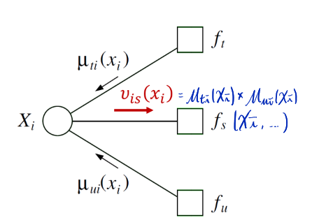

# Factor Graph

- to explicitedly show details of factorization
- **Variable** + **Factor** nodes
- $G(V, F, \epsilon)$
    - $V$: random variable (circle)
    - $F$: factors (square)
    - $\epsilon$: undirected edges, factor to all variable it depends on
- $p(x) = \prod_s f_s(x_s)$

## DGM to factor graph:
- parent-child relationship $p(x_i|x_{\pi_i}) \rightarrow f_s(x_s)$

### UGM to factor graph: 
- $\frac {1}{Z(\theta)} \prod_c 𝜓_c(y_c| \theta_c)$
    - maximum clique $𝜓_c \rightarrow f_s(x_s)$
    - can remove $\frac {1}{Z(\theta)}$ since can define it over empty set of variables

:::note
factor graph representation is not unique
:::
- DGM / UGM with local cycles can become tree
    - therefore can run sum-product algorithm
    

## Sum-Product algorithm on factor graph
- Goal: compute all singleton marginal probability $p(x_i)$
- Message:
    - $v$: variable to factor node
        - $V_{is}(x_i) = \prod_{t \in N(i)-s} \mu_{ti{ (x_i)}} $
        - no marginalization
        
    - $\mu$: factor to variable node
        - $\mu_{si}(x_i) = \sum_{x_{N(s)-i}} f_s(x_{N(s)}) \prod_{j \in N(s)-i} v_{js}(x_j)$
        - should contain only $x_i$, marginaliza away all other nodes
        
    - message from leaf node (Initialization)
        - $v_{is}(x_i)=1$
        - $\mu_{si}(x_i) = f_s(x_s)$
- Marginal probability
    - $p(x_i) \propto \prod_{s \in N(i)} \mu_{si}(x_i) = V_{is}(x_i)\mu_{si}(x_i)$
    

## Maximum a Posterior (MAP) problem
- Goal: to maximize over all sets of random variables
    - find the maximal probability
    - find the configuration
- $max_x p(x|\bar x_E) = max_x \frac {p(x, \bar x_E)}{p(\bar x_E)}$ ($p(\bar x_E)$ can be removed)  
    $= max_x p(x|\bar x_E) = max_x p(x) \delta(x_E, \bar x_E) \\ = max_x p(x)^E$

:::Caution
Underflow problem: prodects of $0.x \rightarrow 0$
:::
- Solution: **log scale**, $max_x p(x)^E = max_x log p(x)^E$  
    $\times \Rightarrow +$ (becomes Max-Sum algorithm)
## Max-Product Algorithm
> Or Max-Sum algorithm if using log scale
- similar to Sum-Product algorithm
- inward message
    - $m_{ji}^{max}(x_i) = max_{x_j}(𝜓^E(x_j)𝜓(x_i,x_j) \prod_{k \in {N(j)-i}} m_{kj}^{max}(x_j))$
    
- $max_x p^E(x) = max_{x_i} (𝜓^E(x_f) \prod_{w \in N(f)} m_{ef}^{max} (x_f))$
### Getting the configurations
- also record max configuration per inward message
- track the configurations from root as outward process
- Trellis diagram

# Junction Tree (Clique Tree)
- Probability distributions of a loopy undirected graph can be re-parameterizes as trees $\Rightarrow$ can perform Sum-Product algorithm
- Cluster graph $\overset{no\ cycle}{\rightarrow}$ Cluster tree $\overset{running\ intersection\ property}{\rightarrow}$ Junction tree
    - Cluster graph
        - cluster nodes $C_i \subset \{ x_1, ... x_n\}$
        edges between $C_i, C_j\ \Rightarrow $ sepset (intersection) $S_{ij} = C_i \cap C_j$
    - Family preservation: each potential $𝜓_k$ is assigned to a cluster $C_{\alpha (k)}$ such that $Scope[𝜓_k] \subset C_{\alpha (k)}$ 
    - Cluster potential: $\phi_j (C_j) = \prod_{𝜓: \alpha(𝜓)=j}𝜓$
        - ensure each $𝜓$ is used **once and only once**
- Running intersection property
    - for each pair of clusters $C_i, C_j$ and $X \in C_i \cap C_j$, there exists an unique path between $C_i, C_j$ fpr which all clusters and sepset contain $X$
    - a.k.a for any $X$, the set of clusters & sepsets containing $X$ form a tree.
    - If fulfilled by cluster tree, it is a junction tree
> what can junstion tree do?
- Marginal probability on junction tree
    1. choose root clique
    2. inward message
    3. outward message
    - messages: $\delta_{i \rightarrow j} = \sum_{C_i - S_{ij}} \phi_i \prod_{k \in N(x)-j} \delta_{k \rightarrow i}$
        - $C_i - S_{ij}$: random variable that are in $C_i$ but not in $C_j$, need to marginalize out
        - $S_{ij}$: common random variables in both $C_i$ & $C_j$
    - $p(C_i) \propto \phi_i \prod_{k \in N(i)} \delta_{k \rightarrow i}$

## Constructing Junction tree
1. Triangulation: get reconstitution graph
    - DAG to UAG to reconstitution graph
    
2. Get all clusters and all possible sepsets 
    
3. Assign cluster potentials
    
4. Get junction tree
    - find the **maximum spanning tree** with weight $=$ cardinality of sepsets

    :::Tip
    A cluster tree is a junction tree only if it is a maximum spanning tree
    :::
     
