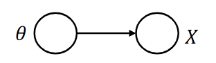
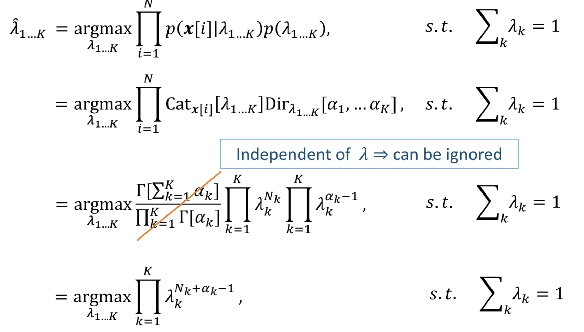
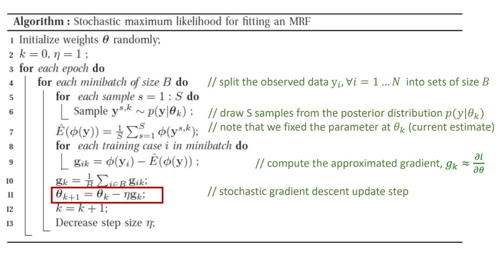
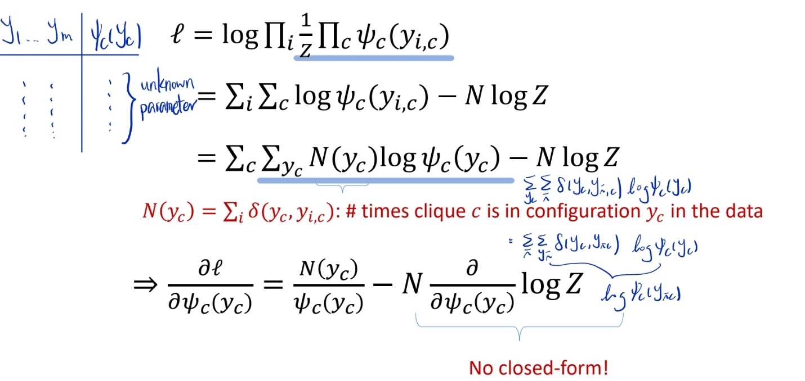
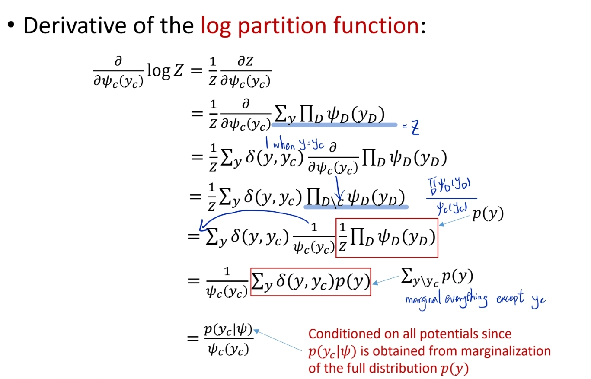
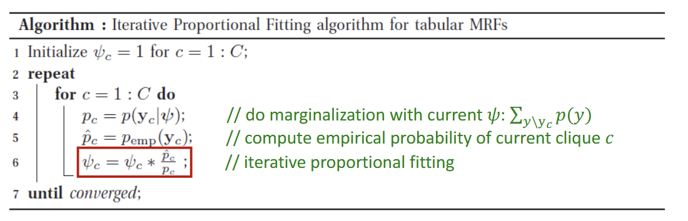
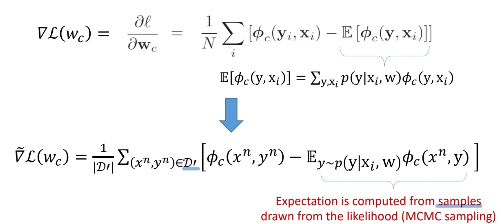
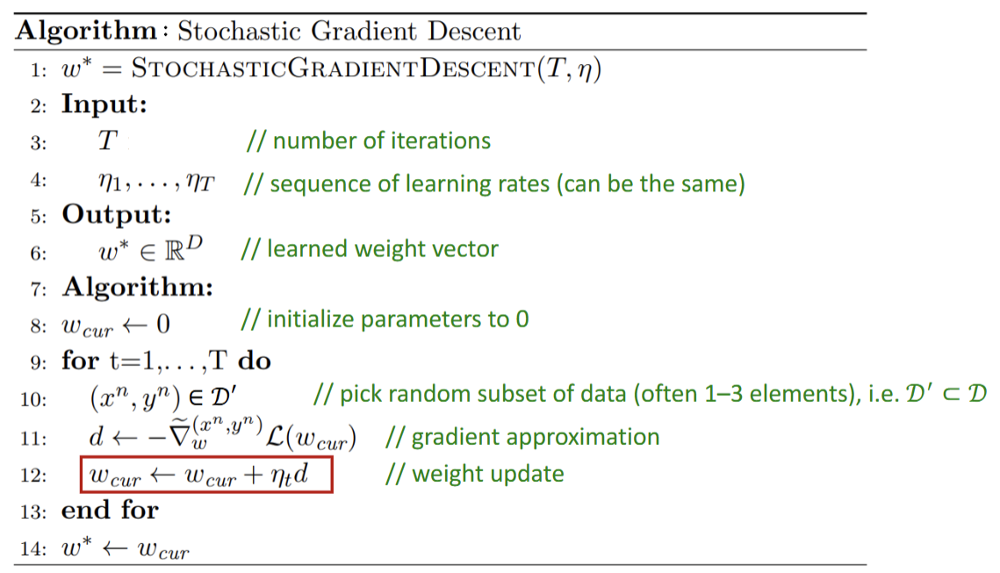

- Goal: How to get unknown parameter $\theta$ of $p(x_1, ..., x_M | \theta)$ from *fully observed* data ($x_1, ... ,x_M$ are observed (known))?

- Given: a set of $N$ *independent and identically distributed* (i.i.d) complete observation of each random variable $X: \{ x_{1,1}, ... x_{1,N}, ...x_{M,1}, ..., x_{M,N}\}$
    - $M$ random variables, each observe $N$ times
- Method:
    1. Maximum likelihood estimate (MLE)
    2. Maximum a posteriori (MAP)

# Maximum Likelihood Estimate (MLE)
> find the unknown parameters $\theta$ that maximize the *likelihood* $p(x_1, ..., x_M| \theta)$
- $\hat \theta = argmax_\theta [p(x_1, ..., x_M| \theta)] $  
    $= argmax_\theta [\prod_{i=1}^N p(x_{1,i}, ... x_{M,i} | \theta)]$ (i.i.d)  
    - $\prod_{i=1}^N p(x_{1,i}, ... x_{M,i} | \theta) = p(x_{1,1}, ... x_{M,1} | \theta) \times p(x_{1,2}, ... x_{M,2} | \theta) \times ... \times p(x_{1,N}, ... x_{M,N} | \theta) $   
    can do this because each set of observed random variable is independent of each other

# Maximum a Posteriori (MAP)
> find the unknown parameters $\theta$ that maximize the *a posterior* probability $p(\theta | x_1, ..., x_M)$
- $\hat \theta = argmax_\theta [p(\theta | x_1, ... x_M)] \\ = argmax_\theta [\frac {p(x_1, ...x_M| \theta)p(\theta)}{p(x_1, ...x_M)}]$ (Baye's rule)  
$= argmax_\theta [\frac {\prod_{i=1}^N p(x_{1,i}, ..., x_{m,i} | \theta) [(\theta)]}{\cancel{p(x_1, ..., x_M)}}]$ 
    ($p(x_1, ..., x_M)$ can be removed because it is independent of $\theta$)  
$= argmax_\theta [\prod_{i=1}^N p(x_{1,i}, ..., x_{M,i} | \theta)p(\theta)]]$

# Example: Single Random Variable DGM

## Continuous DGM
- Univariate Normal Distribution
    - $p(x|\theta) = Norm_x [\mu, \sigma^2] = \frac{1}{\sqrt {2 \pi \sigma^2}} e^{- \frac {(x-\mu)^2}{2 \sigma^2}}$
    - goal is to find the two unknown parameters $\theta = (\mu, \sigma^2)$

- **M1: Maximum Likelihood Estimation (MLE)**
    - $\hat \theta = argmax_\theta [p(x\ theta)] \\ = argmax_\theta [\prod_{i=1}^N p(x[i] | \theta)]$
    - $p(x| \theta) = p(x| \mu, \sigma^2) = \prod_{i=1}^N Norm_{x[i]} [\mu, \sigma^2]$
    - maximize the **logarithm**
        - $\hat \mu, \hat \sigma^2 = argmax_{\mu, \sigma^2} \sum_{i=1}^N log[Norm_{x[i]}[\mu, \sigma^2]] \\ = argmax_{\mu, \sigma^2}[-0.5N log[2\pi] - 0.5Nlog \sigma^2 - 0.5\sum_{i=1}^N \frac {(x[i]-\mu)^2}{\sigma^2}]$
        - $\frac {\partial L}{\partial \mu} = \sum_{i=1}^N \frac {(x[i]-\mu)^2}{\sigma^2} = \frac{\sum_{i=1}^N x[i]}{\sigma^2} - \frac {N \mu}{\sigma^2}= 0$ (set to $0$)
        - $\frac {\partial L}{\partial \sigma^2} = - \frac{N}{\sigma^2} + \sum_{i=1}^N \frac{(x[i]-\mu)^2}{\sigma^4} = 0$
        - we get $\hat \mu = \frac {\sum_{i=1}^N x[i]}{N} = \bar x$, $\hat \sigma^2 = \frac {\sum_{i=1}^N (x[i] - \mu)^2}{N}$
    - Maximum likelihood for the normal distribution gives **least squares** fitting
        - $\hat \mu = argmax_\mu -\sum_{i=1}^N (x[i] - \mu)^2 = argmin_\mu \sum_{i=1}^N (x[i] - \mu)^2$
- **M2: Maximum a Posteriori (MAP)**
    - $\hat \theta = argmax_\theta [\prod_{i=1}^N p(x[i]|\theta)p(\theta)]$
        - $p(x[i]|\theta)$: likelihood, univariate normal distribution
            - $p(x|\mu, \sigma^2) = \prod_{i=1}^N Norm_{x[i]} [\mu, \sigma^2]$
        - $p(\theta)$: prior, conjugate prior, normal inverse gamma distribution
            - $p(\mu, sigma^2) = NormInvGam_{\mu, \sigma^2}[\alpha, \beta, \gamma, \delta]$
    - $\hat \mu, \hat \sigma^2 = argmax_{\mu, \sigma^2} [\prod_{i=1}^N Norm_{x[i]} [\mu, \sigma^2] NormInvGam_{\mu, \sigma^2}[\alpha, \beta, \gamma, \delta]]$
    - Maximize the logarithm
        - $\hat \mu, \hat \sigma^2 = argmax_{\mu, \sigma^2} [\sum_{i=1}^N log [Norm_{x[i]} [\mu, \sigma^2]] + log[ NormInvGam_{\mu, \sigma^2}[\alpha, \beta, \gamma, \delta]]$
    - Take the derivatives of $\mu$ and $\sigma^2$ and set to $0$
## Discrete DGM
- $p(X=e_k|\theta) = Cat_x[\lambda] = \prod_{k=1}^K \lambda_k^{x_k} = \lambda_k$
    - $k$ parameters (categories)
- Goal: find the $K$ unknown parameters $\theta = \{ \lambda_1, ..., \lambda_K \}$ where $\lambda_k \in [0,1]$ and $\sum_k \lambda_k = 1$
- **M1: Maximum Likelihood Estimation (MLE)**
    - $\hat \theta = argmax_\theta [p(x|\theta)] = argmax_\theta[\prod_{i=1}^N p(x[i]|theta)]$
    - $p(x\ lambda) = \prod_{i=1}^N Cat_{x[i]} [\lambda_{1...K}] = \prod_{i=1}^N \prod_{k=1}^K \lambda_k^{x_{ik}}$
    - 
    - apply the Lagrange multipier $v$ on the constraint, we get $L = \sum_{k=1}^K N_k log[\lambda_k] + v (\sum_{k=1}^K \lambda_k-1)$
    - take the derivative of $L$ w.r.t $\lambda_k$ and $v$ and set to $0$, solve for $\lambda_k$
- **M2: Maximum a Posteriori (MAP)**
    - Likelihood $[(x|\lambda)$: categorical distribution
    - Prior: Dirichlet distribution
        - $p(\lambda_1, ..., \lambda_K) = Dir_{\lambda_{1...K}} [\alpha_1, ...\ \alpha_K]$
    - 
    - apply the Lagrange multiplier $v$ on the constraint, we get $L = \sum_{k=1}^K (N_k + \alpha_k -1) log \lambda_k + v (\sum_{k=1}^K \lambda_k -1)$
    - take the derivative of $L$ w.r.t $\lambda_k$ and $v$ and set to $0$, solve for $\lambda_k$

# Parameter Learning in UGM (MRF)
- for example, a MRF in log-linear form
    - $p(y| \theta) = \frac{1}{Z(\theta)}e^{\sum_c \theta_c^T ø_c(y)}$
    - scaled log-likelihood: $l(\theta) = \frac{1}{N} \sum_i^N log p(y_i|\theta) = \frac {1}{N} \sum_i^N [\sum_c \theta_c^T ø_c(y_i) - log Z(\theta)]$
- Since MRFs are in the exponential family, this function is convex in $\theta$
    - it has a unique global maximum, we can use the gradient-based optimizers
- the derivative of the log partition function w.r.t $\theta_c$ is the expectation of the $c^{th}$ feature under the model
    - $\frac {\partial log Z(\theta)}{\partial \theta_c} = E[ø_c(y)|\theta] = \sum_y ø_c(y) p(y|\theta)$
    - gradient of the log-likelihood is $\frac {\partial l}{\partial \theta_c} = \frac{1}{N} \sum_i^N ø_c(y_i) - E[ø_c(y)] = 0$
        $= E_{p_{emp}} [ø_c(y)] - E_{p(y|\theta)}[ø_c(y)] = 0$
        but cannot be evaluated in closed form
    - Sol: use gradient-based optimizers + approximate inference
- **M1: Stochastic Maximum Likelihood**
    - stochastic gradient descent method
    - iteratively update the parmeter $\theta_{k+1}$ at the $k$ step
        - $\theta_{k+1} \leftarrow \theta_k - \eta g_k$
    - 
- **M2: Iterative Proportional Fitting (IFP)**
    - alternative derivation of the gradient in term of $\psi_c(y_c)$  
    
    
    
# Parameter learning in UGM (CRF)
- scaled log-likelihood: $l(w) = \frac{1}{N} \sum_i^N log p(y_i|x_i,w) = \frac{1}{N} \sum_i^N [\sum_c w_c^T ø_c(y_i,x_i) - log Z(w,x_i)]$
- gradients: $\frac {\partial l}{\partial w_c} = \frac {1} {N} \sum_i^N [ø_c(y_i, x_i) - E[ø_c(y, x_i)]]$
- approximate the gradient with MCMC samples  
- 
- we can also do a **MAP** estimation of the unknown parameter in CRF
    - $argmax_w[\sum_i log p(y_i|x_i, w) + log p(w)]$
    - Gaussian prior is often userd for $p(w)$
