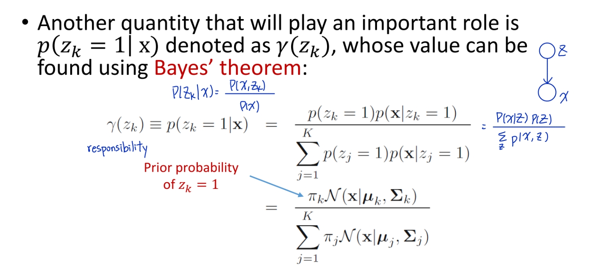

# Motivation
- How to find unknown parameters of clusters in unsupervised learning?
- Which cluster does each data belong to?

# K- Means Algorithm
> Non-probabilistic, 100% assign to that single cluster

- Given:
    - data set $\{ x_1, ...x_N \}$
    - number of clusters $K$
- Find:
    - $K$ cluster centers $\{ \mu_1, ..., \mu_K \}$
    - assign each data $x$ to a cluster center

## 1-of-K coding:
- for each data $x_n$, $r_{nk} \in {0, 1} \ s.t \sum_K r_{nk} = 1$
    - if data $x_n$ is in cluster $k$, then $r_{nk} = 1$, otherwise $0$.
    - Hard assignment
    - each data is assigned to only 1 cluster
- goal is to minimize $J=\sum_N \sum_K r_{nk} ||x_n-\mu_k||^2 \ \ s.t \sum_k r_{nk}=1$

## Algorithm:
1. **Initialization**: randomly choose $\{ \mu_k\}$
2. **Assignment**: fixed $\{ \mu_k\}$, minimize $J$ w.r.t $\{ r_{nk} \}$
    - $argmin_{r_n} \sum_K r_{nk} ||x_n - \mu_k||^2 \ \ s.t \sum_k r_{nk} = 1$
3. **Update**: fixed $\{ r_{nk} \}$, minimize $J$ w.r.t $\{ \mu_k\}$
    - $\frac {\partial J}{\partial \mu_k} = 2 \sum_N r_{nk} (x_n - \mu_k) = 0$
    - $\mu_k = \frac {\sum_N r_{nk} x_n}{\sum_N r_{nk}}$ (mean of all points assigned to cluster $k$)
- Repeat step 2 and 3 until converge

> Can we use probability to assign? (Soft assignment)

# Probabilistic Approach

## Gaussian Mixture Model 
- linear superposition of multiple Gaussians
- probability distribution:
    - $p(x) = \sum_K \pi_K N(x| \mu_K, \sum_K)$ ($K$ Gaussians)
        - $\mu_K$: mean 
        - $\sum_K$: covariance
        - $\sum_K \pi_K = 1$: mixing coefficient (weight of each Gaussians in the model)
    - 1-of-K representation: $Z_K = 1 \Rightarrow Z_{j \neq k} = 0$
        - assignment of $x$ to $k^{th}$ Gaussian
        - $Z_K \in \{ 0, 1 \}, \ \sum_K Z_K = 1$
    - $p(z)$ is categorical distribution
        - $p(z) \ \prod_K \pi_K^{Z_k} = cat_Z[\pi]$
            - if $Z_k = 1$ ($Z$ is in $k^{th}$ Gaussian), $\pi_K^{Z_k} = \pi_K, \ 0$ otherwise
            - $0 \leq \pi_k \leq 1, \sum_K \pi_K = 1$
    - probability of $x$ belonging to each distribution
        - $p(x | z_k = 1) = N(x | \mu_k, \sum_k)$  
          $\Rightarrow p(x|Z) = \prod_K N(x | \mu_k, \sum_k)^{Z_k}$
        - $p(x,z) = p(z)p(x|z)$   
          $\Rightarrow p(x) = \sum_K p(z)p(x|z) = \sum_K \prod_K \pi_K^{Z_k} N(x| \mu_K, \sum_K)^{Z_k} = \sum_K \pi_K N(x| \mu_K, \sum_K)$
- **Responsibility**
 
### Maximum log-likelihood
- we try to get the partial derivative w.r.t $\mu_k, \sum_k, \pi_k$
- $argmax_\theta ln p(x_1, ..., x_N| \theta) = argmax_{\pi, \nu, \sum} \sum_N ln \sum_K \pi_K N(x_n | \mu_k, \sum_k)$, $\sum$ is inside $ln \ \Rightarrow$ no closed-form

## EM for Gaussian Mixtures
- $\theta = {\pi_k, \mu_k, \sum_k}$
1. **Initialize** $\pi_k, \mu_k, \sum_k$
2. **Expectation** step: evaluate responsibilies $r(Z)$  
    - $r(Z_{nk}) = \frac {\pi_k N(x_n | \mu_k, \sum_k)}{\sum_k \pi_k N(x_n | \mu_k, \sum_k)}$
3. **Maximization** step: update $\pi_k, \mu_k, \sum_k$
    - $\mu_k = \frac {1}{N_k} \sum_N r(Z_{nk})x_n$
    - $\sum_k = \frac {1}{N_k} \sum_N r(Z_{nk}) (x_n - \mu_k)(x_n - \mu_k)^T$
    - $\pi_k = \frac {N_k}{N}$
    - where $N_k = \sum_N r(Z_{nk})$
4. **Evaluate** log-likelihood
    - $ln \ p(x| \mu, \sum, \pi) = \sum_N ln (\sum_K \pi_K N(x_n | \mu_n, \sum_n))$
    - check for convergence
- Can run K_Means before initializing for EM algorithm

# General EM algorithm
- **Goal**: find maximum likelihood solution for models with latent variables
    - $ln \ p(x|\theta) = ln (\sum_Z p(x,Z| \theta))$
    - no closed form
- we don't have complete $\{ X,Z \}$, we can consider maximize the expected value of $p(x, z|\theta)$ w.r.t $p(z|x, \theta)$

1. **Initialize** $\mu, \sum, \pi$
2. **Expectation step**
    - Expectation $Q(\theta, \theta_{old}) = \sum_Z p(z| x, \theta_{old}) ln \ p(x, z| \theta) = e_{z | x, \theta_{old}}[ln \ p(x, z | \theta)]$
3. **Mazimization step**
    - $\theta_{new} = argmax_\theta Q(\theta, \theta_{old}) = argmax_\theta \sum_Z p(Z|x, \theta_{old}) ln \ p(x, Z| theta)$
    - log is now insize $\sum \ \Rightarrow$ closed form
4. **Check for convergence** of either log likelihood or parameter value
    - $\theta_{old} \leftarrow \theta_{new}$

# Theory behind EM algorithm
- maximize $ln \ p(x| \theta) = ln \sum_Z p(x, z| \theta)$ is difficult, we can maximize its lower bound $L(q, \theta)$ instead
- $ln p(x| \theta) = L(q, \theta) + KL (q || p) $ where 
    - $L(q, \theta) = \sum_Z q(z) ln \frac {p(x,z |theta)}{q(z)}$
    - $KL(q || p) = - \sum_Z q(Z) ln \frac {p(z|x, \theta)}{q(z)} \geq 0$

    

