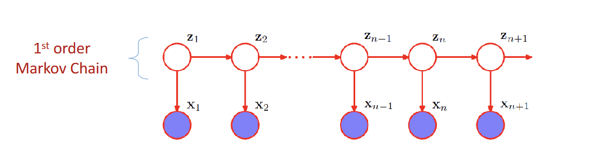

# HMM
- an extension of mixture model
- choice of mixture component depends on the previous observation
- latent variables $\{ Z_1, ..., Z_{n-1}, Z_n, ... \}$ form a Markov Chain, where the current state $Z_n$ is dependent on the previous state $Z_{n-1}$
    - $Z_{n+1} \perp Z_{n-1} | Z_n$
    
    - $p(x_1, ..., x_N, Z_1, ... Z_N) = p(Z_1) \prod_{n=2}^N p(Z_n|Z_{n-1}) \prod_{n=1}^N p(X_n|Z_n)$

## Transition probabilities
- 1-of-K coding
- describe which component of the mixture model is responsible for generating the corresponding $x_n$
- $Z_n \in {0, 1}^K$, $p(Z_n | Z_{n-1})$ is a $K \times K$ matrix. ($A$)
- $A_{jk} = p(Z_{n,k} = 1| Z_{n-1, j}=1)$
    - $A_{jk}$: state $j$ to state $k$
    - $Z_{n,k}=1$: $Z_n$ is state $k$
    - $Z_{n-1, j}=1$: $Z_{n-1}$ is state $j$
    - $0 \leq A_{jk} \leq 1, \ \sum_K A_{jk}=1$
- $p(Z_n|Z_{n-1},A) = \prod_{k=1}^K \prod_{j=1}^K A_{jk}^{Z_{n-1,j} \times Z_{n,k}}$
    - $Z_n$ is state $k$ and $Z_{n-1}$ is state $j$
- $p(Z_1 | \pi) = \prod_{k=1}^K \pi_k^{Z_1,k}$ where $\sum_K \pi_k = 1$
    - $\pi_k$: probability of categorical distribution

## Emission probability 
- $p(X_n | Z_n, \phi)$
    - $\phi$: parameters governing the distribution
    - $p(x_n | Z_n, \phi) = \prod_{k=1}^K p(x_n| \phi)^Z_{nk}$
        - $Z_n$ is $k$ state, only one $Z_{nk}$ will be 1

## Homogeneous Model
- all conditional distributions governing latent variables share the same parameters $A$
- all emission distributions share the same parameters $\phi$

# Maximum likelihood
- now we want to find the maximum likelihood $p(x| \theta) = \sum_Z p(x,z| \theta)$
- NO closed-form solutions
- $\Rightarrow$ use EM algorithm

# EM algorithm on HMM
1. **Initialization** of parameters $\theta^{old}$
2. **E-step**: find $Q(\theta, \theta^{old}) = \sum_Z p(z| x, \theta^{old}) ln \ p(x, z| \theta)$
    - we define:
        - $r(z_n) = p(z_n | x, \theta^{old})$
        - $r(z_{nk})$: conditional probability of $z_{nk} = 1$
            - $= E[z_{nk}] = \sum_{z_n} r(z_n)z_{nk}$ 
            - $z_{nk}=1$ when $k=k$
        - $\xi(z_{n-1}, z_n) = p(z_{n-1}, z_n | x, \theta^{old})$
        - $\xi(z_{n-1,j}, z_{n,k}) = E[z_{n-1,j}, z_{n,k}]= \sum_{z_{n-1}, z_n} \xi(z_{n-1}, z_n) z_{n-1,j} z_{n,k}$
    - our goal is to compute 
        - therefore to find $r(z_n)$ and $\xi(z_{n-1,j},z_{n,k})$
        - 
        - 
    - using the **Forward-Backward algorithm** to find $\alpha$ and $\beta$
    - $\alpha(z_n) = p(x_n|z_n) \sum_{z_{n-1}} \alpha(z_{n-1}) p(z_n|z_{n-1}$
    - $\beta(z_n) = \sum_{z_{n-1}} \beta(z_n+1) p(x_{n+1}|z_{n+1} p(z_{n+1} |z_n)$
    - $\alpha(z_{1,k})$ for $k=1, ... ,K$ $=\pi_k p(x_1 | \phi_k)$
    - $\beta(z_n) =1$
3. **M-step**: maximize $Q(\theta, \theta^{old})$ w.r.t $\theta = \{ \pi, A, \phi \}$
    - $\pi_k = \frac {r(z_{1k})}{\sum_{j=1}^K r(z_{1j})}$
    - $A_{jk} = \frac {\sum_{n=2}^N \xi(z_{n-1,j}, z_{n,k})}{\sum_{l=1}^K} \sum_{n=2}^N \xi(z_{n-1,j} z_{n,l})$

# Scaling Factor (for normalization)
- values of $\alpha(z_n)$ can go to $0$ exponentially quickly
- $\hat \alpha(z_n) = p(z_n| x_1, ..., x_N) = \frac {\alpha(z_n)}{p(x_1,..., x_N)} = \frac {\alpha(z_n)}{C_n}$
    - $C_n = p(x_1,..., x_N)$
- $\hat \beta(z_n) = \frac {\beta(z_n)}{C_{n+1}}$
- $\Rightarrow$
    - $r(z_n) = \hat \alpha(z_n) \hat \beta(z_n)$
    - $\xi(z_{n-1}, z_n) = C_n^{-1} \hat \alpha(z_{n-1}) p(x_n | z_n) p(z_n | z_{n-1}) \hat \beta(z_n)$

# Viterbi Algorithm
- simply the max-sum algorithm performed on HMM
