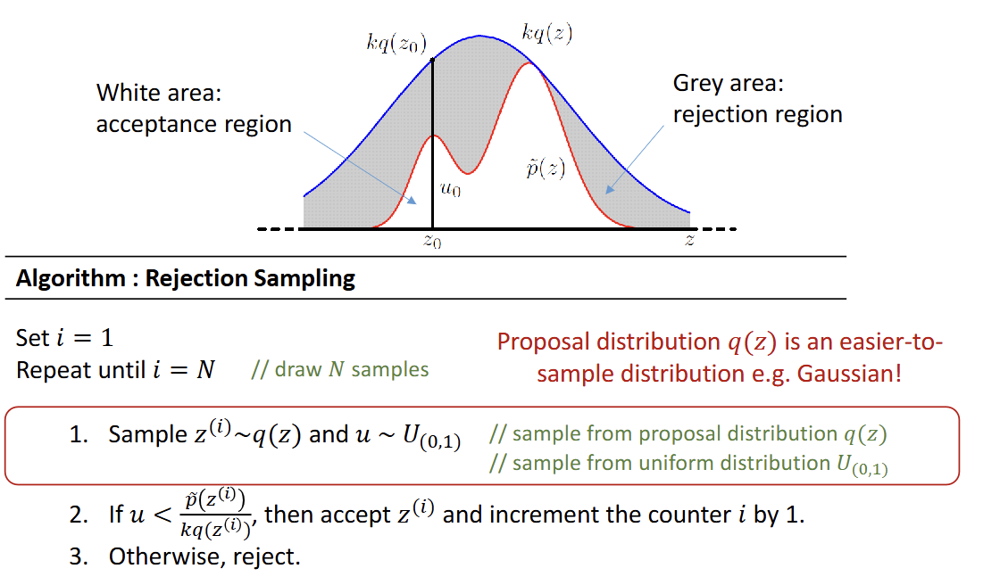
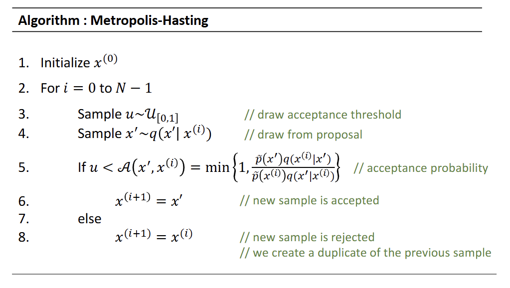
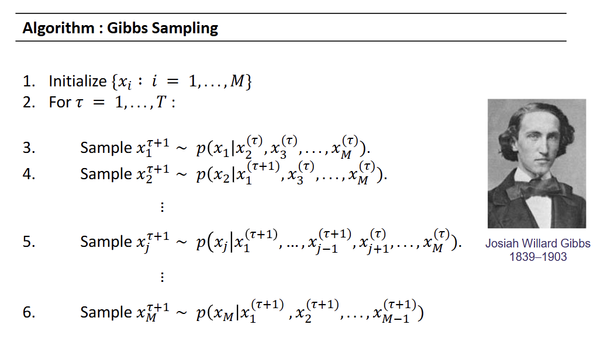

# Motivation
> intractable integration problems
- Normalization: $p(x|y) = \frac {p(y|x)p(x)}{\int_x p(y|x')p(x')dx'}$
    - $\int_x p(y|x')p(x')dx'$ is intractable to compute in high dimension
- Marinalization: $p(x|y) = \int_z p(x, z|y)dz$
- Expectation: $E_{p(x|y)}[f(x)] = \int_x f(x)p(x|y)dx$

# Weak law of large numbers
- $\bar x_n \xrightarrow p \mu$ when $n \rightarrow \infty$
    - $\bar x_n$: sample average $= \frac {1}{n} \sum_n x_n$
    - $\mu$: real average $= \int x p(x) dx$

# Strong law of large numbers
- $\bar x_n \xrightarrow {a.s \ (converges)} \mu$ when $n \rightarrow \infty$
    - $\bar x_n$: sample average $= \frac {1}{n} \sum_n x_n$
    - $\mu$: real average $= \int x p(x) dx$
# Non parametric representation
- represent with drawing samples
- the higher probability of an interval, the more samples are drawn in the intervalf

# Rejection Sampling

- $\tilde p(z)$: target
- $\tilde q(z)$: proposal
- set $k$ so that $k \tilde q(z) \geq \tilde p(z)$

## Limitation
- not always possible for $k$ to cover all $\tilde p(z)$
- if $k$ too large, probability of $z$ is accepted $= Pr(u < \frac {\tilde p(z)}{k \tilde q(z)}) = \frac {1}{k}$

# Importance Sampling
- approximating expectations of a function $f(z)$ w.r.t $p(z)$ (target) samples from $q(z)$ (proposal)
- $E[f] = \int f(z)p(z) dz = \int f(z) \frac {p(z)}{q(z)} q(z) dz \approx \frac {1}{L} \sum{L} \frac {q(z^l)}{p(z^l)} f(z^l)$
- therefore importance weight $r_l = \frac {p(z^l)}{q(z^l)}$
- but $p(z^l)$ is hard to get , $\tilde p(z^l)$ is easy to get (unnormalized) 
- $\Rightarrow E[f] = \frac {Z_q}{Z_p} \frac {1}{L} \sum_l^L \tilde r_l f(z^l)$, $\tilde r_l = \frac {\tilde p(z^l)}{\tilde q(z^l)}$
- $Rightarrow E[f] = \sum_l^L w_l f(z^l)$, $w_l = \frac {\frac {\tilde p(z^l)}{q(z^l)}}{\sum_m \frac {p(z^m)}{q(z^m)}}$ 

## Limitation
- not able to cover everything in the target distribution
- weight may be dominated by a few having large numbers

# Ancestral Sampling
- all weights $=1$
- starts with root nodes (easy to sample)
- troublesome if loop $\rightarrow$ randomly initialize, but may not converge

# MCMC
- spend more time in the most important regions.
- use adaptive proposals: use $q(x'|x)$ instead of $q(x')$
    - $x$: the previous sample
    - $x'$: the new sample
- 

## Burn-In period
- initial samples may be useles
- discard the first few samples (e.g 1000)

# Markov Chain properties
1. Homogeneous: fixed transition matrix
2. Stationary & limiting distribution: $\pi T = \pi$ (will eventually converge)
3. Irreducibility: at any state, there's a probability $>0$ to visit all other states (will not get stuck at a state)
4. Aperiodicity: won't get trapped in a cycle
5. Ergodic: Irreducibility + Aperiodicity. MCMC algorithms must satisfy ergodic
6. Detailed balance (Reversibility): $\pi_a T_{ab} = \pi_b T_{ba}$
- Metropolis-Hasting works because it satisfies detailed balance

# Metropolis Algorithm
- a special case of the Metropolis-Hasting 
- random walk
- acceptance probability $AA(x',x) = min \{1, \frac {\tilde p(x')}{\tilde p(x)} \}$

# Gibbs Sampling
- a special case of the Metropolis-Hasting 
- acceptance probability is always **1**
- 
- condition on all other nodes
- use Markov Blanket (parents, childrens & co-parents) or $1^{st}$ degree neighbor for MRF

# After we have samples:
- $P(B)$: count # of $B=0$ and $B=1$
- becomes **statistic**