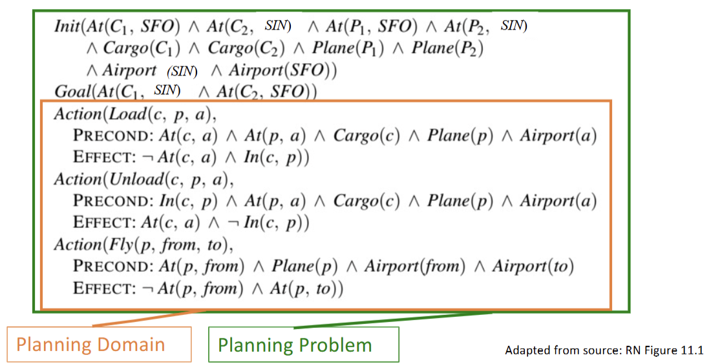

# Classical AI Planning
## Basic terminology and definition
- Environment: Discrete, Deterministic, Static, Fully observable
- Representation: PDDL from STRIPS
- Terms definition:
    - fluent: aspect of world that changes over time.
        - e.g. $At(P_1, SFO)$
    - state: ground atomic fluents (a set of fluents)
        - e.g.$ Hungry ∧ At(Plane)$
    - goal state: goal is partially specified state a.k.a **description**
    - action schema: the skeleton of action, including preconds + effects
        - $Action(Fly(p, from, to))$
            Precond: $At(p, from) ∧ Plane(p) ∧ Airport(from) ∧ Airport(to)$
            Effect: $¬At(p, from) ∧ At(p, to)$
    - grounded action / instantiation: action schema with variables （實例化的動作）
        - e.g. $Action(Fly (P_1, SFO, SIN))$
- Closed-world assumption: any fluents that are **not mentioned** are **FALSE**.
- After performing an action: 
    $$S' = (S - DEL(a)) ∪ ADD(a)$$
    where $DEL(a)$ is the delete list (neg) of action $a$, $ADD(a)$ is the add list (pos) of action $a$.
- The frame problem: to only specify what changed, anything unmentioned is unchanged.
    - Precond at $t$
    - Effect at $t+1$
- Example: Air Cargo

:::note
Goal is a description (contains only partial info), not a state (full info).
:::

## Classical Planning Algorithms
### 1. Forward Search (Progression)
- Search path from initial state to goal state.
- $$S' = (S - DEL(a)) ∪ ADD(a)$$

### 2. Backward Search (Regression)
- Search path from goal state to initial state
- $$POS(g') = (POS(g) - ADD(a)) ∪ POS(Precond(a))$$   
    $$NEG(g') = (NEG(g) - DEL(a)) ∪ (NEG(Precond(a)))$$
- **Relevant action**: action that can lead to the goal. (effect can achieve thegoal)
### 3. Boolean Satisfiability (SAT) Problem
- Turn classical planning problem into a prepositional formula and check if it is satisfiable (can be true)
- SAT is a NP-complete problem

:::note
State vs. Description:
- description represents a set of states (a part of states)
- state can have 2 possibilities: True / False
- description can have 3 possibilities: True/ False/ not mentioned
:::

### Planning algorithms must be 
1. **Soundness**: plans generated are valid
2. **Completeness**: if solution exists, the plan can find it.
3. **Optimality**: guaranteed to find the optimal possible solution.

### The Frame Problem
- In most actions, most fluents are left unchanged. If we were to explicitedly shown these unchanged fluents,
for $m$ actions and $n$ fluents, we need $O(mn)$.
- We can thus use successor-state axions to show only how fluents can change.
    -e.g. $Have(Cake, 1) ⇔ (Have(Cake, 0) ∧ ¬Eat(Cake, 0)) ∨ Bake(Cake, 0)$
- Only needs $O(n)$
