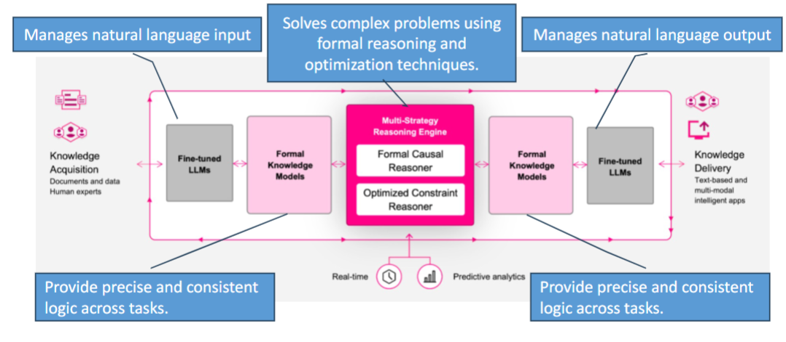
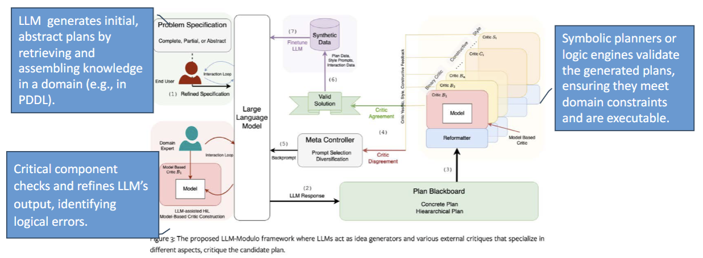

# Large Foundation Model (LFM)
- pre-trained on vast data, can generalize across tasks
- characteristics
    - few-shot learning
    - versatility: can adapt to multiple domains
    - scalability: can handle large & complex tasks

# Human-guided AI reasoning
- human expertise in AI design
- reinforcement learning with human feedback
- LFMs provide data-driven insights, human add critical thinking & intuition

# Chain of Thought (CoT) Reasoning
- LFM solves problems by **breaking them in intermediate steps**
- improve reasoning accuracy

# Reinforcement Learning from Human Feedback (RLHF)
- train AI agents to follow human preferences
- complex reward functions are hard to define
- human feedback guides AI agent training via a learned reward function (built based on human feedback)

## Bradley-Terry Model
- $P(a>b) = \frac {exp(r(a))}{exp(r(a)) + exp(r(b))}$

# State of the Art
## Generalized Planning with LLM
- use Cot prompting for LLM to summarize the domain, propose strategies and generate plans
- automated debugging: LLMs are re-prompted with feedback to refine plans

## LLM Sandwich Architecture
- combine LLMs with a reasoning engine
- the engine, not LLM, provides final answers, enhancing reliability & accuracy

## LLM-Modulo Framework
- integrate LLM with reasoning engines to create a hybrid planning framework
- LLM generates abstract, partial plan  
external critics validate & refine plans, enhancing reliability

:::Note
This is the end of the course!!
:::