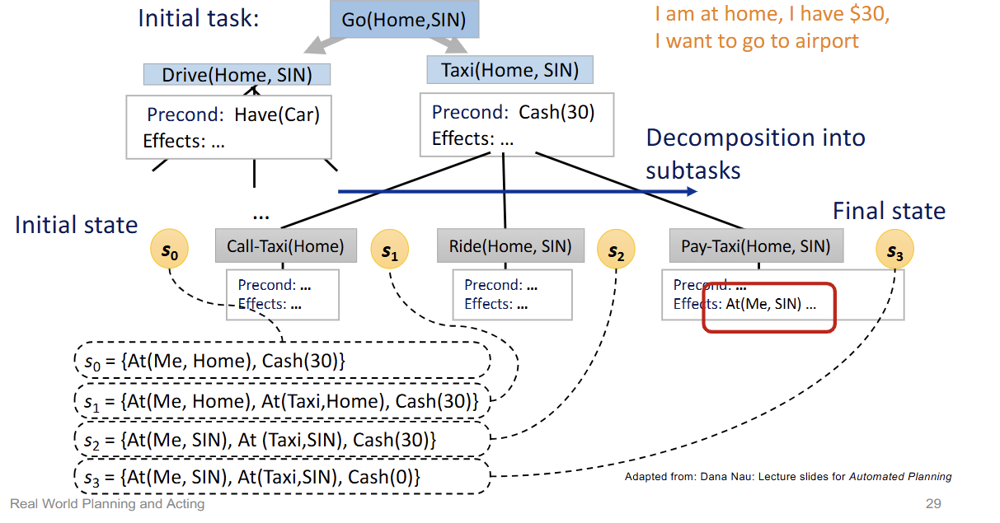
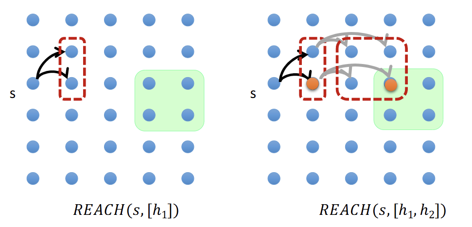

# Heuristic Planning 
> to increase efficiency
- heuristic function $H(s)$: estimates the distance from state $s$ to goal
- find admissible heuristic estimations: doesn't over / under estimation
- relaxed problem:
    1. add more edges: easier to find path to goal
        - ignore precondition from action (all actions can be chosen at any state)
            - e.g. 8-Puzzle
                - remove the precondition $ Blank(s_2) ∧ Adjacent(s1, s2)$
                - now tiles can swap with any tiles, doesn't have to be adjacent
                - the heuristic estimate becomes # misplaced tiles
        - ignore delete list (no reversing), assume goal states are all positive.
            - goals are never undone
            - e.g. 8-Puzzle
                - each block will have more and more numbers.
    2. state abstraction
        - ignore some fluents
        - solution in abstract state space will be shorter than in original space
        - e.g. Air Cargo Transportation
            - Original problem:
                - 10 airports, 50 planes, 200 cargos.
                - Total # of states: $10^50^$ (planes at airports) $× (10+50)^200^$ (cargos at airports or planes) $= 10^405^$

            - Relaxed problem:
                - All cargos are in 5 airports, all cargos in same airport have same destination. => 5 big plands, 5 big cargos
                - Total # of states: $10^5 × (10+5)^5 = 10^11^$

# Hierarchical Planning
> to manage complexity
- divide tasks into different subtasks
- Deferred （推遲） planning: plan details only after choosing that refinement
- Hierarchical task networks (HTNs)
    - environment: Fully observable, deterministic
- High-Level Actions (HLAs)
    - Each HLA has one or more refinements into a sequence of actions
    - Refinements: can be an HLA or a primitive action
    - HLA implementation: HLA refinement that contains only primitive actions
    - 

## Searching for Abstract Solutions
> Determine if **reachable sets** of a sequence of HLAs overlap with goals

### Reachable set $REACH(s, h)$
- the set of states reachable by any of the HLA's implementations
- 
- Notation:
    - $~$ means possibly
    - e.g. $\overset{\sim}{+}$ means add / unchange.
- Approximation of effects
    - Optimistic Reachable Set ($REACH+$): may overestimate the actual reachable set
    - Pessimistic Reachable Set ($REACH-$): may underestimate the actual reachable set
- If **optimistic set** intersect with goal: may succeed
- If **optimistic set** doesn't intersect with goal: must fail
- If **pessimistic set** intersect with goal: must succeed
- If **pessimistic set** doesn't intersect with goal: must fail
- If not **pessimistic set** but **optimistic set**: uncertain, refinements needed
