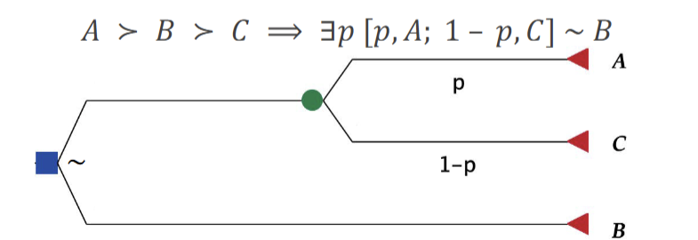
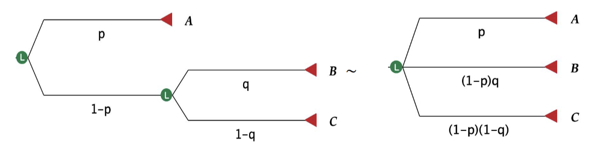
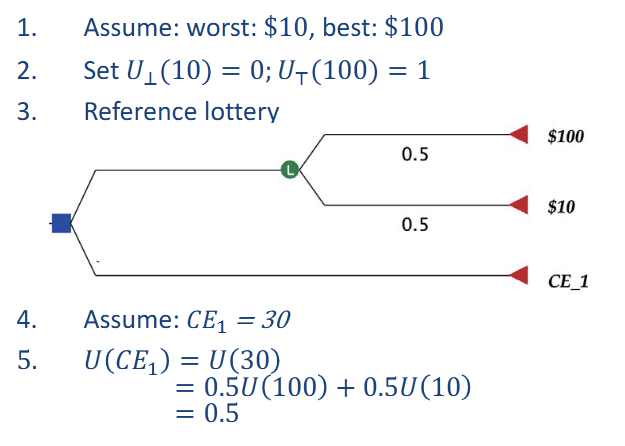

# Decision Making under **Uncertainty**
- Decision Algorithm
    - Input: a problem
    - Output: a solution (**policy**) that specifies best action in each state wrt. values
- Types of decision theory
    1. **Normative decision theory**: describes how **ideal**, rational agents should behave
    2. **Descriptive decision theory**: describes how **actual agents** aka humans really behave
    3. **Prescriptive decision theory**: guidelines for agents to behave rationally
- environment: episodic, non-deterministic, partially observable
- try to maximize gain
- Decision Model:
    - Actions: $a ∈ A$
    - States: $s ∈ S$ with probability of reaching: $P(s)$
    - Transition model: $P(s'|s, a)$ probability that action $a$ in state $s$ reaches state $s'$
    - Result: $Result(a)$ 
    - Probability of outcome state $s'$: $P(Result(a) = s') = \sum_{s} P(s)P(s'|s,a)$
    - Utility function: $U(s)$ express the desirability of a state $s$
- rational: to maximize the maximum expected utility (MEU)
- EU of action: average of utility value for all outcomes, weighted by probability
    - $EU(a) = \sum_{s'}P(Result(a) = s')U(s') = \sum_{s'} \sum_{s} P(s)P(s'|s, a)U(s')$
## Axioms of Utility
- notation:
    - $A ≻ B$: agent prefers A to B
    - $A ∼ B$: agent is indifferent between A and B
    - $A ≽ B$: agent prefers A over B or is indifferent between them
- 6 rules
    - Orderability: must be one of $A ≻ B$, $A∼B$, or $B ≻ A$
    - Transitivity: If $A ≻ B ∧ B ≻ C$ => $A ∧ C$
    - Continuity: If $A ≻ B ≻ C$ => there exist some probability $p$ for which the agent will be indifferent between
        1. getting $B$ for sure
        2. getting the lottery that gets $A$ with probability $p$ and $C$ with probability $1-p$
        - 
    - Substitutability: If $A ∼ B$ => $[p, A; 1-p, C] ∼ [p, B; 1-p, C]$
    - Monotonicity: If $A ≻ B$ and $p > q$ => $[p, A; 1-p, B] ≻ [q, A; 1-q, B]$
    - Decomposibility: 
        - 
- $𝑈(𝐴) > 𝑈(𝐵) ⟺ 𝐴 ≻ 𝐵$, $𝑈(𝐴) = 𝑈(𝐵) ⟺ 𝐴 ∼ 𝐵$

:::note
Agent's behavior **doesn't change** if $U$ is subjected to an **affine transformation**  
$U'(s) = aU(s) + b$ with $a > 0$
:::

## Utility function
- encode preferences
- translate "desirability" measures $x$ into utility units $U(x)$
### Preference elicitation methods
> How to get the utility?

1. Probability equivalent
    - set $u_{\perp} = 0; u_{\tau} = 1$
    - find $p$ s.t $U(s) ∼ [p, u_{\tau} ; 1-p, u_{\perp}]$ => $U(s) = p$
2. Certainty Equivalent (CE)
    - how much $ the lottery is equivalent to in your mind.
    - $U(CE) = EU(Lottery)$
    - 
## Expected Monetary Value (EMV)
- use money as decision objective
- doesn't take into account risk attitude
- e.g. Win 1 million so far. A lottery: 50% loss all, 50% add 1.5 million. Play?
    => $[0.5, 0; 0.5, 2.5] = 1.25 > 1$, Play!
## Risk Attitude and risk premium
- Risk_premium = EMV - CE
    - how much money are you willing to buy the lottery?
- Risk-averse: $EMV > CE$, $RiskPremium > 0$ (不想吃虧)
- Risk-seeking: $EMV < CE$, $RiskPremium < 0$ (賭下去就對了)
- Risk neutral: $EMV = CE$, $RiskPremium = 0$

