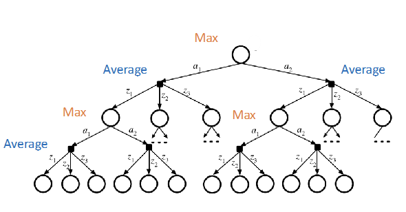
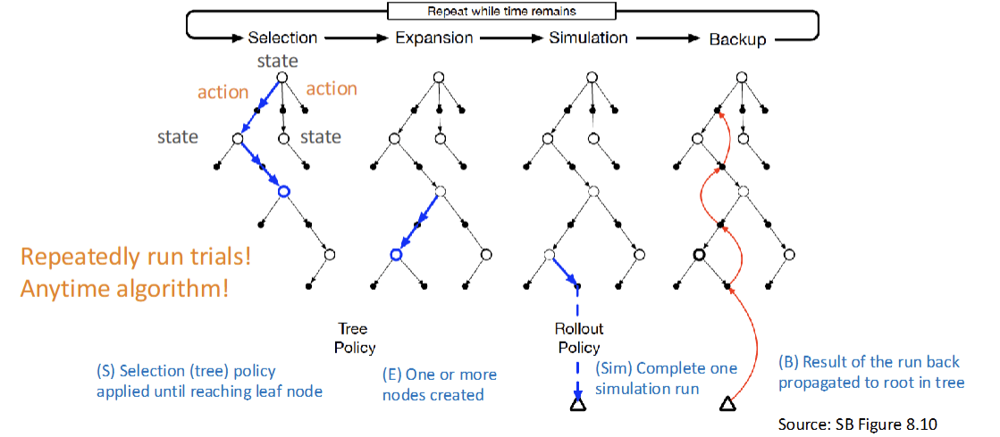

# Markov Decision Process (MDP)
> How can we deal with uncertainty?
- A sequential decision problem for a **fully observable**, **stochastic** environment with **Markovian transition** and **additive rewards**.

## Formal definition
- MDP $M ≜ (S, A, T, R, γ)$
    - states $S$
    - actions $A$
    - Transition function $T$: $S, A, S' -> [0, 1]$
        -satisfies the Markov property s.t $\sum_{s'} T(s,a,s') = \sum_{s} P(s'|s,a) = 1$. (Sums to 1)
    - Reward function $R$
    - discount facrot $0 ≤ γ ≤ 1$
    - solution is a policy: a function that recommend an action in each state
- Markov property: Next state only determined by current state & action
    - $P(s_{t+1}|s_t, a_t, s_{t-1}, a_{t-1}, ..., s_0, a_0) = P(s_{t+1}|s_t, a_t)$
    - Markov property simplifies real-world problems
- Reward funciton $R(s,a,s')$: need to balance between risk & reward
- Policy $π: S -> A$: for every state
    - quality of $π$: expected utility of sequence guaranteed by policy $π$
    - Optimal policy $π^*$: highest expected utility

## Finite horizon:
- fixed time $N$, then terminate
- Reward: sums up to $R_n$
- optimal action may change over time => **Nonstationary** $π^*$

## Infinite horizon:
- no fixed deadline, may run forever
- **stationary** $π^*$
- But *R* may be infinite, hard to compare policies.
    1. use discount factor $γ < 1$, utility becomes finite
        - $U_h([S_0, a_0, s_1, a_1,s_2, ...]) ≤ R_{max}/(1-γ)$
    2. Environment has terminal states, and policy guaranteed to get to a terminal state.
    3. Compute average rewards obtained per time stop
        - hard to compute and analyze

## Utility of States
- reward of executing $π^*(s)$
- Bellman Equation: $U(s) = U^{π^*}(s) = max_{a} \sum_{s'} P(s'|s,a)[R(s,a,s') + γU(s')] = V(s)$
- Optimal policy $π^*$ is the policy that maximizes $U(s)$: $π^*(s) = argmax_{a} \sum_{s'} P(s'|s,a)[R(s,a,s') + γU(s')]$
- **Q-Function** $Q(s,a)$: expected utility of taking a given action in a given state
    - $U(s) = max_a Q(s,a)$

# Value Iteration
- repeatedly perform Bellman Update
    - $U_{i+1}(s) ← max_a \sum_{s'} P(s'|s,a) [R(s,a,s') + γU_i(s')]$
- to find rewarding value for each state
- initialize as 0, iterate until convergence

# Policy Iteration
- Begin with initial policy $π_0$
- Repeat until converge:
    1. **Policy evaluation**: uses the given policy to calculate the utility of each state
    2. **Policy improvement**: 
        - find the best action for $π_i$ via one-step lookahead based on $U_i$
        - $π_{i+1}(s) = argmax_a \sum_{s'} P(s'|s,a)[R(s,a,s') + γU_{π_k}(s')]
- Complexity: $S = n$ linear equations with $n$ unknowns -> **O(n^3)** 
- Policy iteration may be faster than value iteration.

# Online Algorithms
> Decision-time planning
- for large problems, state space increase exponentially
- we can use Online search with sampling
    - real time dynamic programming
    - Monte Carlo Tree Search
- 
- keep the best actions at each state nodes
- tree size: $A^D S^D$, A is the # of actions, S is the # of states, D is the depth of tree
- With sparse sampling:
    - sampling $k$ observations
    - tree size: $A^D k^D$
    - but still exponential with search depth

## Monte Carlo Tree Saerch
> Online search with simulation
- 
- Selection: select the leave nodes to expand
    - Selection policy: Upper Confidence Bounds applied to Trees(UCT)
        - $π_{UCT}(n) = argmax_{a}(\hat{q}(n,a) + c \sqrtln(N(n)/N(n,a)))$
            - $\hat{q}(n,a)$ is the average return of all trials (exploitation)
            - $c$ is constant balancing exploitation & exploration
            - $N(n) is # tials through node $n$
            - $N(n,a)$ is $ trials through node $n$ starting with $a$
        - $UCB(n) = U(n)/N(n) + C \sqrtln(log N(Parent(n))/N(n))$
            - $N(Parent(n))$ is the # parent node been visited
            - $N(n)$ is the # node $n$ been visited.
- Expansion: one or more nodes created
- Simulation: estimate the value of the node by completing one simulation run (run to leaf)
- Backup: update the result back to root.
