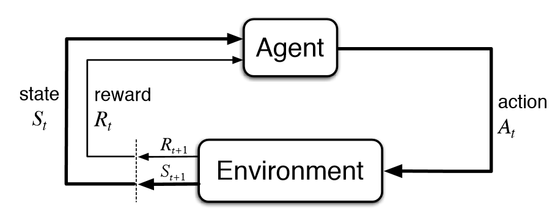
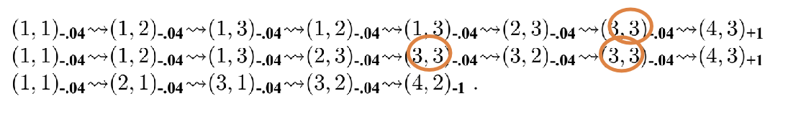
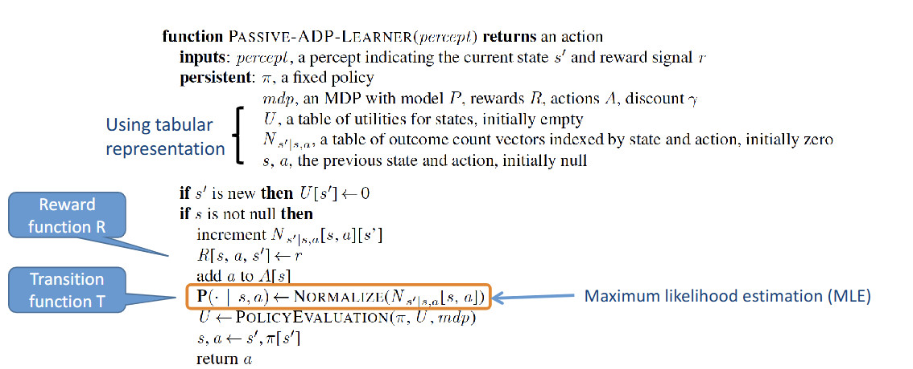
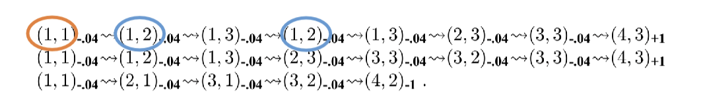
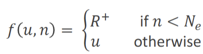

# Reinforcement Learning

- Learning to behave in unfamiliar environment
- Environment is a Markov Decision Process
    - relies on Markov Property (but doesn't know that it looks like)
- Unknown transition function, unknown reward function
- Use observed rewards to learn optimal policy

# Types of RL
## Model-based vs. Model-free
- Model-based: Learn transition model to solve problem
- Model-free: Doesn't learn the transition model, directly solve the problem

## Passive vs. Active learning agent
- Passive: given policy → evaluate the value & find utility function
- Active: Learns the optimal policy & utility function.
    - Needs to balance between exploitation & exploration

## Passive RL
- Execute a set of trials using **fixed** (given) policy $\pi$
- Learn expected utility $U^{\pi}(s)$ for each non-terminal state $s$
    - $U^{\pi}(s) = E[\sum_{t} γ^t R(s_t, \pi(s), s_{t+1}]$
### **Model-based** Passive RL
1. Adaptive Dynamic Programming (ADP)
- Learn transition function through experience
    - Count outcomes of each state, action
    - Normalize to estimate $P(s'|s,a)$
- e.g 
    - $𝑃(𝑠′=(3,2)|𝑠 = (3,3), 𝑎 = 𝑅𝑖𝑔ℎ𝑡) = 1/3$
    - $𝑃(𝑠′=(4,3)|𝑠 = (3,3), 𝑎 = 𝑅𝑖𝑔ℎ𝑡) = 2/3$
- Now we have the transition functions, we can obtain rewards for each $(s, a)$ with given policy $\pi$
    - $U^{\pi}(s) = \sum_{s'} P(s'|s, \pi(s))[R(s, \pi(s),s') + γU^{\pi}(s')]$
    - Learn reward function $R(s,a,s')$ upon entering state $s'$
    - Solve $S$ linear equations with $S$ unknowns requires $O(S^3)$ time 
- Adjusts the state to agree with ALL successors
- 

### **Model-free** Passive RL
> Directly learn the utility, doesn't learn the transition and reward function
1. Monte Carlo Learning
    - Maintain running average of expected return for each state.
    - If run many times → converge to true expected value
    - e.g 
        - For the first trial, 
            - Expected reward of (1,1) = 0.72
            - Expected reward of (1,2) = 0.76, 0.84
        - Overall (average),
            - $U^{\pi}(1,1) = (0.72+0.72-1.24)/3 = -0.067$
            - $U^{\pi}(1,2) = (0.76+0.84+0.76)/3 = 0.79$
    - Different variences: first visit vs. every visit (of a trial)
    - Slow convergence
        - Learning starts only **at the end of each trial (episode)**
2. Temporal Difference (TD) Learning
    - TD target: $R(s, \pi(s),s') + γU^{\pi}(s')$
    - TD error (term): TD target $- U^{\pi}(s)$
    - $U^{\pi}(s) ← U^{\pi}(s) + α($ TD Error $)$
    - N-step TD: do estimate up to $n$ steps
    - TD(λ): combine returns from different TD-steps

## Active RL
> Act optimally based on prediction of utility of states
- Goal: learn optimal $\pi^*$ that obeys Bellman Equation
### **Model-based** Active RL
> Learn the transition and reward function, then solve the MDP ($\pi^*$)
1. Active Adaptive Dynamic Programming
    - Learn model with outcome probability for all actions
    - $\pi^*(s) = argmax_{a} \sum_{s'} P(s'|s,a) [R(s,a,s')+ γ U(s')]$
    - Resulting algorithm is **greedy**
        - Pure exploitation may *not* be optimal
    - We need tradeoff between exploration & exploitation

### Greedy in the Limit of Infinite Exploration (GLIE)
- a learning policy
- scheme for balancing exploration & exploitation
- **ε-greedy** exploration
    - choose greedy action with $p=(1-ε)$
    - choose exploit (random) action with $p=ε$
    - lower ε over time $ε = 1/t$, eventually becomes greedy (takes the optimal action)

### **Model-free** Active RL
> Directly learn $\pi^*$
1. Monte Carlo Control
    - $Q(s, a) = avg( Returns(s,a))$
    - $\pi(s) = argmax_{a}f(Q(s,a), N(s,a))$
        - Exploration function $f(u,n)$
            - how greed is trade off against curiosity
            - should increase with $u$ and decrease with $n$
            - e.g 
                - $R^+$: best possible reward
                - $Ne$: agent tries each state-action pair $Ne$ times
2. Active TD / TD Control
    - $Q(s,a) ← Q(s,a) + α(R(s,a,s') + γQ(s', \pi(s'))-Q(s,a))$
    #### Q-Learning
    - Use optimal $\pi$ to estimate Q
    - $Q(s,a) ← Q(s,a) + α(R(s,a,s') + γmax_{a'} Q(s,a')-Q(s,a))$
    - **off-policy**: estimate policy ≠ behavior policy
    - Q-function: expected total discounted reward if $a$ is taken in $s$ with optimal behavior
        - $U(s) = max_a Q(s,a)$

    #### SARSA (State-Action-Reward-State-Action)
    - Uses TD for prediction, ε-greedy for action selection
    - $Q(s,a) ← Q(s,a) + α(R(s,a,s') + γQ(s',a')-Q(s,a))$
    - Waits until an action is taken, then update Q function

## Comparison
|             |      Passive     |                       Active                       |
|:-----------:|:----------------:|:--------------------------------------------------:|
| Model-Based |        ADP       |                     Active ADP                     |
|  Model-Free | Monte-Carlo;  TD | Monte-Carlo Control;  Active TD: Q-Learning, SARSA |