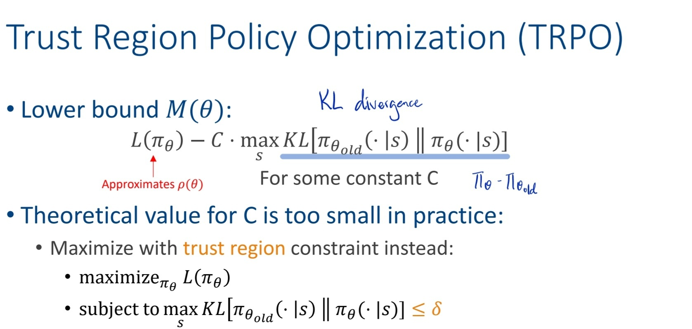
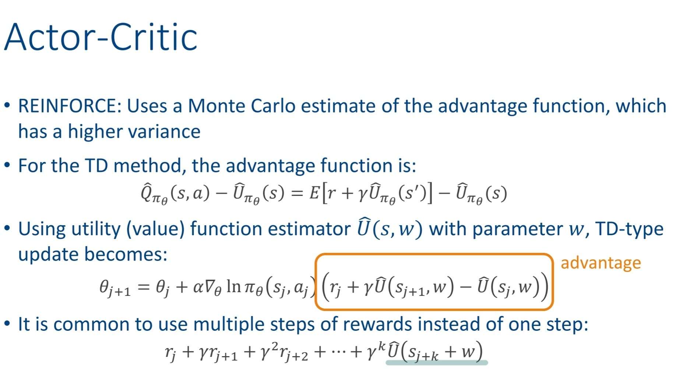

:::caution
Problem: Tabular representation cannot scale big  
:::

Two solutions:
1. Function Approximation
2. Policy Search

# Function Approximation
- compact representation of true utility function
- $\hat{U}_\theta = \theta_1f_1(s) + \theta_2f_2(s) + ... + \theta_nf_n(s)$
    - input: states
    - output: utility value
- better generalization

## Linear Function Function Approximation
- Use Linear function to approximate $U$
- $\hat{U}(s) = \theta_0 + \theta_1S_0 + \theta_2S_1 + ... + \theta_nS_n$

1. Approximate Monte Carlo Learning
- Supervised learning
- update parameters ater each trial
- L2 loss: $\frac {1}{2} (\hat{U}_\theta(s)- u_j(s))^2$
- Update:  $\theta_i ← \theta_i + ɑ (u_j(s) - \hat{U}_\theta(s)) \frac{\partial \hat{U}_\theta(s)}{\partial \theta_i}$
    - for each parameter

2. Approximate Temporal Difference Learning
- aka semi-gradient
- Utility: $\theta_i ← \theta_i + ɑ [R(s,a,s') + γ \hat{U}_\theta(s') - ]\hat{U}_\theta(s)$
- Q-Learning: $\theta_i ← \theta_i + ɑ [R(s,a,s') + γ max_{a'} \hat{Q}_\theta(s', a')] - \hat{U}_\theta(s,a)$

:::note
Approximate MC / TD are similat to MC / TD but is calculated for each parameteres, multiply by its gradient.
:::

### Issues
- **The deadly triad**
    - may not converge if: function approx + bootstrapping + off-policy
- **Catastropic forgetting**:
    - happen when over-trained, forget about the dangerous zone （訓練太久後，只訓練optimal path，就忘記危險的地方。之後若走到那邊容易出事）
    - Solution: **Experience Replay**
        - Replay trials to ensure utility function still accurate for parts no longer visited
## Non-Linear Function Approximation
- deep reinforcement learning, use gradient descent for back propogation
- experience replay + fixed target

# Policy Search
- $\pi: S \rightarrow A$ (find good policy)
- $\pi_\theta(s) = argmax_a \hat{Q}_\theta(s,a)$
- Problem:
    - $\hat{\pi}_\theta(s,a) = 1 $ if max, else $0$.
    - discrete, cannot use gradient
    - Solution: Stochastic Policy (probability)
        - Use Softmax function $\Rightarrow$ differentiable
        - use gradient descend to update

:::note
Policy search estimates the policy function, but only care if it leads to optimal policy, doesn't care whether the estimation is close to true utility.
:::

1. **REINFORCE**
- Monte-Carlo policy gradient
- high variance => use baseline (center the return)
- Advantage function $A_{\pi_\theta}(s,a) = \hat{Q}_\theta(s,a) - \hat{U}_{\pi_\theta}(s)$, where $\hat{U}_{\pi_\theta}(s)$ is the baseline

### Problem of policy gradient
- unstable returns $\Rightarrow$ bad updated $\Rightarrow$ FAIL!
- wants to restrict the update
- Solution: **Minorize Maximization**
    - use a **simpler objective** (is the lower bound of the true one) to replace the true one.
        - $g(\theta|\theta^t) ≤ f(\theta)$
    - maximize the simpler objective
    - guarantee monotonic policy improvement

2. **Trust Region Policy Optimization (TRPO)**
- uses lower bound (**KL divergence**) to limit the change per update, to ensure that the update is gradual and stable, moving toward the optimal action
- maximize KL diverge to ≤ 𝛿

3. **Proximal Policy Optimization (PPO)**
- TRPO is too computationally complex
- uses clipped objective to limit updates
- $\frac{\pi_\theta (a|S)}{\pi_{\theta_{old}} (a|S)}$ must be in the range of $[1- \epsilon, 1 + \epsilon]$
    - if $< 1 - \epsilon$, then clip to $1- \epsilon$
    - if $> 1 + \epsilon$, then clip to $1+ \epsilon$
    - 限制update的幅度介於 $[1+\epsilon, 1-\epsilon]$之間

# Value-function approximation + Policy search
1. **Actor-Critic methods**
- Learns a policy (actor) that takes action
- Also learns an utility function (critic) for evaluating the actor's decisions
- The **actor** is running **policy search**
- The **critic** is running **value-function approximation**
- Actor adjusts policy based on feedback from critic (using **policy gradient**)
- The **advantage estimate** shows how much the currect pollicy is better than the average.
    - $A(s,a) = R + \gamma V(s') - V(s)$
- The policy gradient update is $E(A(s,a) \nabla_\theta ln \pi_\theta(a,s)$

