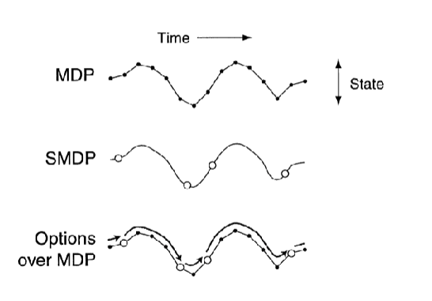

# Model-free vs. Model-based
- Model-free: No model, learn value function from **experience**
- Model-based: 
    - Model the environment
    - Learn/ Plan value function from **model** and/ or **experience**
    - Efficient use of data
    - Reason about model uncertainty
    - But may have model bias
## Model
- $(S, A, T, R, \gamma)$ parameterizad by $\eta$: $M_{\eta}$
- state & action are known
- find transition & reward function
- model learning to create model

# Model Learning
- learn from past experience $S-A-R$
- supervised learning
- to minimize loss function (MSE, KL-diverge)

## Model
1. **Table Lookup Model**
    - i.e ADP
    - cannot scale
2. **Linear Model**
    - represent tranition & reward function
    - as linear model
3. **Nearual Networks Model**
    - i.e VAE
- Problem
    - learning transition function may be difficult
        - too many factors
    - Sol. Value Equivalence Principle
        - Two models are value equivalent if they yielf the *same Bellman updates*
        - learn latent mapping function $h: s \rightarrow z$  
            learn latent transition * reward function $g: z, a \rightarrow z', r$

> Now that we have a model, how can we use it?

# Model based techniques
- Goal: find optimal policy/ value using the model and/or the environment
1. **Direct model solving**
    - solve using MDP solvers
        - i.e. value/ policy iteration
    - uses the model fully
    - **ADP**: learn a model and solve the bellman equation of the learned model
    - **Value iteration network**: value iteration + NN
2. **Sample-based planning**
    - use the model ONLY to generate samples
    - dont consider the probability distribution of the model
        - $s' \sim P_\eta (s' | s,a)$  
          $r = R_\eta (s,a,s')$
    - apply model-free RL on samples
        - Monte Carlo
        - Q-Learning
            - but too time consuming
            - Sol: plan for states that are relevant for NOW (planning for surrounding)
            
3. **Model-based Data Generation**
    - consider both
        - real experience from environment
        - simulated experience from model
    - train model free RL with both experience
    - i.e Dyna-Q
        
# Frontiers
- **General Value Function (GVF)**
    - generalize value function to predict any signals
    
- **Temporal Abstractions** via **Options**
    - hierarchical RL
    - option $O = (I, \pi, \beta)$
        - $I \subseteq s$ (state)
        - $\pi: S \times A \rightarrow [0, 1]$: a policy to follow
        - $\beta: S \rightarrow [0, 1]$: probability of terminating at each state
    
- **Designing Reward Signals**
    - Problem: agent cannot learn until it reaches the goal (where the reward is)
    - Sol: add **fake** rewards to make the learning easier
    - **Extrinsic reward**: rewards from the environment  
      **Intrinsic reward**: rewards from the agent itself based on its internal state
    
