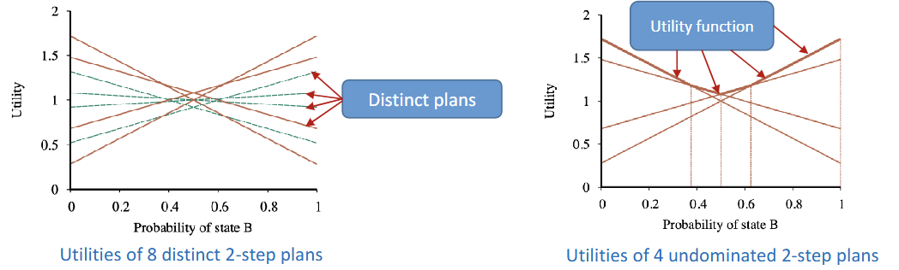
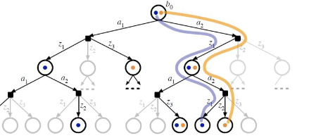

# POMDP
- uncertainty in **observations**
    - agent doesn't konw exactly which state it is in
- $M = (S,A,E,T,O,R)$
    - $S$: state
    - $A$: action
    - $E$: evidence/ observation
    - $T$: transition function $T:S \times A \times S' \rightarrow [0,1]$
        - $P(s'|s,a)$
    - $O$: observation function $O:S \times E \rightarrow [0,1]$
        - $P(e|s)$ (probability of observing $E$ from state $S$, defines the sensor model)
    - $R$: reward function $R:S \rightarrow R$
- history $h_t = \{ a_1, e_1, ..., a_t, e_t \}$
- policy: 
    1. define on belief state $a = \pi (b)$ or
    2. define on history $a = \pi (h)$
## Belief state
- actual state is unknown, but we can track the proability distribution over possible states
- $b(s)$: probability of agent is now in actual state $s$ by belief $b$
- belief update: $b'(s') = \alpha p(e'|s') \sum_s p(s'|s,a)b(s)$ (filtering)
    - agent executes $a$, receives evidence $e'$, then update $b'(s')$

# Decision making of POMDP
1. give current belief $b$, execute action $a = \pi^*(b)$
2. receive evidence $e'$
3. update belief $b'(s')$

# Belief space MDP 
> reducing POMDP into MDP
- transition model $P(b'|b,a)$
    - $= \sum_{e'} p(b'|e',a,b)p(e'|a,b) \\ = \sum_{e'} p(b'|e',a,b) \sum_{s'}p(e'|s') \sum_s p(s'|s,a)b(s)$
- reward function $p(b,a)$
    - $= \sum_{s}b(s) \sum_{s'} p(s'|s,a)R(s,a,s')$
- each belief is a state

# Solution for POMDP
- Discretize the belief state space
    1. construct belief space MDP
    2. discretize belief state space
    3. solve the MDP
    4. map the solution back to POMDP
    - $<S,A,R,T,O,E> \rightarrow <B,A,R,T>$ ($B$ is discretized)
    - problem: Curse of dimensionality (state sapce too large, even after discretization)
- Utility function representaed by piecewise linear function
    - conditional plan: policy generates action $\rightarrow$ observation $\rightarrow$ update belief state $\rightarrow$ new action .... The conditional plan is the **policy**
    - utility function of belief state
        - $\alpha_p(s)$: utilify of executing a conditional plan $p$ starting in real state $s$
    - expected utility of executing $p$ in belief state $b$: $U_p(b) = \sum_s b(s) \alpha_p(s) = E_b[\alpha_p(s)$
        - $U^{\pi^*}(b) = max_p U_p(b)$
    - maximum of collection of hyperplanes $\Rightarrow$ piecewise linear, or convex
    - continuous belief space is divided into regions
    - 

# Online methods (Approximation solutions)
- to scale up
- POMCP (Partially Observable Monte Carlo Planning)
    - run UCT on POMDP, uses action-observation history
    - samples a state at root from the initial belief
    - select $\rightarrow$ expand $\rughtarrow$ simulate $\rightarrow$ backup
- DESPOT (Determinized Sparse Partially Observable Tree)
    - similar to POMCP, but at every observation node, only sample a single observation (make the tree smaller)
    
    

