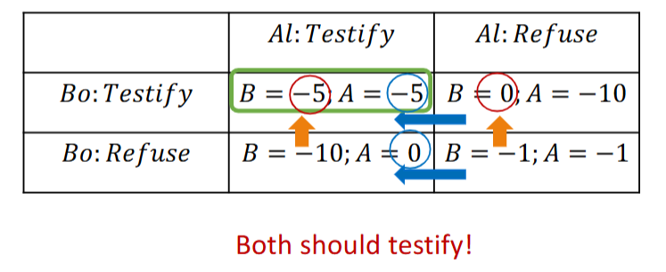
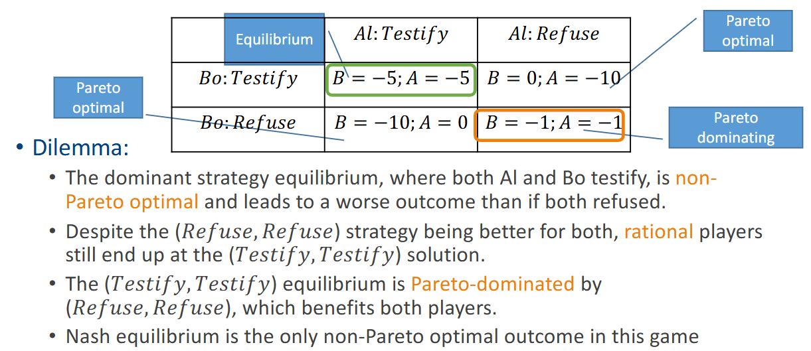
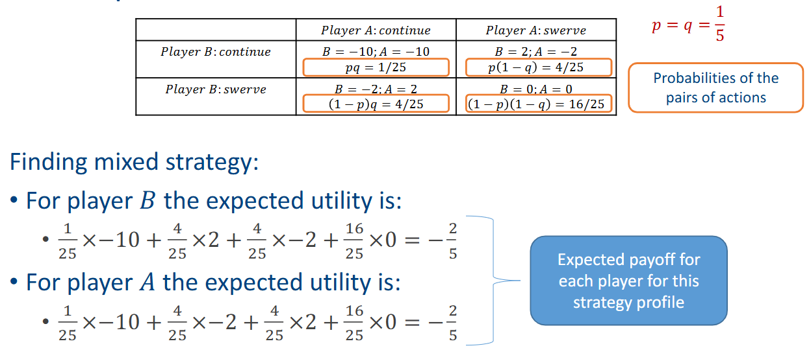

# Elements of a game
- Players (N): set of decision makers
- Actions ($A_i$): possible actions for each player $i \in N$
    - $A = A_1 \times A_2 \times ... \times A_N$: combination of actions
- Payoffs ($u_i(a)$): reward for layer $i$ based on action $a$
- Information ($I_i$): what player $i$ knows about the game
- Strategy ($s_i$): plan of action for player $i$ based on its known information
- Objective: to choose optimal strategy $S_i^*$ that maximizes payodd, given strategy of others $s_{-i}$. $S_i^* = argmax_{s_i} u_i(s_i, s_{-i})$
- Equilibrum ($S_1^*, S_2^*, ..., S_N^*$): stable outcome where no player can improve payoff by changing strategy

# Type of game
- Non-cooperative vs. Cooperative
- Simultaneous vs. Sequential
- Perfect vs. Imperfect information
- Single vs. Repeated game

# Non-Cooperative game

## Game of pure competition
- players have opposing interests
- involve 2 players
- the sum of payoffs is a constant: $u_1(a) + u_2(a) = c$
    - payoff sum of zero-sum game is $0$

## Game of pure coordination
- players have same interests
- all players aim for the same outcomes
- all players have the same playoffs: $u_1(a) = u_2(a)$

# Pure strategy game
- Players choose simultaneously, with immediate outcome
- example: Prisoner's dilemma 

- Solution: a strategy profile where each player adopts a rational strategy.
    - **Pareto Optimal**: No player can be made better off without making anotherplayer worse off
    - **Nash Equilibrium**: No player can improve their payoff by unilaterally changing their strategy: $u_i(s_i^*, s_{-i}^*) \geq u_i(s_i, s_{-i}^*)$ for all $i$ and $s_i \in S_i$
        - every game has at least one Nash equilibrium

## Domination
- Dominant Strategy: strategy dominates all others if it always yoelds a better or equal outcome  regardless of other playes' strategies
- Strongly dominant strategy: $u_i(s_i, s_{-i}) > u_i(s_i', s_{-i})$
- Weakly dominant strategy: $u_i(s_i, s_{-i}) \geq u_i(s_i', s_{-i})$

# Mixed strategy game
> Probabilistic action selection with randomized policy

- Example: game of chicken 

# Zero-sum game
- **Minimax Theorem**
    - in a finite, two-player zero-sum game, the maximin value (the maximum of a player's minimum payoffs) is equal to the minimax value (the minimum of the opponent's maximum payoffs)
    0 both players have optimal mixed strategies that ensure the same game value, regardless of the order of play