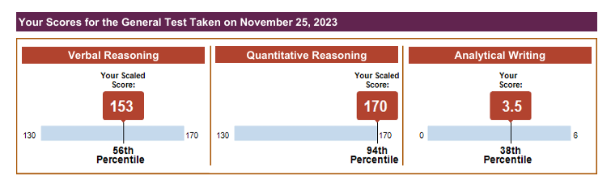

# 前言
由於一直都有出國讀研究所的夢想，因此從去年就馬不停蹄地開始準備留學所需文件，而語言證照也是留學美國必備的文件。在9月時我考完托福，便開始準備GRE，並於2023/11/25考試。GRE考試在去年暑假時有改版過，考試時間縮短成2小時左右，去掉加試題，寫作只剩下 Analytical Writing和新加上的Discussion，大幅減少考生的體力消耗。我認為這對考生而言是一大福祉。以下是我準備GRE的過程與心得。

# 我的背景
- 考試時是彰師大資工系大四學生
- 多益965分
- 托福109分

# 我的分數
第一次考試，我考取了**V 153**、**Q 170**、**AW 3.5**，總分**323**分。考試時的順序是**QVQV**。

# 準備過程
由於準備時間較短，我想說去補習班，利用更豐富的教材以及更有系統化的學習方式準備較能夠事倍功半。在詢問了多家補習班後，最終選擇字神帝國。我報名的是全線上的GRE全科課程，因此可以依照自己的進度安排上課影片。  

9月中時我正式開始看上課影片，因為我知道自身的單字量不太夠，因此我準備的順序是先單字、填空、閱讀最後再準備數學、邏輯、寫作。我自己是安排每周看3~4部影片，但因為中間碰到大學的期中考周，所以那段時間的進度稍微緩慢些，我認為這也是在學學生在準備GRE常會遇到的問題：如何在學校課業與額外花時間準備的GRE中取得平衡。我給自己的要求是，無論是學校或是GRE，一定要在上課後一天內複習過，否則上課學到的單字、技巧會隨著時間慢慢忘掉。例如在GRE的部分我是看完一個section便開始練題目。填空都上完後，便開始寫課本上的練習題，寫完後，再寫Google Classroom上的題庫。這些題目就很夠我練習了。在準備的期間，只要有讀書會我都會參加。讀書會除了是累積實戰經驗的好機會外，同時老師們也會在讀書會上分享許多最新的考試資訊，我認為十分受益。在短短2個多月的準備時間，我對於自己能拚到超過320分的結果已然是滿意了，至少不需要再二戰，畢竟考試報名費不便宜。字神的課程十分有系統性與連貫性，讓我能夠在短時間內考取到自己需要的分數。  

## 各科準備心得＆方式

### 字彙
字彙算是我最弱的一科了，應該也是大多考生在準備GRE時遇到最大的困難。GRE的單字並不是難在專有名詞，GRE的單字都是日常生活中我們中文口語很常用到的詞彙，只不過我們並不常有用英文描述這類詞彙的機會，又或者我們時常可以用比較通用、簡單的單字取代。

學會GRE單字的好處在於我們的用字能夠更精準，在描述、批判和表達時能夠避免詞不達意的情況發生。而GRE字彙的準備方式是用心智圖的方式來呈現，上課跟隨老師的步調認真學習，課後再複習，腦中自然而然就會對心智圖的組織脈絡有印象，在單字的背誦上也就更容易。而講義後面的部分則是相似字的辨別，這部分我認為對於GRE的填空選項很有幫助。另外，我在備考時，也有使用李碩老師的精選必備字彙書和有聲書，這些書提供了十分容易，但又不會淪為純諧音的背誦方法。從老師的字根字首解釋中，其實我們也能夠舉一反三，考試時就算遇見不會的單字也能大致猜出意思。

### 填空

準備完字彙，便是以填空來驗證前面單字的實力了。填空考的除了是對單字的理解外，也能夠使用技巧來協助解答GRE的填空通常都是有邏輯可循的，不會平白無故多出一個不相關的論點出來。填空課上完後，我便開始大量刷題，從這些題目中，我們也可以認識到許多字彙課沒準備到的單字，同時當我們從題目上看到字彙課學到的單字時，也會有所成就感。因為我的準備時程只有兩個多月，因此在準備填空上，完成課程後，我每天固定寫兩回Google Classroom上的填空題庫，也就是**20題/天**。

### 閱讀
比起填空這種一翻兩瞪眼的題目，我反而比較喜歡閱讀。閱讀在準備上對我而言也比較輕鬆。在準備托福時，我已經具備**跳讀**的技巧，這對於閱讀的速度提升我認為是十分有幫助的。閱讀在刷題的部分，我每天會寫5篇閱讀+邏輯。閱讀的用字通常也不會像填空這麼難，因此我主要的練習方向是提升速度，訓練自己能夠精準定位到關鍵句，閱讀對我來說的問題比較沒有那麼大，在上完閱讀課後，實際演練時便可以發現老師上課傳授的解題方法也十分受用。

### 計量、邏輯
這兩個部分寫在一起，因為我認為我準備的方式差不多。計量應該是準備上最快樂的。身為台灣人，數學能力自然不會太差，只要將專有名詞記起來，看懂題目意思便可。但是若要拿滿分，則需要多加細心。數學考的觀念一定都懂，但是需要考量的極端值、特例、變化性很多。舉凡比大小的題目，有時候題目的定義給得不夠縝密，這時候就會多出許多特例，我們就只能選(D)，就算這很反直覺。而邏輯的部分，老師上課也會提供取反等技巧，由於我的資工背景，在數理與邏輯能力上就相對比語文還要好，因此考試時我也不著急，慢慢寫，將每一題都想透徹，最後也成功拿到滿分。準備時，我每天會練習約20題的題庫題目。

### 寫作
寫作這塊，因為我想申請學校與科系並不是很重視，只要求3.5分。因此我在準備上也只從老師的講義上改寫了一份自己的**4段模板**而已。考試時，我也將模板套用在寫作上，同時舉一些具體一點的實例，再剛好用到一些GRE單字，要拿3.5應該是很容易的。在準備上，由於在我看完寫作影片後，我只剩下5天便要考試了，因此我考前只練習寫大綱，以及使用中國考滿分的線上模擬頁面練習了3題。

# 結語

GRE的考試要破320其實不難，只要你有心，每天準備一些，背一點單字、寫一些題目，其實長期累積下來，你已經學會許多單字和解題技巧了。建議若要準備GRE，可以提前更多時間開始準備，除非是逼不得已，不然不要像我一樣只準備兩個多月就去考試。
加油！