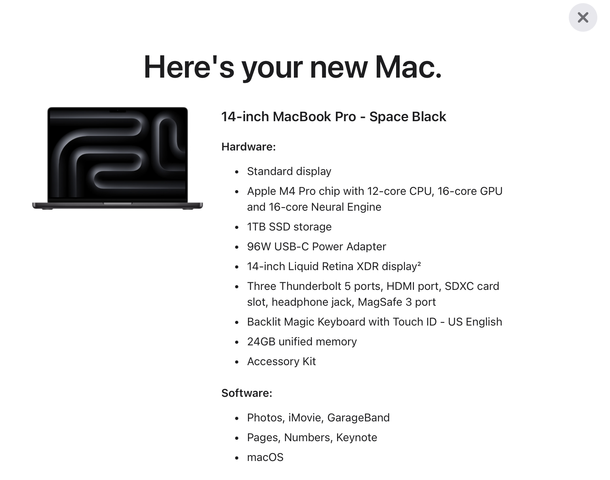
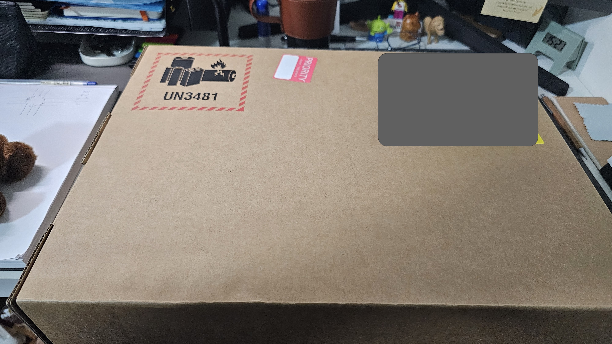
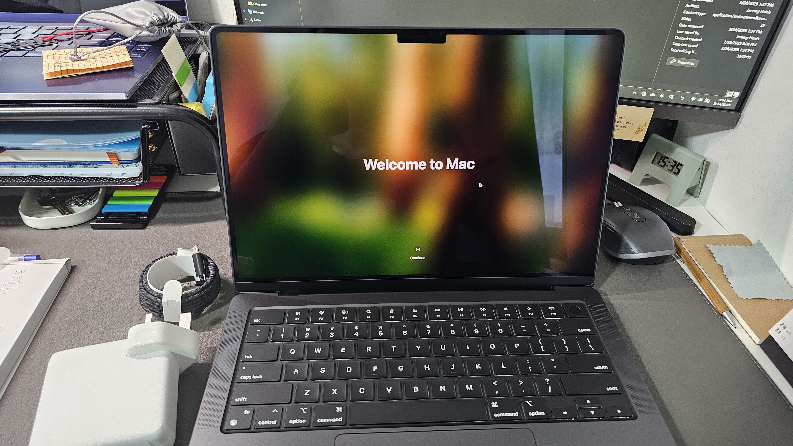
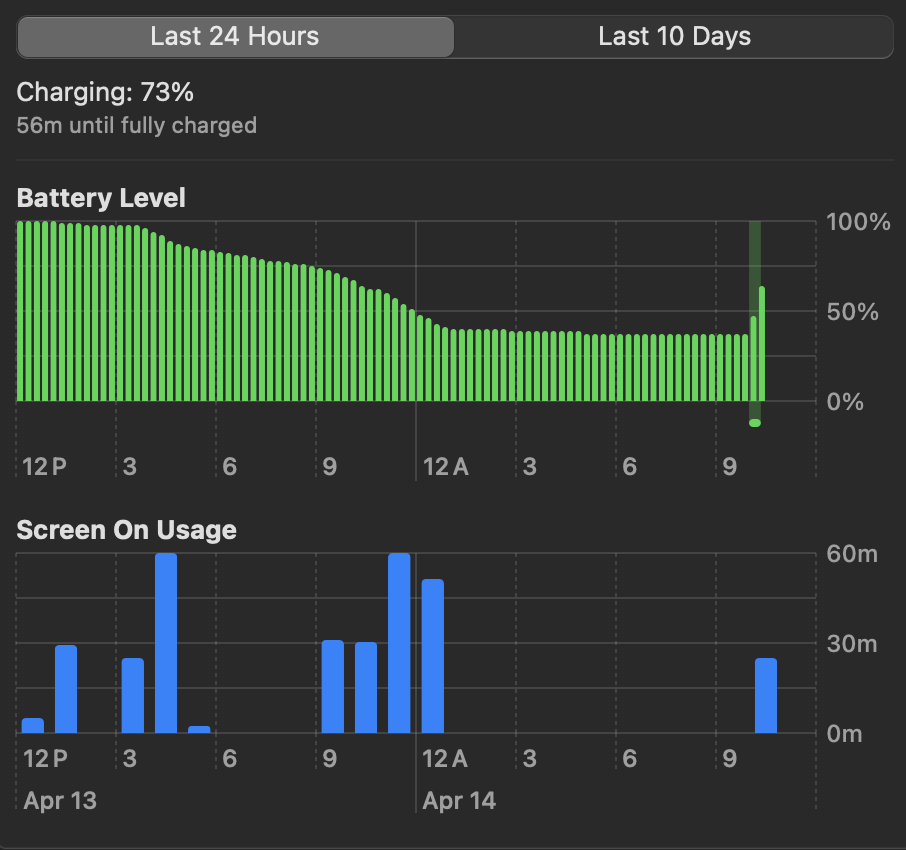

# Hello MacBook!
距離我上次換電腦已經快五年了！上一台是 Samsung 的 Galaxy Book Flex 15.6（2020年款）。
當初會選它，主要是因為那台電腦實在太漂亮了，寶石藍的機身、QLED 觸控螢幕，加上三星生態圈獨有的串聯功能，全都只要三萬塊就能入手，真的超值。
認識我的人都知道，我一直是個死忠的三星粉絲。直到一個月前，用不到兩年半的 S23 Ultra 突然無預警死機，怎麼都開不了機。這讓我對三星的信心，開始動搖了。

## 換機契機
原本那台電腦也確實舊了，隨著時間推進，Windows 系統常見的問題一個個浮現出來：
電池續航極差，中度使用大約三個小時就會沒電；觸控板變得不靈敏；風扇總是在全速運轉，聲音大得像飛機起飛。最嚴重的是，它的效能已經無法負荷我碩士論文的實驗需求了。

儘管我再怎麼喜歡那台電腦，這些問題終究逼得我必須汰換。

在真正按下購買鍵之前，我其實猶豫了將近兩個月。猶豫的點主要有三個：
1. 現在真的需要換電腦嗎？
2. 要繼續用 Windows 還是改用 Mac？
3. 若選 Mac，要買 MacBook Air 還是 MacBook Pro？

對於**第一點**，綜合我的使用需求與電腦目前的狀況來看，確實該換了。即使不是現在，今年之內也遲早要換，畢竟我得完成實驗、寫完論文，才能順利畢業。

至於**第二點**，我曾經用過不少 Windows 筆電，但它們普遍都有隨時間效能下滑的問題。反觀我人生第一台也是唯一一台 Mac，是2016年買的 MacBook Air。那三年用下來的體驗真的非常驚艷：操作絲滑、系統流暢、續航表現也很出色。雖然最後還是因為效能不足而換掉，但對 Mac 的好印象一直留在心裡。所以這次我決定，再給 Mac 一個機會。

**第三點**，Air 和 Pro 主要差別在於螢幕更新率（120Hz）和風扇散熱。螢幕的部分我還好，畢竟之前也一直用 60Hz；但散熱就不同了，因為我常需要跑較吃資源的實驗，有風扇的主動散熱對電腦壽命更有保障。

綜合以上考量，我最終選擇了 M4 Pro 的 MacBook Pro 14 吋。

# 硬體配置

我這次買的是 M4 Pro 基本款，唯一升級的是把 SSD 加大到 1TB。
原因也很簡單：上一台只有 512GB，容量總是用得戰戰兢兢，這次不想再被空間綁手綁腳了。
有了學生優惠後，我從蘋果新加坡官網下訂了這台電腦。總金額為 SGD 2809，折合台幣大約是 **69,400** 元。

# 開箱體驗
期待了一整個禮拜，終於在某個午後，我的 MacBook 安全地從成都一路運抵新加坡的家門口。
迫不及待地拆箱！我只能說，蘋果的開箱體驗，真的是其他品牌難以比擬的。

從最外層紙箱的撕開方式，到每一層包裝的細節設計，再到實際觸碰到筆電本體的那一刻，整個過程都極其直覺、順暢，讓人感覺像在打開一件藝術品。連外盒都毫無撞傷或壓痕，完好如初！ 
這一代的充電器搭配了與電腦本體顏色相襯的黑色編織線，不僅外觀更具整體感，使用起來也更加耐用。相比傳統的 Type-C 充電方式，MagSafe 在實際使用中提供了更高的安全性。

終於，打開筆電螢幕，筆電開機了。
初次開機的體驗也相當流暢，不像許多 Windows 筆電總是反覆重開、更新個沒完。
簡單登入 Apple ID、設定指紋和密碼後，就進入了桌面，馬上就能開始使用，整個流程順到不行。

# 使用心得

用了這台 MacBook Pro 幾天之後，真的不得不說這台電腦的體驗完全超出了我的期待。

首先是電池續航，真的強到有點誇張。過去我用 Windows 筆電，只要稍微開幾個網頁、跑個程式，電量就像溜滑梯一樣往下掉。但這台 MacBook，不管是上網、寫論文、甚至跑著 Python 實驗，一整天下來竟然都還有電！完全改寫我對「筆電續航」的標準。以前出門一定要帶充電器，現在反而單帶一台電腦就可以撐過一整天。

再來是觸控板，真的有夠滑順，滑起來的感覺就像在操作一塊會聽你話的玻璃。macOS 的手勢也設計得非常直覺，三指滑動、四指切換應用程式，操作上幾乎不需要外接滑鼠也能用得非常順手（雖然我後來還是買了 Magic Mouse）。

螢幕也是讓我超驚艷的一部分。這台 14 吋的 Liquid Retina XDR 顯示器，不管是在室內還是戶外，亮度都夠、細節清晰、顏色準確。用來看影片的時候超有臨場感，畫面乾淨、色彩層次也很豐富。在看 Netflix 的時候很爽。

最後想特別提一下的，是音質。我原本以為筆電喇叭就那樣，但 MacBook Pro 的音響表現，讓我第一次覺得原來筆電也可以當音箱。聲音很有層次，不會悶、也不刺耳，聽音樂或看影片時完全不用接耳機就已經很夠用了。

總結來說，這台 MacBook Pro 給我的第一印象真的非常好。不只硬體給力，整體的使用體驗就是簡單、順暢、讓人會想一直用下去。工作都有了動力！

# 結語
從猶豫到下訂，從開箱到實際使用，這次換機的過程對我來說不只是設備的升級，更像是一種生活節奏的轉換。M4 Pro MacBook Pro 不只解決了我舊電腦的各種痛點，還在效能、續航、體驗上給了我超出預期的驚喜。  

對於現在正要進入論文衝刺期的我來說，能有這樣一台穩定又好用的工具，真的安心不少。