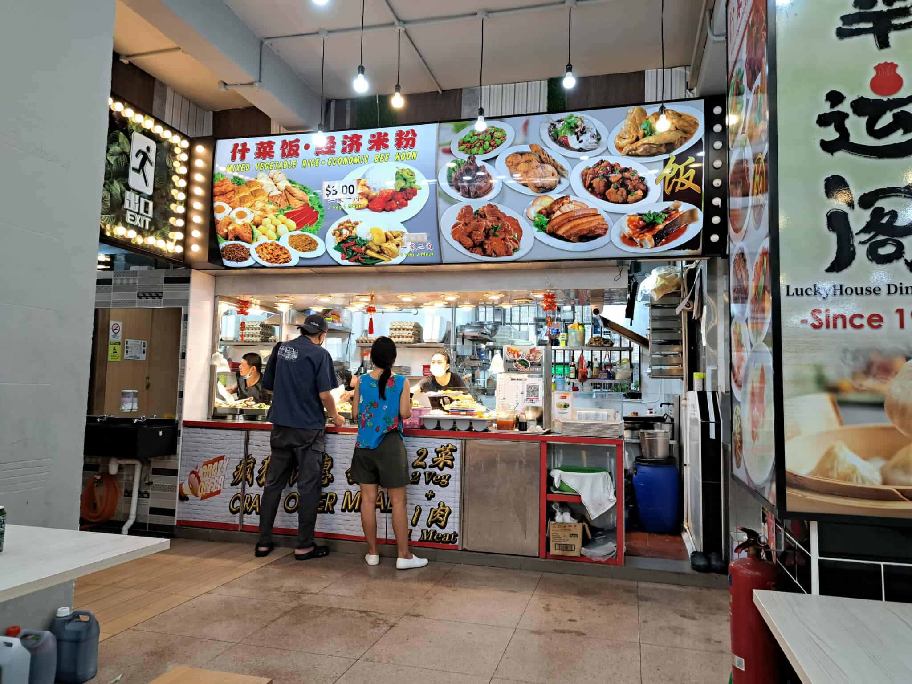
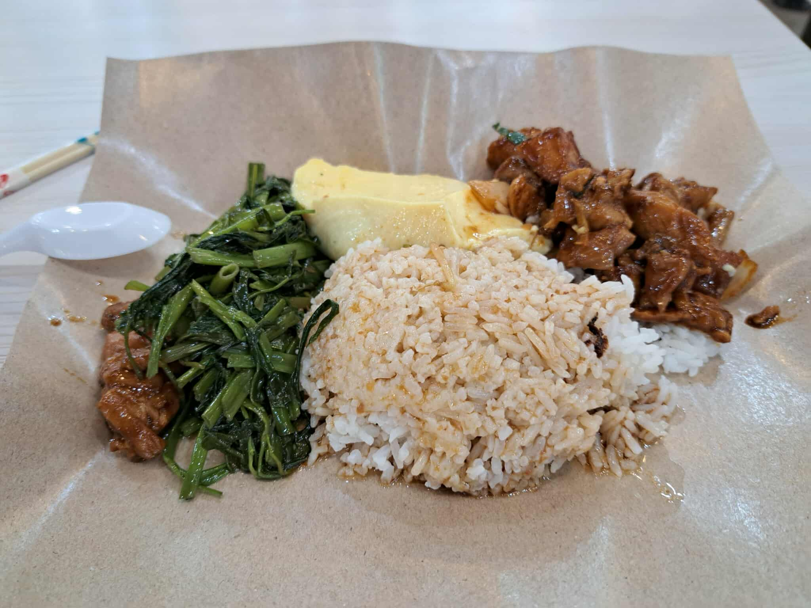

當我在[上一篇文章](https://itsjeremyhsieh.github.io/posts/singapore-study/singapore_study_living/)中分享了在新加坡國立大學的生活經歷後，今天我將帶來更深入的介紹，重點關注在新加坡的食、住、行三個方面。今天的文章將從交通系統開始。

# 行：新加坡的公共交通系統

新加坡是一個相對小巧的國家，國土面積大約是台北的2.5倍。因此，公共運輸網路十分發達，能夠高效地滿足居民和遊客的需求。

在新加坡，最常見的交通工具是公車和地鐵。新加坡的地鐵系統（SMRT）和台北的地鐵差不多，地鐵線路遍及全國，無論要到哪裡，幾乎都能輕鬆搭乘地鐵到達目的地。對於更詳細的目的地，公車則補充了地鐵無法覆蓋的區域。

公車的班次非常頻繁，車站與住宅區之間的距離也十分近，尤其是住在HDB（公共組屋）的人，公車站常常就在家樓下。例如我住的地方，從家裡到學校的中央圖書館有直達公車，且班次大約每 10 分鐘一班。

然而，有一點需要注意的是，Google Maps 在新加坡並不總是很準確。它有時候會推薦你去較遠的公車站，或者顯示的班車時間不準。新加坡本地人比較常使用的地圖導航App 是 CityMapper，雖然介面相對簡單，也沒有店家資訊，但實測發現它比Google Maps 更準確，尤其是在指引公車路線和估算公車到達時間方面。

在新加坡，地鐵站通常會和公車站有連接，所以出行的邏輯一般是這樣的：你先搭乘地鐵到達最接近目的地的地鐵站，再轉乘公車到達最後目的地，除非有直達的公車線路可以搭乘。

新加坡的交通系統是電子支付系統，所有地鐵和公車都需要刷卡。可以用當地的交通卡 EZLink 卡（相當於新加坡版的悠遊卡），這張卡可以在新加坡的地鐵站、機場等地方購買，卡片的基本費用為10新幣，其中包含5新幣的乘車儲值金。需要注意的是，當EZLink卡餘額低於3新幣時，可能無法再進行搭乘，就需要先儲值再進站。儲值方式除了在各地鐵站儲值外，也可以下載 SimplyGo App，連接信用卡扣款。除了EZLink卡外，你也可以使用 Visa、MasterCard 等信用卡進行刷卡支付，與台灣的交通系統類似。很重要的一點：進出地鐵站閘門和上下公車時都要「刷卡」！

新加坡的公共交通採用「距離票價制」（Distance Fares），根據搭乘的距離來計算票價。成人通常需要支付介於 \$1.19（最多 3.2 公里）到 \$2.47（超過 40.2 公里）之間的車費。無論是搭乘公車還是地鐵，且不論是直達還是轉乘，若是相同的距離，票價都是一樣的。

# 食：新加坡吃什麼？

作為一個新加坡的當地人或是留學生，食物是我們日常生活中最重要的一部分。新加坡的飲食文化深受多元民族影響，街頭小吃、傳統美食以及國際化的餐飲選擇應有盡有。不僅如此，新加坡的食物價格相對親民，也有許多地方可以讓你輕鬆享受美食。

## Hawker Center：新加坡的街頭美食天堂

如果你是新加坡的留學生，想要吃到道地的本地美食，**Hawker Center（熟食中心）** 絕對是你最常光顧的地方。這些熟食中心分布在全島，從市區到郊區都有，是新加坡飲食文化的縮影。這裡的食物種類繁多，從經典的海南雞飯、炒粿條、叻沙到肉骨茶、西式牛排，價格也相對平實。

作為留學生，我最常去樓下的熟食中心用餐，最常吃的是菜飯（新加坡版的自助餐）、雞飯與西餐。這邊的菜飯兩菜一肉最低只需要 S$3.2，非常適合錢都拿去交房租的留學生。

## 超市購物：平價且方便的食物選擇

除了熟食中心，新加坡的超市也是我們日常生活中不可或缺的一部分。兩大主流超市 — FairPrice 和 盛松超市（Sheng Siong），是許多新加坡居民的首選。
- FairPrice：這是新加坡最大的超市之一，分布在全島各大商場和住宅區。這裡的商品種類繁多，從新鮮蔬菜水果、日常生活用品，到即食泡麵、冷凍食品等應有盡有。
- 盛松超市（Sheng Siong）：這是一家以價格便宜著稱的超市。雖然它的規模比 FairPrice 小，但卻提供了很多本地特色產品以及進口商品。對於喜歡購買一些亞洲食品的留學生來說，這裡是個理想的選擇。

## 外賣服務：便捷的食物選擇

如果你一天忙碌，沒有時間外出就餐，那麼新加坡的外賣服務也是你不可忽視的選項。這邊常用的外送平台是 GrabFood 和 FoodPanda。

# 住：貴到爆的住宿

在新加坡，住宿費用是許多留學生和當地居民開銷中最大的一部分。新加坡的住宿類型大致可以分為兩種：HDB（政府建設的公共住宅）和公寓（私人或高級住宅）。

## HDB（公共住宅）

HDB 是新加坡的公共住房，政府為了提供平價住房，推出了這類住宅。對於大多數新加坡人來說，HDB 是最常見的居住選擇。這些住宅大多數是高樓大廈，社區環境設施完備，如有公園、超市、學校、醫療設施等，生活非常便利。對於新加坡的留學生來說，選擇 HDB 也是一個非常實惠的選擇，尤其是當你沒有高額的租金預算時。

相比於公寓，HDB的租金通常較為便宜。根據區域的不同，租金價格有所波動。若住在市區的HDB，租金可能會較高，舉例來說，我住在 Clementi 的 HDB，是靠近學校，但房價相對較貴的區域，一間單人 commonroom 一個月租金為 S\$1250（台幣約32000元）。

## Condo（公寓）
如果你追求更高的隱私、更多的設施或更高的生活品質，公寓可能是你更適合的選擇。新加坡的公寓大多由私人開發，設施通常比HDB更豪華，包括泳池、健身房、會議室等設施。

相比於HDB，公寓的租金會高很多，尤其是市區或熱門地區的高檔公寓。通常一個簡單的單人房或一房公寓的月租費用在S\$1,500 至 S\$3,000 不等，視地點、設施以及公寓的品質而有所不同。高檔的豪華公寓，租金可能會超過S\$3,000。

## 租屋平台
對於留學生來說，租房通常是從學校附近開始搜尋。許多留學生會選擇與其他同學合租，這樣可以有效分擔租金。新加坡有許多網站和平台，專門幫助租房和找室友。例如：
- [PropertyGuru](https://www.propertyguru.com.sg)：新加坡非常受歡迎的房產網站，提供了大量的租房選擇，無論是HDB還是公寓，都能找到。平台的搜索篩選功能非常詳細，讓你能根據預算、地點、設施等條件選擇最合適的房源。
- Facebook 社團：許多留學生也會加入新加坡的租房群組（如[台灣人在新加坡](https://www.facebook.com/share/g/16F9N9TGA1/)），我自己的租屋就是在臉書社團找到的。

# 結語

新加坡作為一個多元化且高效的城市，無論是在交通、食物還是住宿方面，都提供了豐富的選擇和便利的生活條件。  

對於留學生來說，適應這裡的生活節奏並不難，從高效的公共交通到便捷的食物選擇，再到多樣化的住宿選擇，都能讓我們輕鬆融入這個城市，享受生活。