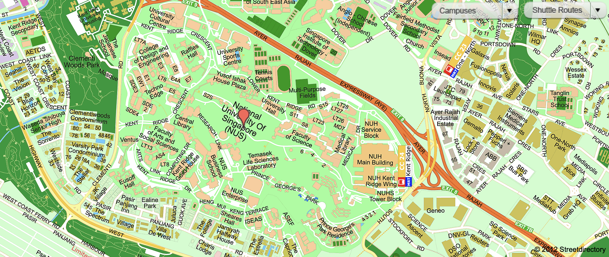

# 初抵獅城：我與新加坡的第一次見面

在 **2024 年 7 月**，我首次踏上新加坡，準備展開我在這座城市國家的碩士求學之旅。

在此之前，我從未來過新加坡，對這裡的文化、氣候、生活方式，幾乎一無所知。當時的我，腦中只有一個清晰的目標：**進入新加坡國立大學（NUS）就讀**，其他的，都是未知。

收到 NUS 的錄取通知後，我才真正開始在網路上搜尋與這所學校相關的一切。從 Reddit、Dcard、YouTube，到 NUSMods 和各種部落格，我試圖拼湊出關於校園生活的全貌。有哪些課程值得修？住宿怎麼選？交通怎麼通勤？食堂有什麼好吃的？每一點資訊，對當時的我來說都是寶貴的線索。

現在回頭看，當時那種又期待又焦慮的心情，至今仍記憶猶新。

# 新加坡國立大學介紹
新加坡國立大學（National University of Singapore, NUS）是亞洲最具聲望的高等學府之一，長期位居全球大學排行榜前列。創立於1905年，NUS 擁有超過一世紀的歷史，最初是作為英國殖民地時期的醫學學校成立，如今已發展成為一所綜合性研究型大學，提供多元化的學術課程與國際化的學習環境。  

除了卓越的學術實力，NUS 也非常重視全球視野與社會責任。學生來自全球100多個國家，構築出多元文化的學習社群。  

NUS 目前設有17個學院與研究所，涵蓋領域包括人文、科學、工程、商業、法律、醫學、建築與設計等。  

NUS 共有3個校區：Kent Ridge 校區、Bukit Timah 校區與 Outram 校區  

NUS School of Computing（計算機學院） 就設在 Kent Ridge 校區，鄰近 Central Library，這是 NUS 的主校區，幾乎所有學院（包括計算機學院、工程學院、商學院、法學院等）都位於這裡。也是最多學生活動與宿舍的地方。  

完整地圖可參照 [NUS 官網](https://map.nus.edu.sg)

<figure>
  
  <figcaption>新加坡國立大學 Kent Ridge 校區地圖</figcaption>
</figure>

## 通勤與交通
NUS 校園非常大，Kent Ridge 校區本身就像一個小城市。為了方便師生移動，學校提供 免費的校園穿梭巴士（NUS Internal Shuttle Bus），每幾分鐘一班，依照不同路線（A, B, C, D 等）將學生送往各個學院、宿舍與捷運站。

此外，Kent Ridge MRT station 就設在校園邊緣，可以從全島的地鐵抵達，從市中心搭車約 20 分鐘就能抵達校園。

## 食物
NUS 整個校區遍布著各式的遍布著各式的 food court，且價格比外面更便宜。
整個校園內分布著超過十個餐廳與食堂，以下是幾個學生常去的熱門食堂：
- UTown（University Town）：有 Food Clique 美食中心、西式餐廳、韓式與日式小吃、星巴克等。
- Techno Edge（工程學院食堂）：價格實惠、選擇多樣，我最喜歡的 Western 就在這邊，家附近的 food court fish & chips 賣8元，這邊只用4元。
- The Deck（FASS 人文學院食堂）：融合中餐、馬來、印度與素食選擇。
- Frontier（Science 食堂）：靠近理學院，也是不少人下課就直奔的地方。
- Terrance（Computing 食堂）：最靠近計算機學院的食堂，2024年新開幕，但選擇較少。

<figure>
  
  <figcaption>我在 Techno Edge 吃到的4元 Western</figcaption>
</figure>

## 課程

## 在 NUS 修課的一年：從挫折到成就感的轉折

由於碩士班同時招收全職（full-time）與兼職（part-time）學生，**NUS MComp（Master of Computing）** 的大部分課程安排都在晚上進行。課程代碼方面，計算機學院碩士課程以 **CS5xxx** 編碼為主，如果是大學部與碩士合開的課，則會標示為 **CS4xxx/CS5xxx**。

一般來說，一門課的學生人數大約在 **100 到 400 人** 之間。課程資訊、歷年評價、考試時間等實用資料，都可以從半官方的課程平台 [**NUSMods**](https://nusmods.com/timetable/sem-2) 查詢，非常方便。

每門課通常為 **4 學分**，具體的畢業修課規定則因不同專業方向（如 AI、General Track 等）而異。大多數課程會安排每週一次的 **2 小時 lecture（教授課）** 和 **1 小時 tutorial（助教課）**，但也有些課是 3 小時的連續 lecture，由教授親自授課。

NUS 的課程通常不外乎就是包含 **期中/期末考試** 和 **專案（project）**。幾乎每門課都有小組合作的元素，專案內容從報告、簡報到實作不等，算是訓練溝通、協作與時間管理能力的好機會。

在 project 分組時，會遇到來自不同背景的同學。因為碩士班有很大一部分是中國學生，有時候在開會時會遇到一點口音上的理解挑戰，但我目前遇到的中國隊友人都滿不錯的，**參與度與配合度都很高**，分工也算平均，溝通起來基本沒什麼問題。

也有遇過本地新加坡學生，平時打字溝通我們可以用中文（因為對方也是華人），但一到開會時，自動就會切換到英文模式，滿有趣的。在這樣的多語言、多文化環境下合作，雖然一開始會需要一點適應，但其實也讓我學會了更多不同的表達方式與合作節奏。

整體來說，雖然課程有時會壓力很大，但在這些 project 合作中，倒也累積了不少實戰經驗與國際視野。

在我就讀 NUS 的這一年中，我總共修了四門課。有些課的教授教學非常認真細膩，讓人感受到他們對教育的熱情；但也有少數課程，教授明顯只是走流程，不僅英文表達不清楚，整堂課幾乎只是草草講過投影片，甚至經常提早下課，讓人失望。

印象最深刻的一門課是 **CS5340 Uncertainty Modelling in AI**。還記得當初在 NUSMods 上看到這門課的評論是：「**Challenging but rewarding**」，現在回頭看，真的一點都沒錯。

這門課教的是如何讓機器在面對不確定性時進行建模與推理，核心主題是 **Probabilistic Graphical Models（PGM）**，一種結合機率論與圖論的方法，用來處理真實世界中複雜的不確定問題。

對我來說，這門課是挑戰也是突破。由於我本身的數學底子不強，加上課程的難度高、coding 作業多、還有期末考試，整體 workload 非常大。但因為它是我的必修課，我只好硬著頭皮在第一學期就選修。

我每週都會提前預習上次課程的錄影，但每次正式上課時還是會聽到一半就迷失自我，只能靠課後不斷重看錄影、自己補筆記、或在教授提供的線上提問平台上向同學和助教求助。慢慢地，我驚訝地發現自己竟然真的在進步，從一開始每堂課只能理解約三成，到學期中期能掌握六成以上，剩下的就靠課後複習與不恥下問來補足。

期末考前，我把教授提供的練習卷做了整整 **三輪**，還親自到教授的辦公室花了兩個多小時，把所有疑問一一釐清。最後的成績是 **A+**，對我來說不只是好成績，更是一種「征服了不可能」的成就感。

這也再次印證了那句話：**Challenging but rewarding.** 有挑戰，才有收穫。

---

## Dissertation Option

在就讀碩士學程時，學生可以選擇不同的 track，其中較具研究導向的就是 **Dissertation Option**，也就是論文選項。

這個選項特別適合未來想要從事研究、繼續攻讀博士學位，或對某個主題有濃厚興趣、希望深入鑽研的學生。和一般只修課（Coursework）的學生不同，選擇 Dissertation Option 的學生需要在修完核心與選修課程的同時，**進行一個約一年的長期研究專案，並撰寫碩士論文**。

### Dissertation Option 的修課架構：

- **總學分需求**：40 學分  
- **包含**：
  - 12 學分的必修課程（包括 AI/General Track 核心課）
  - 12 學分的選修課程
  - **16 學分的 Dissertation Project**

Dissertation 專案通常持續一整個學年（2 個學期），由一位 NUS 教授指導，學生需獨立完成研究工作。最後還需參加口頭報告或提交最終報告書給評審小組評分。 

原本我只打算走 **Coursework** 的修課路線，但在第一學期結束後，深深感受到修課實在太燒腦、太耗體力，加上自己真正感興趣的幾門課不一定搶得到名額，最後在第二學期我決定轉為 **Dissertation Option**，把重心從密集修課轉向深入研究。

我目前正在鑽研的主題是：**階層式多智能體強化學習（Hierarchical Multi-Agent Reinforcement Learning）**，結合強化學習與多智能體系統的研究方向，挑戰不少，但也非常有趣。

### 適合的人：

Dissertation Option 並不強制，是在申請或入學後可以選擇加入的。如果你符合下列情況之一，這個選項可能很適合你：

- 未來考慮申請 **PhD**
- 對某個技術領域（如 AI、Security、Software Engineering）有濃厚研究興趣
- 希望在履歷中增加一段完整的研究經驗
- 想與 NUS 教授深入合作，建立學術人脈
