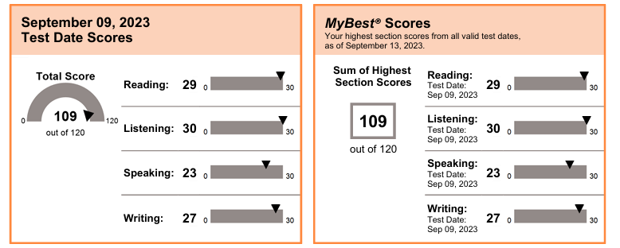

# 我的托福成績

- R: 29
- L: 30
- S: 23
- W: 27
- Total: 109
  
# 我的背景
- 考試時是彰師大資工系大四學生
- 多益965分
- 全民英檢中高級
- 國小至高中就讀國際學校

# 準備經驗

最初由於在去年底時萌生**研究所出國就讀**的想法，同時因為國外研究所通常將托福成績列為必要條件，加上托福對於**國內推甄書審**也是一大加分項目，因此有考慮先將英文證照考起來備著。  

原先也曾想過參考之前高一時準備多益的方式，**不補習**、只使用官方以及網路上的題目練習，但試了幾週後發現，托福與多益比起來，在考試複雜度與準備難度簡直天差地遠。多益只考聽力與閱讀，因此準備上相對容易。而托福則是聽說讀寫四科皆考，而且又有更緊迫的時間壓力，因此我決定藉由補習來幫助我準備。  

在打聽幾間補習班後，發現戴爾美語的托福課程與其他補習班不同的是，課程安排是循環式的。以口說為例，每週會練習四種考試題型中的一種，並且四週後便會再次練習第一種題型，我認為這樣的方法能有助於我們溫故知新，不但可以鞏固自己的基礎，同時又可以在每次的練習中獲得新想法、技巧與經驗。

## 使用教材

托福這種英文檢定考試最看重的就是實戰經驗，但由於官方出的練習題很貴，題數又少，因此我最常使用的平台是中國的[**考滿分**](https://toefl.kmf.com)。上面不僅有聽、說、讀、寫四個科目的大量練習題外，也依照題型、難易度等分類得很清楚，可以針對較弱的題目加強練習。

##各科準備技巧

對於**口說**而言，我的準備方式主要還是在**上課時積極講給同學、老師聽**，並從中獲取回饋。若是一個人在家準備，也可以將自己練習的內容錄下來後聽，去思考可以再補充哪些內容、替換哪些用詞。我認為口說的準備上有一個重點，那就是要敢說，就像口說老師說的，口說的評分是疊加上去的，不會因為說錯了什麼而扣分，只會因為你說了什麼而加分，因此，我認為最重要的是一旦有想法就要馬上說出來，在邊說的過程中，頭腦會同時想接下來的內容。下課後，我也會以教材後面的題目進行自我練習，練習時一定要記得計時，才能真實模擬考試，而在考場當下，由於同時可能會有很多人進到口說環節，環境會很吵雜，因此，為了自己的分數著想，我建議一定要講得越大聲越好，可能我當時因為顧慮會影響到他人而講得有點小聲，收音沒有很清楚，所以口說分數才不是非常理想。  

**聽力**部分，由於我從小就讀國際學校，已經很習慣聽英文，對於英文的靈敏度也比一般國內教育體制下的學生高，因此聽力部分我並沒有多加著墨，只有在考試準備後期每天大約花半個小時上考滿分網站做模擬題，聽力的準備上，我覺得**做筆記是最重要的**，單字的簡寫、關鍵字的擷取、符號的應用等等，也都是上課時老師會實際演練給同學看的，我覺得速成的最快方法就是使用老師上課的那一招，再輔以自己的書寫習慣便可。  

**閱讀**部分，由於托福剛改制，改制後的閱讀題組固定為2題，因此對於考生會是比較輕鬆的改變，我認為閱讀的技巧就是從茫茫文字海中定位到**關鍵句**後選答案，老師上課時也會教許多不需要花費時間閱讀完全文，便可以完整寫完10題的技巧。從閱讀老師的教學中學到最受用的技巧，可能就是學會如何看頭看尾、中間**跳讀**，便可以對文章的主旨與細節有所掌握，這個技能對於考試時間有限的托福閱讀也是十分受用的。在課後練習的部分，由於考師上課時常使用真經題目，因此我回家後會再完整自己重新寫過一遍當天上課的題目，並仿照考師的解題思維去思考，有空閒時，我也會上考滿分網站去練習更多閱讀題組，增加自己的字彙量與語感。  

**寫作**部分，我上課時還沒有改制，因此上課內容還是維持原本的整合與獨立寫作各一篇，但報名考試時已經改制了，因此原本最擔心的獨立寫作沒有考到，只考了相對擅長的**整合寫作**以及需要自己額外準備的**課程討論**。**課程討論**的部分，由於只有10分鐘可以構思和寫作，因此我覺得考前**自製模板**是必備的，在準備上，我是大量閱讀網路上的範文，以及使用ETS官方提供的AI模擬分數的工具去練習，AI評分下來，我發現只要有契合主題，文字數量足夠且有闡明自己的想法，通常分數不會太低。實際考試下來，我考試當天寫了一段，大約一整個視窗滿（約**180個字**左右）。在**整合寫作**方面，由於題型很固定，因此我覺得也可以先以**模板**去固定每段的開頭與結尾，考試當下就只需要依據題目去補足雙方想法，在事前準備上，我覺得也可以多準備幾個贊成、宣稱、反對的同義詞，在文字搭配上可以更有彈性。

## 時間分配

**時間分配**上，由於我深知自己**字彙量**不足，因此我自己各科的花費時間是**閱讀＞寫作＞口說＞聽力**，也很慶幸考試當天一切順利，一次就讓我達到自己的目標分數，由於我將準備時間拉得很長，因此最初每週可能只花不到兩個小時準備，**考前一個月才有真正積極每天在寫題目**。我認為去補習班上課，除了是多練習題目、多背幾個單字之外，而是為了來學習解題技巧，畢竟技巧自己讀是學不來的，也正是這些技巧讓我能在緊湊的時間內順利完成考試，達到目標。