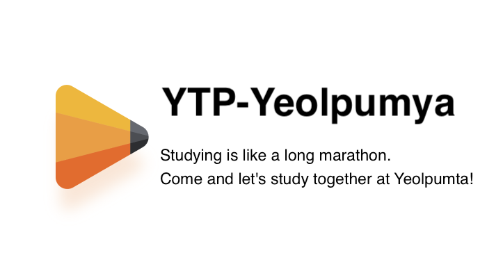
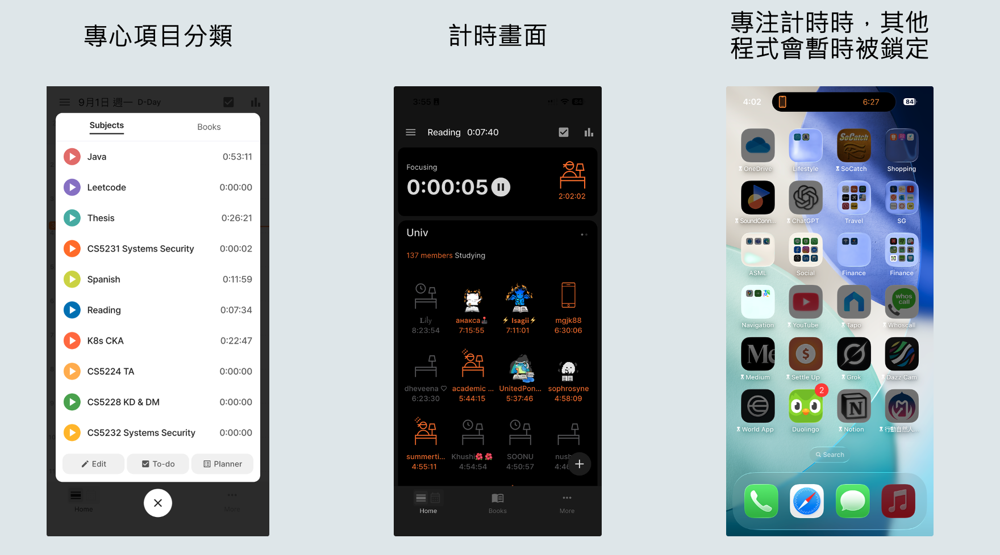
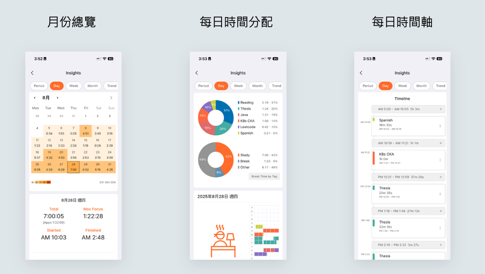

這學期我只剩下一門碩士課程需要修讀，因此空閒時間變得相對充足。然而，無論有多少時間，如果不加以妥善利用，最終仍會被白白浪費。

我們每日花費大量時間在滑手機上，瀏覽著IG、FB、Dcard上與自己無關的資訊。如果這些時間能被用來充實自己、學習對未來有益的知識，那該有多好。

從高中準備學測時，我便開始使用一款手機應用程式。這款應用不僅能幫助我在讀書時更加專注，還能提供非常詳細的時間使用報告，讓我能夠迅速檢視自己是否有效地利用時間，還是任由寶貴的時光悄然流逝。

## YPT
今天要介紹的app就是**YPT**，相信應該有不少人有聽過或用過。 

YPT 是一款專注於提高用戶學習和工作效率的計時應用程式，它的名字 YeolPumTa（全名是Yeoligeong Pumeun Taimer，Google跟我說的） 字意為「**Enthusiastic Timer**」（熱忱的計時器）。這款應用最初由一群致力於改善時間管理和生產力的韓國開發者創建，目的是幫助人們在日常生活中更好地專注於重要任務。

在開發過程中，開發團隊參考了眾多成熟的時間管理理論和方法，例如番茄工作法（Pomodoro Technique），同時融入了更靈活的自定義選項，以適應不同使用族群的需求。

YPT 特別受到學生、自由職業者、企業家以及任何希望提升個人效率的專業人士歡迎。它的強大分析功能，允許他們追蹤自己的學習和工作時間，識別效率最高的時間段，並根據這些數據進行自我優化。YPT 也提供設置 todo list 和提醒的功能，進一步促使使用者完成每日計劃，提高成就感。

## YPT 功能介紹
如同[YPT官網](https://www.yeolpumta.com/en/)的slogan，學習是一場漫長的馬拉松。這段旅程中，保持持久的專注和動力至關重要。因此，YPT提供了許多幫我們達成目標的功能。

### 專注計時功能
YPT App 結合了著名的**番茄工作法（Pomodoro Technique）**，讓用戶能夠設定25/5分鐘或50/10分鐘的專注工作時間，隨後進行短暫休息，這樣的循環可以有效增強專注力，減少疲勞感。同時也提供了自定義計時器功能，用戶可以根據自己的需求調整工作與休息的時間比例，從而打造最適合自己的工作節奏。

使用者可以在這款軟體上自定義專心事項的分類。例如，我就為學習修的課程、論文以及自學準備的證照等設置了不同的分類。這樣一來，在計時時除了可以計算總時間以外，也能獲得每個項目所花費的時間資料。當進行專注計時時，應用程式會暫時鎖定其他應用，防止使用者分心，這是這款 app 能夠有效提升專注力的主要方法之一。不過，它也保留了一定的彈性，允許用戶設定例外的應用程式，如字典和相機等，使得在專注過程中依然可以進行必要的查詢與使用。

特別值得一提的是，在專注時，應用程式的介面上會顯示同時正在和你一起專心的人。對於某些人來說，這種社群互動的元素可能會提供更大的動力，因為它創造了一種共同努力的氛圍，讓人感到不再孤單，從而更有動力堅持下去。

### 分析功能
YPT App 提供強大的數據分析能力，幫助用戶詳細了解自己的時間管理和生產力水平。應用內的圖表和報告功能能夠清晰反映出使用者在各個時間段內的效率、月份總覽、時間軸等資訊。例如，用戶可以查看每日的生產力高峰時間，或者哪種時間規劃效果最顯著。這些分析可以幫助用戶進行自我反思和優化，提高整體效率。

## 使用心得

從高中開始，我就陸陸續續使用YPT。對我來說，這個軟體的意義並不是限制自己使用手機的時間，而是透過量化每天的專注時間來獲得成就感，進而激勵自己不斷努力。畢竟，並不是所有的努力都能立即看到成果，許多事情需要長時間的投入才能得到回報。這款應用程式正好填補了這一需求，讓我能在短期內獲得成就感，從而保持持續的動力。

值得一提的是，如果你使用的是iPhone和Mac，這個應用還能同步顯示在電腦上，使得追蹤專注時間變得更加便捷。這樣的功能讓我能夠更清楚方便地知道自己每天已經專注了多久。

