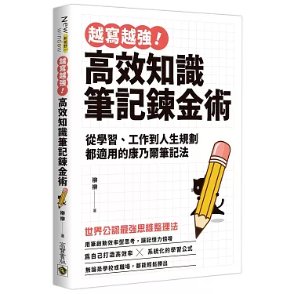
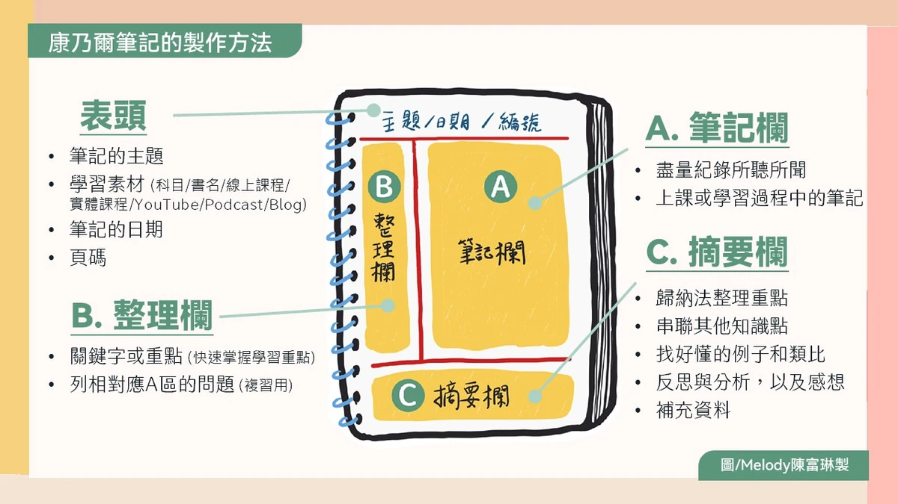
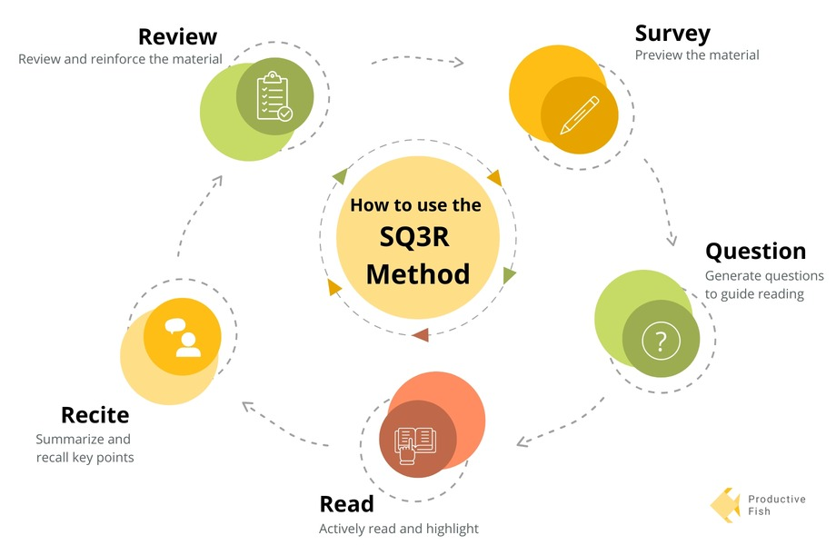

- 閱讀時間：2024-09-03 ~ 2024-09-09

## 為何要做筆記
> 做筆記是思考的過程，不是簡單的複製。

> 真正能改變你的，是透過做筆記帶了的思維方式和認知方式的轉變。

改變作筆記的方式，將會改變思維方式，並改變行為，進而結果自然就改變了。

> 無論我們學習什麼、方式如何，最終的目的都是輸出

> 學習的目的是將知識應用於實踐。

如同在考場上寫出答案，或在工作中報告，抑或是將學習到的技能應用於改善生活上。
## 如何做康乃爾筆記

> 理解 $\rightarrow$ 記筆記 $\rightarrow$ 提煉問題 $\rightarrow$ 總結

- 線索欄：將右側的筆記內容提煉成一個個小問題，用來考自己，促進自己思考。
    - 如同一個**提問系統**設想如果自己是一位出題老師，會載麼把筆記內容匯總成考試題目。
    - 使用疑問句，不是陳述句
> 同時做兩件事情 $=$ 把兩件事做了 $2+N$ 遍 $=$ 做了$N$件事情。

> 一次只做一件事。

每次只專注一任務，把時間劃分成不同時間段，一個時間段**集中處理**一件事物。

## 上課專注
> 主動思考

> 比老師走得更快一步。

當老師講解時，一邊聽老師當前講的內容，一邊思考老師接下來會說什麼。

## 記憶組塊
> 組塊是指對資訊進行加工處理，將一個個零散的資訊打包成**有意義**的集合，從而幫助人們加深理解、提升記憶和有效輸出。

## SQ3R學習法

## 複習的最佳時機
> 每天下課後花15分鐘回顧筆記，然後在每週結束後再花15分鐘瀏覽這一周的筆記

> 瀏覽 $\rightarrow$ 粗背 $\rightarrow$ 精背 $\rightarrow$ 心智圖 $\rightarrow$ 亂序背誦

## 複習技巧
> 尋找知識的異同點，進行對比

將能更好地促進我們理解和加深記憶。

## 做計劃
> 不做計劃的人，就等於在計畫失敗。

> 美件事情本身並無好壞之分，也無難易之分
是我們對這件事的看法賦予了它不同的意義。
